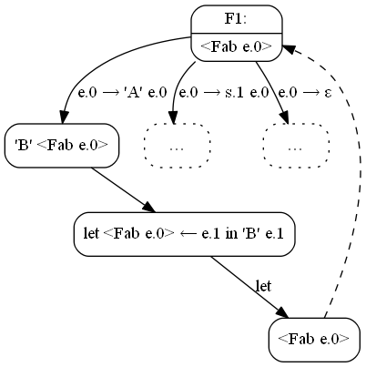
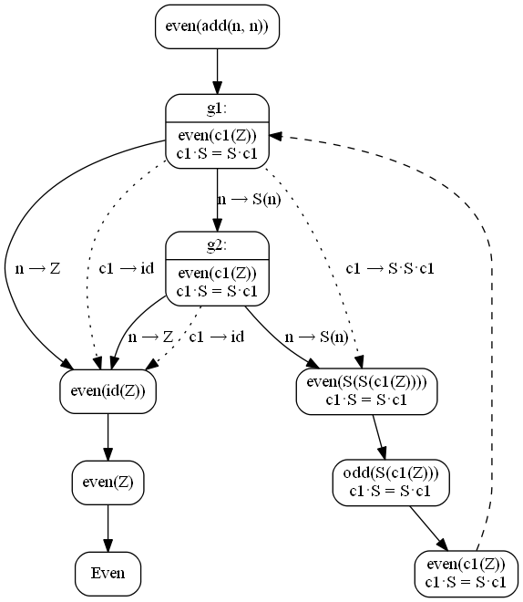
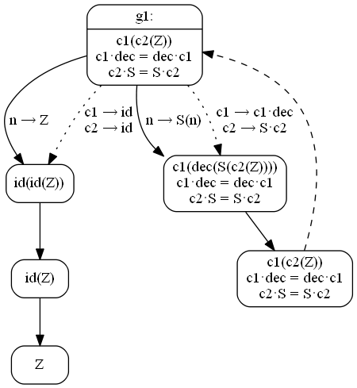

Алхимия композиций
==================

_Александр Коновалов, январь 2018_

> _Отсюда возникнут удивительные приспособления, способ которых такой…_  
> Гермес Трисмегист «Изумрудная скрижаль»

В этом эссе будет рассмотрен подход к суперкомпиляции, основанный на расширении
языка конфигураций. Описание конфигурации пополняется композиционными
параметрами, которые абстрагируют композицию произвольного количества вложенных
вызовов функций.

Граф суперкомпиляции с композиционными параметрами построить сравнительно просто,
и его построение довольно очевидно. Обратная же процедура — устранение
композиционных параметров из графа, менее очевидна и обоснована. К сожалению,
в эссе не будет дано формального обоснования обратной процедуры (как, однако,
и прямой), автор будет аппелировать к интуиции читателя.

Сочетание конфигурационных параметров с простейшими рестрикциями в уравнениях
в словах (конкретно, `A·x = x·A`) позволяет преобразовывать рекурсию в итерацию
и наоборот, что может являться важным дополнением к суперкомпилятору,
использующему таплинг \[1, 2].

В эссе будет рассмотрен ряд примеров применения этого подхода, демонстрирующих
преобразования, недоступные «обычной» суперкомпиляции, описанной, например,
в работах \[3, 4].

Листинги кода будут записываться на «игрушечном» модельном языке SLL \[3, 4],
поскольку на нём примеры и сама техника преобразований описываются наиболее
наглядно. Однако, к этому языку мы будем относиться как к псевдокоду, добавляя
в него, например, инфиксные арифметические операции и целые числа.

Автор эссе должен предупредить, что он не пытался искать в литературе похожие
подходы, поэтому не знает, является ли подход новшеством, либо был хорошо изучен
ранее. Есть некоторое интуитивное сходство со статьёй Турчина из Journal
of Functional Programming 1993 года \[5], но сходство чисто интуитивное.

В работе предполагается, что читатель знаком с основами суперкомпиляции. Если
это не так, то достаточно прочитать работы \[3] и \[4].

Используемые обозначения
------------------------

В работе будут использоваться следующие обозначения. Центральная часть работы —
композиция функций — будет обозначаться знаком `·` (точка в середине строки):

    c = f·G·h

означает, что для любого `x`

    c(x) = f(G(h(x)))

Композицию функций, применённую к аргументу, мы будем обозначать так:

    (f·G·h)(x) ≡ f(G(h(x)))

В теории работы с деревьями есть понятие _контекста_ — дерева с «дыркой»
на месте листа \[6, стр. 18]. Для контекста определена операция подстановки,
которая принимает контекст и дерево и подставляет второй аргумент на место
«дырки» в первом. Выражения в SLL можно рассматривать как деревья, дырку
в контексте мы будем обозначать `•`. Пример контекста:

    Cons(x, •)

Контексты мы будем рассматривать и как функции, т.е. они тоже могут выступать
элементами композиции. Например:

    Cons(x, append(y, Cons(x, y))) ≡ ((Cons x, •)·append(y, •)·Cons(x, •))(y)

Вызов одноместной функции также можно рассматривать как контекст, поэтому,
если `f` — это конструктор или функция, то записи `f` и `f(•)` будем считать
эквивалентными:

    f(G(h(x))) ≡ (f·G·h)(x) ≡ (f(•)·G(•)·h(•))(x)

Но для одноместных функций мы будем предпочитать запись `f` (вместо `f(•)`)
ради краткости.

Графы суперкомпиляции мы в целом будем изображать согласно \[3, 4] с некоторыми
отличиями. Во-первых, используемый нами Graphviz не поддерживает волнистые
стрелки (их мы будем изображать прямыми), во-вторых сужения и присваивания
мы будем обозначать не знаками равенства, а стрелками так, как обозначал их
Турчин. Сужение будем обозначать как `var → expr`, присваивание — `expr ← var`.

У let-узлов в графе не менее двух потомков — по одному потомку на каждое
присваивание в let-части и один потомок для подвыражения в in-части. Если одной
из частей находится пассивное выражение, мы будем для краткости опускать
соответствующего потомка.

При суперкомпиляции все параметры конфигураций будут получать последовательные
имена `v0`, `v1`, `v2`… — так их удобнее будет отличать от переменных в исходной
программе.

Возникновение идеи
==================

Рассмотрим функцию на Рефале, которая заменяет в строке все вхождения символа
`'A'` на символ `'B'`, остальные символы оставляет неизменными. (Те, кто
не знает Рефал, смотрят переводы всех листингов этой главы на диалект SLL
в **Приложении** после списка литературы.)

    Fab {
      'A' e.Rest = 'B' <Fab e.Rest>;
      s.Other e.Rest = s.Other <Fab e.Rest>;
      /* пусто */ = /* пусто */;
    }

Начнём суперкомпилировать её вызов в общем положении `<Fab e.0>`:

У нас получились две конфигурации:

    <Fab e.0>

и

    'B' <Fab e.0>

которые, очевидно, похожи. Когда при суперкомпиляции образуются похожие
конфигурации, выполняется одно из двух действий. Либо мы можем выполнить
декомпозицию нижней конфигурации, либо обобщить нижнюю, либо обобщить верхнюю.

Здесь мы можем выполнить декомпозицию нижней конфигурации:

(Полностью построенный остаточный граф можно посмотреть
[по ссылке](alchemy/2020-idea-fabref-let.png))

Остаточная программа будет совпадать с исходной с точностью до имён:

    F1 {
      'A' e.0 = 'B' <F1 e.0>;
      s.1 e.0 = s.1 <F1 e.0>;
      ε = ε;
    }

Но здесь мы можем не только выполнить декомпозицию! Мы можем обобщить ещё
и верхнюю конфигурацию. Действительно, для конфигураций `<Fab e.0>`
и `'B' <Fab e.0>` мы можем записать обобщение вида

    e.1 <Fab e.0>

Тогда граф будет строиться следующим образом:

(Полностью построенный остаточный граф можно посмотреть
[по ссылке](alchemy/2040-idea-fabref-gen.png))

Остаточная программа будет иметь вид (для наглядности считаем, что наш Рефал
умеет многоместные функции):

    F1 { e.0 = <F2 ε, e.0>; }

    F2 {
      e.1, 'A' e.0 = <F2 e.1 'B', e.0>;
      e.1, s.2 e.0 = <F2 e.1 s.2, e.0>;
      e.1, ε = e.1;
    }

Заметим, что в первом случае программа получилась рекурсивной (верно не для
всех реализаций Рефала), а во втором случае — итеративной.

А теперь рассмотрим такую же программу на SLL:

    fab(v0)
    where

    fab(A(x)) = B(fab(x));
    fab(B(x)) = B(fab(x));
    fab(C(x)) = C(fab(x));
    fab(Nil) = Nil;

Начнём суперкомпилировать эту программу:

Здесь мы имеем текущую конфигурацию `B(fab(v0))`, с которой единственное, что
мы можем сделать — выполнить декомпозицию:

(Полный граф доступен [по ссылке](alchemy/2070-idea-fabsll-let.png).)

Остаточная программа будет идентична исходной с точностью до имён:

    g1(v0)
    where

    g1(A(v0)) = B(g1(v0));
    g1(B(v0)) = B(g1(v0));
    g1(C(v0)) = C(g1(v0));
    g1(Nil) = Nil;

А вот просуперкомпилировать эту программу вторым способом, как на Рефале,
здесь уже нельзя. **Или можно? А если можно, то как?** Как можно обобщить
`fab(v0)` и `B(fab(v0))`, чтобы каждую из них можно было получить подстановкой
из обобщения?

Сначала разберёмся, почему удаётся выполнить обобщение для Рефала. Потому что
в нём выражения представляют собой строки, у которых есть два конструктора —
ассоциативная операция приписывания и нейтральный элемент (пустая строка).
Поэтому выражение `'B' <Fab e.Rest>` в правой части можно трактовать не только
как конструирование строки из символа `'B'` и рекурсивного вызова, но и как
приписывание символа `'B'` к некоторой строке, которая располагается слева
от вызова функции.

Кстати, обратите внимание на обе остаточные программы. В первой программе
символ приписывается слева к рекурсивному вызову

    F1 {
      'A' e.0 = 'B' <F1 e.0>;
    …

во второй — справа к переменной-аккумулятору:

    …
    F2 {
      e.1, 'A' e.0 = <F2 e.1 'B', e.0>;
    …

Структура данных, у которой есть ассоциативный конструктор и нейтральный
элемент, называется _моноидом._ Так например, строка — моноид. Натуральные
числа образуют моноид как по операции сложения (+, 0), так и по операции
умножения (×, 1).

Можно показать, что можно построить обобщение для конфигураций `f(x)`
и `K @ f(x)`, где `K` — некоторое значение, а `@` — двуместный конструктор,
если `K` и `@` образуют моноид. Например, рассмотрим функцию факториал:

    fact(v0)
    where

    fact(n+1) = (n+1)×fact(n);
    fact(0) = 1;

При суперкомпиляции мы неизбежно получим конфигурации `fact(v0)`
`(v0+1)×fact(v0)`, при этом нижнюю можно как разделить, так и обобщить с верхней
до `v1×fact(v0)`. Разделение воспроизведёт исходную программу, поэтому
рассмотрим более интересный вариант с обобщением:

Остаточная программа:

    f1(v0)
    where

    f1(v0) = g1(v0, 1);

    g1(v0+1, v1) = g1(v0, v1×(v0+1));
    g1(0, v1) = v1;

Снова получаем итеративную программу.

Получается, что для обобщения конфигураций `f(x)` и `K @ f(x)`, `K` и `@`
должны образовывать моноид.

Теперь вернёмся к примеру с функцией `fab` на SLL и подумаем, а есть ли там
моноид? Одна конфигурация — `fab(v0)`, вторая — `B(fab(v0))`. Читатель помнит,
что в используемых обозначениях есть операция композиции функций.

Композиция функций ассоциативна. Если область определения функции совпадает
с её областью значений, то нейтральный элемент тоже есть — это тождественное
отображение. (Если области определения и значений не совпадают, то будут два
нейтральных элемента — слева и справа.) А SLL — динамически типизированный язык,
области определения и значений всех функций (включая конструкторы) — любые
данные языка SLL.

Таким образом, композиция функций и конструкторов в SLL тоже образует моноид
с нейтральной операцией, которую будем обозначать как `id`:

    id(x) = x

Теперь мы знаем, как описать обобщение конфигураций `fab(v0)` и `B(fab(v0))` —
`c0(fab(v0)) ≡ (c0·fab)(v0)`, где `c0` — _композиционный параметр._ Далее
по тексту композиционные параметры мы будем обозначать как `c0`, `c1`, `c2`…
и для краткости называть их c-параметрами.

Просуперкомпилируем программу с использованием композиционных параметров:

Остаточную программу можно записать так:

    f(v0)
    where

    f(v0) = g(v0, id);

    id(x) = x;

    g0(A(v0), c0) = g0(v0, c0·B);
    g0(B(v0), c0) = g0(v0, c0·B);
    g0(C(v0), c0) = g0(v0, c0·C);
    g0(Nil, c0) = c0(Nil);

Мы формально получили плоскую итеративную программу, но перешли в высший
порядок, за рамки языка SLL первого порядка. У нас появилась переменная,
в которой хранится функция, вычисляемая на лету.

Если подходить к полученной программе с точки зрения реализации, то новая
программа может быть даже медленнее исходной несмотря на формальное отсутствие
рекурсии. Тут две проблемы. Во-первых, накладные расходы на построение замыканий
(придётся построить по одному замыканию на каждый элемент списка). Во-вторых,
не факт, что внутренняя реализация вызова `c0(Nil)` не потребует рекурсии
и стека вызовов глубиной, пропорциональной длине списка.

Да и вообще, хотелось бы иметь обратное преобразование, уметь возвращаться
от программы с композиционными параметрами к программе первого порядка.
В терминах композиционных параметров можно проводить довольно интересные
преобразования (о них далее), но нужен способ снова построить программу первого
порядка, избавившись от композиции.

Solve et Coagula
================

В этом разделе описывается общий метод суперкомпиляции программ, использующих
композиционные параметры. Преобразование программы осуществляется в две стадии.
На первой стадии по исходной программе строится граф суперкомпиляции, содержащий
композиционные параметры. На второй стадии снова выполняется суперкомпиляция,
но роль исходной программы выполняет ранее построенный граф. При этом
суперкомпиляция второй стадии выполняется таким образом, чтобы вновь построенный
граф не содержал композиционных параметров. Таким образом, мы снова получаем
программу на языке первого порядка.

Придумать короткие названия обоим фазам исходя из сути задачи автору не удалось,
но ему на глаза попался алхимический девиз **«Solve et Coagula»** — «растворяй
и сгущай». Слова из этого лозунга были выбраны для обозначения обоих фаз.
На первой фазе вложенные вызовы функций сгущаются в композиционные параметры,
поэтому её будем называть _coagula,_ на второй стадии композиционные параметры
растворяются, возвращая нас к программе первого порядка — будем называть эту
фазу _solve._ Кроме того, мы будем использовать как синонимы такие слова
как _сгущение,_ _коагуляция,_ _растворение_ и _сольватация_ для обозначения
обоих стадий.

_Примечание._ Весьма любопытно посмотреть переводы слов solvo и coagulo
в словаре:

* <https://ru.wiktionary.org/wiki/solvo> — отвязывать, расстёгивать; уплачивать;
  отбывать (наказание); выполнять (обещание); возмещать; искупать (вину);
  выдавать (награду); освобождать, избавлять; оправдывать; давать волю;
  разрушать; расторгать; рассеивать, разгонять; **растворять, растоплять,
  плавить (снег);** распускать (собрание, войско); **размягчаться, оттаивать,
  разлагаться;** расслабляться; подрывать; отбрасывать; разъяснять, объяснять;
  **решать, разгадывать.**
* <https://ru.wiktionary.org/wiki/coagulo> — вызывать свёртывание, сгущение,
  затвердение, застывание; свёртываться, створаживаться, застывать, твердеть;
  закреплять, утверждать.

Стадия сгущения (Coagula)
-------------------------

Стадия сгущения отличается от обычной суперкомпиляции теми действиями, которые
выполняются при обнаружении «похожих» конфигураций. Там, где обычная
суперкомпиляция выполняет разделение конфигурации при помощи let-узла,
коагуляция производит обобщение со вставкой конфигурационного параметра.

То есть, если родительская конфигурация имеет вид (условно) `f(h(x))`,
а дочерняя — `f(g(h(x)))`, где `f`, `g`, `h` могут быть как вызовами функций,
так и конструкторами, то вместо разделения верхней конфигурации в виде

           f(h(x))
              ↓
    let h(x) ← v in f(v)

и независимой суперкомпиляции `h(x)` и `f(v)` верхняя конфигурация обобщается
как

            f(h(x))
               ↓
    let id ← c in f(c(h(x)))

и дальше суперкомпиляции подвергается обобщённая конфигурация
`f(c(h(x))) ≡ (f·c·h)(x)` с композиционным параметром. При её развитии снова
может вылезти `g(•)`, например, как `f(c(g(h(x)))) ≡ (f·c·g·h)(x)`. В этом
случае происходит обобщение c-параметром:

          (f·c·g·h)(x)
               ↓
    let c·g ← c in f(c(h(x)))

Следует иметь ввиду, что некоторые вызовы функций в графе могут оказаться
блокированными c-параметрами, как `f(c(…))` в примере выше. А значит, граф
коагуляции может оказаться не самодостаточным (сохранять вызовы функций
исходной программы). Это не страшно, такие вызовы функций, как правило,
разрешаются (solvo) на стадии растворения.

Должен получиться граф примерно такого вида:

Т.е. прогонка по некоторому параметру приводит либо к конфигурациям, которые
сводятся к исходной путём присваивания c-параметру (конфигурации `C1` и `C2`),
либо происходит (единственный) выход из рекурсии (`C3`). Если получился более
сложный граф, то решение использовать коагуляцию для начальной конфигурации было
ошибочным — следует отбросить построенный граф и выполнить суперкомпиляцию
обычным образом. Дело в том, что методы растворения (solvo) таких графов пока
не разработаны: пока есть только идеи по поводу того, что нужно делать
с несколькими выходами из рекурсии, но и те пока очень сырые.

При этом в графе не может быть присваиваний c-параметрами вида

    f·c·g ← c

по той же причине — стадия растворения может работать только с присваиваниями
вида

    f·c ← c
    c·f ← c

В случае появления такого присваивания (`f·c·g ← c`) следует заменить c-параметр
парой смежных (вместо `c` пара `c1·c2`), в этом случае присваивание заменится
на два независимых (`f·c1 ← c1`, `c2·g ← c2`).

Другое ограничение на построенный граф заключается в том, что в точке выхода
из рекурсии построенное выражение не должно содержать параметров, по которым
выполняется прогонка (на иллюстрации выше — параметр `v` в выражении `E′`
должна отсутствовать).

Рассмотрим несколько примеров графов коагуляции.

Примеры для стадии сгущения
---------------------------

Все примеры из этого раздела дают тривиальный результат, поскольку они
приводятся лишь для иллюстрации сгущения. Эти же примеры будут использоваться
для иллюстрации стадии растворения.

### Сложение чисел

Функция сложения двух пеановских чисел без аккумулятора, аргументы в общем
положении:

    add(x, y)
    where

    add(S(x), y) = S(add(x, y));
    add(Z, y) = y;

Начнём строить граф:

В соответствии с нашей методой конфигурации `add(x, y)` и `S(add(x,y))` мы
обобщаем, вводя композиционный параметр:

Если граф «почистить» то он примет вид:

### Сложение с аккумулятором

В предыдущем примере конструктор `S(•)` выносился наружу, здесь он применяется
ко второму аргументу:

    add(x, y)
    where

    add(S(x), y) = add(x, S(y));
    add(Z, y) = y;

Начинаем строить:

Опять обобщаем конфигурации `add(x, y)` и `add(x, S(y))`, вводя композиционный
параметр:

«Чистим» граф:

Обратите внимание на сходство с графом в предыдущем примере. Они различаются
только присваиванием во втором let-узле!

### Композиция в повторных параметрах

Иногда композиционные параметры могут вылезти в самых неожиданных местах,
например, при параметрах, которые явным образом в программе не меняются.
Рассмотрим функцию `k`, которая имитирует комбинатор `K` (вычёркиватель),
определяемый как `Kxy≡x`:

    k(A(y), x) = k(y, x);
    k(B(y), x) = k(y, x);
    k(Nil, x) = x;

Функция разбирает свой первый аргумент (список знаков `A` и `B`), при достижении
конца списка возвращает второй аргумент.

Переменная `x` на шаге рекурсии не меняется. Но вокруг неё может вылезти
композиционный параметр тоже. Рассмотрим следующее задание на суперкомпиляцию:

    k(x, x)
    where

    k(A(y), x) = k(y, x);
    k(B(y), x) = k(y, x);
    k(Nil, x) = x;

Здесь мы имеем повторное вхождение параметра `x` в стартовую конфигурацию.
Как мы увидим далее, все интересные преобразования программ связаны либо
с повторными параметрами, либо с рестрикциями на c-параметры, либо с тем
и с другим. Приступим к суперкомпиляции:

Конфигурации `k(x, x)` и `k(x, A(x))` похожи. Заметим, что конструктор `A`
перед `x` у нас вылез из-за того, что параметр `x` — повторный: его дало
сужение `x → A(x)` при прогонке. Обобщаем с использованием c-параметра
и строим граф суперкомпиляции:

После «чистки» графа получим:

### Смежные c-параметры

Необходимо также рассмотреть пример на смежные c-параметры, возникающие
при попытке обобщить c-параметр присваиванием `f·c·g ← c`. Вот есть такая
вот бессмысленная программа

    f(x, x)
    where

    f(A(x), y) = f(x, B(y));
    f(Z, y) = y;

Начнём суперкомпилировать эту программу:

Конфигурации `f(x, x)` и `f(x, B(A(x)))` похожи. Обобщаем их при помощи
c-параметра:

Хочется обобщить конфигурации `f(x, c0(x))` и `f(x, (B·c0·A)(x))` путём
присваивания `B·c0·A ← c0`, но нельзя, иначе такой граф нельзя будет растворить
(см. следующий раздел). Поэтому заменяем параметр `c0` на пару смежных
параметров `c0·c1`:

«Сжатый» «почищенный» граф примет вид:

Стадия растворения (solve)
--------------------------

Рассмотрим ещё раз граф, который должен получиться на стадии сгущения:

Перерисуем его следующим образом:

Здесь вместо let-узлов присваивания явным образом написаны на обратных дугах.

_Примечание._ Дальнейшие рассуждения будут нестрогие, местами безграмотные.
Но по-другому обосновать стадию растворения автору пока не удалось.

Что такое конфигурация? Это некоторое обобщённое состояние программы. Параметры
конфигурации описывают множества объектных значений. Если мы вместо них
подставим конкретные значения и положим в интерпретатор языка, то либо получим
конкретное значение — результат работы программы с заданной стартовой точкой,
либо ничего не получим (интерпретатор упадёт либо зависнет). Т.е. конфигурация
определяет некоторую частичную функцию, областью определения которой являются
допустимые множества параметров конфигурации.

Что означает переход от `C0` к `C1` с пометкой `v → X(v)`? Он означает, что
частичная функция, соответствующая конфигурации `C0[v → X(v)]` совпадает
с частичной функцией, задаваемой конфигурацией `C1`. А что значит стрелка
от `C1` к `C0` с пометкой `c·f ← c` (до конца абзаца забудем о специфике
c-параметров)? В принципе, тоже самое. Что конфигурация `C1` определяет
частичную функцию, совпадающую с частичной функцией `C0[c → c·f]`. Т. е.
направления стрелок можно заменить:

Иначе говоря, конфигурация связывает свои параметры неким инвариантом,
предикатом. И при переходе от одной конфигурации к другой этот инвариант
сохраняется. Перейти из `C0` в `C1` можно двумя путями: либо подстановкой
одного параметра `v → X(v)`, либо другого `c → c·f`.

Выражение `E0` содержит некоторые конфигурационные переменные, которые связаны
неким инвариантом. При переходе через let-узел к выражению `E′` в конфигурации
`C0` мы к этому инварианту добавили переменную `c` с пустым значением.
Выражение `E′` в точке выхода из рекурсии по требованию к графу не должно
содержать переменных, по которым выполнялась прогонка, т.е. переменной `v`
в данном случае. Все переменные из выражения `E′` связаны тем же инвариантом.
Если мы пройдём по пути `E0 → C0 → C3(E′)`, то параметр `c` из `E′` удалится,
поскольку его значение установлено пустым и нигде не менялось. Отражаем это
на графе:

Вышенаписанное туманно, сомнительно и непонятно, но это так и должно быть.
Потерпите ещё пару абзацев.

А вот вступает в действие специфика c-параметров. При замене направления
стрелок нужно также поменять порядок приписывания контекстов к параметру:
было `c → c·f`, должно стать `c → f·c`, было `c → g·c`, должно стать `c → c·g`.
C-параметр, приписанный вокруг некоторого подвыражения, в некотором смысле
заменяет собой это выражение. И если подвыражение на выходе из рекурсии
изчезает, оставляя вокруг себя «шкурку» композиционного параметра,
то на дальнейших преобразованиях мы будем рассматривать вместо выражения
его «шкурку». Поэтому, когда на стадии свёртки выражение

    … c(expr) …

преобразовывалось к виду

    … c(f(expr))…

то мы заменяли c-параметр по схеме `c·f ← c`. Теперь у нас нет подвыражения
`expr`, осталась его оболочка `c(…)`. Поэтому на стадии растворения мы должны
подвыражение

    … c(…) …

преобразовывать к виду

    … f(c(…)) …

Поэтому переворачиваем также значения подстановок для c-параметров.

Необходимость переворачивания и вынуждает нас вводить смежные c-параметры.

Дальше прогоняем как текущую конфигурацию выражение точки выхода из рекурсии
`E′`. В нём нет параметров для прогонки, но в нём есть c-параметры. Поэтому,
когда мы движемся по сплошной стрелке, выполняем подстановку по пунктирной:

Такой граф мы будем называть _вывернутым._ Дальнейшие манипуляции с `C1` и `C2`
в вывернутом графе делаются по обычным правилам суперкомпиляции. Т.е. если
имеем конфигурацию вида `f(h(x))` и дочернюю — `f(g(h(x)))`, то мы разделяем
родительскую. Если видим родительскую `g(x)`, и дочернюю `f(g(x))` или
`g(h(x))`, то разделяем дочернюю. Однако, можно (а иногда нужно) учитывать
рестрикции на c-параметры, о которых будет подробно написано ниже.

В результате должен получиться граф первого порядка, в котором уже не будет
c-параметров. Почему должен — автор пока не знает. Может быть, не всегда должен.

Автор рекомендует относиться к вышеизложенному (как к стадии сгущения, так
и к стадии растворения) не как к доказанной теореме, а как к эмпирическому
рецепту, который вроде как работает. Автор надеется, что в дальнейшем сможет
сформулировать теоретическую базу под рассматриваемым подходом.

Примеры для стадии растворения
------------------------------

Рассматриваемые примеры являются продолжениями иллюстраций выполнения стадии
сгущения.

### Сложение чисел

Напомним исходную программу

    add(x, y)
    where

    add(S(x), y) = S(add(x, y));
    add(Z, y) = y;

и получившийся граф коагуляции:

Выворачиваем граф:

и суперкомпилируем его:

Остаточная программа принимает вид:

    g1(x, y)
    where

    g1(S(x), y) = S(g1(x, y));
    g1(Z, y) = y;

Остаточная программа идентична исходной.

### Сложение с аккумулятором

Исходная программа:

    add(x, y)
    where

    add(S(x), y) = add(x, S(y));
    add(Z, y) = y;

и её граф сгущения:

Выворачиваем граф:

Суперкомпилируем:

и получаем остаточную программу, идентичную исходной:

    g1(x, y)
    where

    g1(S(x), y) = g1(x, S(y));
    g1(Z, y) = y;

### Композиция в повторных параметрах

Исходная программа:

    k(x, x)
    where

    k(A(y), x) = k(y, x);
    k(B(y), x) = k(y, x);
    k(Nil, x) = x;

и её граф коагуляции:

Строим вывернутый граф:

Суперкомпилируем:

Остаточная программа принимает вид

    g1(x)
    where

    g1(A(x)) = A(g1(x));
    g1(B(x)) = B(g1(x));
    g1(Nil) = Nil;

Остаточная программа является тождественной функцией. Она выполняет полный
проход по входным данным, а значит имеет ту же сложность, что и исходная.
Исходная программа была итеративной — рекурсия была хвостовой. Новая программа
стала формально рекурсивной (хоть и выносится наружу не функция, а конструктор).

### Смежные c-параметры

Завершим и последний пример со смежными параметрами. Как можно и предположить,
здесь тоже, как и в предыдущем случае, остаточная программа будет отличаться
от исходной. Была у нас такая бессмысленная программа:

    f(x, x)
    where

    f(A(x), y) = f(x, B(y));
    f(Z, y) = y;

И был такой граф коагуляции.

Приступим к его растворению. Сначала вывернем наизнанку:

А потом начнём суперкомпилировать:

А вот это уже интересно. Родительская конфигурация `c0(c1(Z))`, дочерняя —
`c0(B(A(c1(Z))))`. Конфигурации похожи. Но мы на стадии растворения, вводить
новые композиционные параметры не можем, можем только действовать по-старинке.
А именно, разделить родительскую конфигурацию:

Заметим, что ветви прогонки «по наследству» получили обе дочерние конфигурации.
Достраиваем граф:

Остаточная программа принимает вид

    f1(x)
    where

    f1(x) = g2(x, g1(x));

    g1(A(x)) = A(g1(x));
    g1(Z) = Z;

    g2(A(x), v1) = g2(x, B(v1));
    g2(Z, v1) = v1;

Функция `g2` дословно воспроизводит `f` исходной программы. Однако, вторым
аргументом ей передаётся не `x` в чистом виде, а `g1(x)`, которая реализует
холостой проход по данным. Остаточная программа в этом смысле оказалась хуже,
чем исходная, поскольку делает избыточный цикл. По всей видимости, эти
избыточные циклы есть побочный эффект выбранного способа суперкомпиляции.

Использование рестрикций на c-параметры
---------------------------------------

_Рестрикции_ — ограничения на множество допустимых значений параметоров
в конфигурации. Рестрикции позволяют как ограничивать развёртку дерева,
отсекая недостижимые ветви, так и позволяют выполнять преобразования
конфигураций, основанные на свойствах параметров. Нас здесь будет интересовать
исключительно второе свойство рестрикций — возможность эквивалентного
преобразования конфигураций.

_Уравнение в словах_ упрощённо — это запись некоторого равенства, справа
и слева которого находятся конкатенации либо константных, либо неизвестных
строк. Например, уравнение

    'abra' ++ x = 'abracadabra'

имеет решение

    x = 'cadabra'

Уравнение

    x ++ 'abra' ++ y = 'abracadabra'

имеет два решения

    x = ε && y = 'cadabra'
    x = 'abracad' && y = ε

Уравнение

    x ++ 'baba' = 'baba' ++ x

имеет бесконечное число решений:

    x = ε
    x = 'ba'
    x = 'baba'
    x = 'bababa'
    …

т.е. все их можно записать в виде регулярного выражения `'ba'*` — строка `'ba'`,
повторенная ноль или более раз.

Мы будем применять рестрикции только к композиционным параметрам, и они будут
иметь вид одного из простейших уравнений в словах — уравнения вида

    c·f = f·c

где `c` — композиционный параметр, а `f` — функция или конструктор. Решением
этого уравнения является ноль или более раз применённый `f`. Т.е. значением
параметра `c` может быть либо пустое значение `id`, либо некоторое количество
применений `f`: `id`, `f`, `f·f`, `f·f·f`…

Подробнее об уравнениях в словах и их применении в качестве рестрикций можно
прочитать и послушать в докладе Антонины Непейвода, прочитанном в Институте
системного программирования РАН \[7].

Рестрикция налагается на параметр при обобщении `id` (пустоты) и некоторого
контекста (не зависящего от других параметров), сбрасывается, если при
присваивании параметру нового значения рестрикция становится противоречивой.

Если на стадии растворения на параметр наложена рестрикция `c·f = f·c`,
то в конфигурации мы можем менять композицию `c(f(…)) ≡ (c·f)(…)`
на `f(c(…)) ≡ (f·c)(…)`, пользуясь некоторой стратегией (которую в этом эссе
мы обсуждать не будем). Подобные преобразования рестрикций способны обеспечить
довольно нетривиальные преобразования.

Рассмотрим пример — функцию, которая принимает список из конструкторов `A(•)`,
`B(•)` и `Nil` и заменяет в нём все `A` на `B`:

    fab(x)
    where

    fab(A(x)) = B(fab(x));
    fab(B(x)) = B(fab(x));
    fab(Nil) = Nil;

Конфигурации `fab(x)` и `B(fab(x))` похожи — их можно обобщить до `c1(fab(x))`,
где подстановка для первой конфигурации будет `id ← c1`, для второй — `B ← c1`.
Делаем гипотезу, что верно уравнение `c1·B = B·c1`:

Можем ли мы в последней построенной конфигурации обобщить `c1·B` до `c1`?
Попробуем выполнить подстановку `c1·B ← c1` в уравнение `c1·B = B·c1`:

    c1·B = B·c1          // подставляем вместо c1 выражение c1·B
    (c1·B)·B = B·(c1·B)
    c1·B·B = B·c1·B      // сокращаем …·B
    c1·B = B·c1

Получилось такое же уравнение с точностью до порядка левой и правой частей.
Значит, обобщить можем:

Прогоняем остальные ветки:

утрясаем граф:

выворачиваем его наизнанку:

и начинаем суперкомпиляцию, растворяя параметр `c0`:

Дальше можно поступить двумя путями. Можно продолжить суперкомпиляцию,
не взирая на рестрикции. Очевидно, получим программу, совпадающую с исходной
с точностью до имён переменных. А можно поступить иначе — воспользоваться
рестрикцией:

Зелёной стрелкой на графе показан переход, использующий свойство параметра `c1`.
Конфигурации `c1(Nil)` и `c1(B(Nil))` похожи — обобщаем верхнюю как `c1(v1)`:

Остаточная программа получила вид:

    f1(x)
    where

    f1(x) = g1(x, Nil);

    g1(A(x), v1) = g1(x, B(v1));
    g1(B(x), v1) = g1(x, B(v1));
    g1(Nil, v1) = v1;

Получили вместо рекурсивной итеративную программу. Следовательно, использование
рестрикций вида `c·f = f·c` позволяет менять рекурсию на итерацию и наоборот.

**Домашнее задание.** Выше в эссе были рассмотрены две функции сложения:
с аккумулятором и без него. Показать, что можно преобразовать одну из них
в другую и наоборот, применяя рестрикцию на c-параметр.

Рассмотрим другой пример, где рестрикция неприменима. Пусть у нас есть список
конструкторов `A(•)`, `B(•)` и `Nil`, в этом списке нужно заменить `A` на `C`,
а `B` — не трогать.

    fac(x)
    where

    fac(A(x)) = C(fac(x));
    fac(B(x)) = B(fac(x));
    fac(Nil) = Nil;

Конфигурации `fac(x)` и `C(fac(x))` похожи. Как и в предыдущем случае, мы их
обобщаем до `c1(fac(x))` (подстановки `id ← c1` и `C ← c1`) и делаем гипотезу,
что верно уравнение `c1·C = C·c1`.

Мы можем свести конфигурацию `(c1·C)(fac(x))` к `c1(fac(x))` при помощи
подстановки `c1·C ← c1`. Проверим, не нарушается ли рестрикция `c1·C = C·c1`:

    c1·C = C·c1          // подставляем вместо c1 выражение c1·C
    (c1·C)·C = C·(c1·C)
    c1·C·C = C·c1·C      // сокращаем …·C
    c1·C = C·c1

Рестрикция сохраняется, значит делаем подстановку и продолжаем суперкомпиляцию:

Конфигурации `c1(fac(x))` и `(c1·B)(fac(x))` похожи. Мы можем свести одну
к другой при помощи подстановки `c1·B ← c1`. Проверим, сохраняется ли верным
уравнение `c1·C = C·c1`:

    c1·C = C·c1          // подставляем вместо c1 выражение c1·B
    (c1·B)·C = C·(c1·B)
    c1·B·C = C·c1·B

Получили противоречие — слева строка заканчивается на `C`, справа — на `B`.
Следовательно, гипотеза об ограничении на переменную `c1` неверна. Стираем
рестрикцию из всего графа:

Полученный граф коагуляции после растворения может дать только остаточную
программу, идентичную исходной. Получение остаточной программы оставим
в качестве упражнения читателю.

Рассмотрим ещё один пример, где рестрикция неприменима. Пусть у нас есть
программа реверсирования лисповского списка:

    rev(lst, Nil)
    where

    rev(Cons(head, tail), res) = rev(tail, Cons(head, res));
    rev(Nil, res) = res;

Начинаем суперкомпиляцию:

Конфигурации `rev(lst, Nil)` и `rev(lst, Cons(v1, Nil))` похожи, их можно
обобщить вставкой c-параметра. Чтобы было нагляднее, куда этот параметр
вставлять, оба выражения записаны в графе как композиции контекстов в явном
виде: `(rev(lst, •))(Nil)` и `(rev(lst, •)·Cons(v1, •))(Nil)`. Обобщаются
они до `(rev(lst, •)·c1)(Nil)`, сводящие подстановки: `id ← c1`
и `Cons(v1, •) ← c1`. Здесь рестрикцию задать невозможно, поскольку подстановка
для `c1` зависит от другого параметра — `v1`.

Как может догадаться читатель, суперкомпиляция этой программы воссоздаст
исходную, но мы этот пример закончим для демонстрации работы с более сложными
контекстами вида `Cons(v1, •)`.

Граф коагуляции:

Вывернутый граф:

Граф сольватации:

Остаточная программа:

    f1(lst)
    where

    f1(lst) = g1(lst, v2);

    g1(Cons(v1, lst), v2) = g1(lst, Cons(v1, v2));
    g1(Nil, v2) = v2;

Примеры нетривиальных преобразований
====================================

Примеры, рассмотренные ранее в этой работе, были тривиальными, поскольку
предназначались только для демонстрации отдельных этапов преобразований.
В этом разделе мы рассмотрим программы, суперкомпиляция которых согласно
методичкам \[3] и \[4] даёт тривиальный результат (остаточная программа
идентична исходной), а предложенный метод данные программы радикально
проясняет.

Удвоение числа
--------------

Рассмотрим программу, которая удваивает число путём сложения его с самим собой.
Данный пример рассматривается в \[4, стр. 7] как иллюстрация для гомеоморфного
вложения и методики обобщения двух конфигураций. Как показывается в \[4],
остаточная программа оказывается идентичной исходной.

    add(a, a)
    where

    add(Z, y) = y;
    add(S(x), y) = S(add(x, y));

Посмотрим, что получится у нас. Начинаем суперкомпиляцию:

Очевидно сходство двух конфигураций. Коагулируем:

Выворачиваем:

Растворяем (зелёной стрелкой показано применение рестрикции):

Остаточная программа:

    g1(a)
    where

    g1(Z) = Z;
    g1(S(a)) = S(S(g1(a)));

Остаточная программа, как видим, гораздо проще исходной. Можно было применить
уравнение-рестрикцию иначе:

    (S·c1)((S·c1)(Z)))
    (S·c1·S·c1)(Z)
    (c1·S·c1·S)(Z)
    (c1·c1·S·S)(Z)
    c1(c1(S(S(Z))))

и после обобщения `c1(c1(Z))` с последним выражением до `c1(c1(v1))` получили бы
итеративную остаточную программу с аккумулятором:

    f1(a)
    where

    f1(a) = g1(a, Z);

    g1(Z, v1) = v1;
    g1(S(a), v1) = g1(a, S(v1));

**Домашнее задание** читателю: просуперкомпилировать этот же пример с функцией
сложения с аккумулятором:

    add(a, a)
    where

    add(Z, y) = y;
    add(S(x), y) = add(x, S(y));

Ответ должен получиться тот же.

Длина двух списков
------------------

Рассмотрим такую задачу. Нужно найти длину лисповского списка,
сконкатенированного с самим собой.

    length(append(xs, xs))
    where

    length(Nil) = Z;
    length(Cons(head, tail)) = S(length(tail));

    append(Nil, ys) = ys;
    append(Cons(head, tail), ys) = Cons(head, append(tail, ys))

Задача похожа на предыдущую задачу, ответ также будет похож. Давайте получим
этот ответ. Начинаем как обычно:

Две конфигурации похожие, сгущаем в них композиции и продолжаем:

Граф коагуляции получился не самодостаточным — в точке выхода из рекурсии
осталась невычисленная функция `length` из исходной программы. Её вычисление
блокируется c-параметром `c2`. Это так и должно быть, выворачиваем граф
и растворяем:

Остаточная программа:

    g1(xs)
    where

    g1(Nil) = Z;
    g1(Cons(v1, xs)) = S(S(g1(xs)));

Верификация: n+n всегда чётно
-----------------------------

Определим чётность суммы числа с самим собой.

    even(add(n, n))
    where

    even(Z) = Even;
    even(S(n)) = odd(n);

    odd(Z) = Odd;
    odd(S(n)) = even(n);

    add(Z, y) = y;
    add(S(x), y) = S(add(x, y));

Начнём суперкомпиляцию:

Две конфигурации — `even(add(n, n))` и `even(add(n, S(S(n))))` похожи. Их
можно обобщить (сгустить) в `even(add(n, c1(n)))`, сводящие подстановки
соответственно `id ← c1` и `S·S ← c1`. Проверим, можно ли навесить на `c1`
рестрикцию `c1·S = S·c1`:

    c1·S = S·c1    // применяем подстановку id ← c1
    id·S = S·id
    S = S

    c1·S = S·c1    // применяем подстановку S·S ← c1
    S·S·S = S·S·S

Рестрикция применима. Продолжаем суперкомпиляцию со сгустком `c1`:

Нужно только пояснить, почему в нижнем правом let-узле сохраняется рестрикция:

    c1·S = S·c1              // применяем подстановку c1·S·S ← c1
    (c1·S·S)·S = S·(c1·S·S)
    c1·S·S·S = S·c1·S·S      // сокращаем …·S·S
    c1·S = S·c1

Точка выхода из рекурсии одна. Формально, две, но выражение получается одно
и то же. Его и будем использовать для выворачивания графа:

Растворяем c-параметр:

Остаточная программа:

    g1(n)
    where

    g1(Z) = Even;
    g1(S(n)) = g2(n);

    g2(Z) = Even;
    g2(S(n)) = g1(n)

В остаточной программе отсутствует символ `Odd`, следовательно, суперкомпиляция
доказала чётность суммы двух одинаковых натуральных чисел.

N-е число Фибоначчи
-------------------

В этом примере мы рассмотрим сразу два спекулятивных подхода к суперкомпиляции:
метод, рассматриваемый в эссе, и метод суперкомпиляции, сочетающейся с таплингом
\[1, 2, 8].

Метод таплинга \[1, 2] часто любят иллюстрировать на примере функции,
вычисляющей n-е число Фибоначчи:

    fib(0) = 1;
    fib(1) = 1;
    fib(n+2) = fib(n+1) + fib(n)

Эта функция имеет экспоненциальную сложность (O(φn), где φ ≈ 1,618… —
отношение Золотого сечения), линейный стек (O(n)) и экспоненциальную кучу.
Задача состоит в том, чтобы эту сложность (и по времени, и по памяти) снизить.

Для начала перепишем эту функцию на SLL:

    fib(n)
    where

    fib(Z) = I;
    fib(S(n)) = aux(n);

    aux(Z) = I;
    aux(S(n)) = Plus(aux(n), fib(n))

Вспомогательная функция `aux` нужна из-за синтаксических ограничений языка —
конструктор в pattern-matching-функции («любопытной функции», см. \[1])
может быть только один.

Данная функция будет порождать термы вида

    fib(Z)             → I
    fib(S(Z))          → I
    fib(S(S(Z)))       → Plus(I, I)
    fib(S(S(S(Z))))    → Plus(Plus(I, I), I)
    fib(S(S(S(S(Z))))) → Plus(Plus(Plus(I, I), I), Plus(I, I))
    …                  → …

Число знаков `I` в записи терма равно числу Фибоначчи. Если заменить `I`
на единицу, а конструктор `Plus` на операцию сложения, то результатом выражения
будет само число Фибоначчи.

Сначала выполним суперкомпиляцию с таплингом:

Видно, что конфигурация `Plus(aux(n), fib(n))` похожа на своего предка (и даже
двух), поэтому согласно \[3, 4] её нужно разделить на три:

    let aux(n) ← v1, fib(n) ← v2 in Plus(v1, v2)

Но «таплящий» суперкомпилятор поступает иначе. Он действительно решает её
разделить, но на две части: конструктор `Plus` и кортеж `<aux(n), fib(n)>`,
поскольку догадывается, что функции `aux(n)` и `fib(n)` должны прогоняться
совместно. Почему он так догадывается? В рамках этого эссе не важно. Можно
предположить, что суперкомпилятор может использовать кортежный анализ (tupling
analysis) по \[2], либо прогонять совместно обе функции, потому что они
разделяют общую переменную согласно \[8]. Суть в том, что он прогоняет их
совместно:

Конфигурации `<aux(n), fib(n)>` и `<Plus(aux(n), fib(n)), aux(n)>` похожи
(однако, для таплинга отношение похожести определяется хитрее — см. \[8]).
Причём вторую можно разделить так, что она будет выражаться через первую.
Получается у нас такой граф суперкомпиляции:

В графе суперкомпиляции присутствуют кортежи вида `<x, y>`. При трансляции
графа в остаточную программу мы их будем изображать конструктором `T2(x, y)`.
Именно для разбора этого конструктора явным образом описывались in-потомки
let-узлов и им приписывались pattern-matching-функции. Остаточная программа
приобретает вид:

    g1(n)
    where

    g1(Z) = I;
    g1(S(n)) = g2(n);

    g2(Z) = I;
    g2(S(n)) = g4(g3(n));

    g3(Z) = T2(I, I);
    g3(S(n)) = g5(g3(n));

    g4(T2(v1, v2)) = Plus(v1, v2);

    g5(T2(v1, v2)) = T2(Plus(v1, v2), v1);

Программа стала сложнее прежде всего из-за того, что SLL не поддерживает
нативно работу с кортежами — требуется вводить вспомогательные функции `g4`
и `g5` для разбора этого кортежа. Ad hoc здесь можно обойтись без `T2` —
вместо него использовать `Plus`, но это, хоть и сделает ненужной функцию `g4`,
но программу больше запутает.

Характеристики программы улучшились: теперь требуется линейное время и линейная
куча (от `n`) для вычисления результата. При этом не должно смущать то, что
длина записи результата функции экспоненциально растёт от значения аргумента —
в типичной реализации чистого функционального языка подвыражения будут разделять
своё представление. Поэтому и куча линейна.

Результат неплохой, но есть куда его улучшить. Можно сделать и стек константным,
и даже упростить программу, но для этого её придётся бросить в нашу алхимическую
реторту. Читатель, наверное, догадывается, что мы будем менять рекурсию
на итерацию.

Суперкомпилируем в режиме «Coagula»:

Конфигурации `g4(g3(n)) ≡ (g4·g3)(n)` и `g4(g5(g3(n))) ≡ (g4·g5·g3)(n)` похожи,
их можно обобщить, введя c-переменную. Обобщение имеет вид `g4(c1(g3(n)))`,
сводящие подстановки `id ← c1` и `g5 ← c1`, следовательно можно задать
рестрикцию `c1·g5 = g5·c1`.

Получаем граф коагуляции:

Выворачиваем граф:

Растворяем c-параметр:

Конфигурации `g4(c1(T2(I, I)))` и `g4(c1(T2(Plus(I, I), I)))` похожи, но первую
нельзя преобразовать во вторую при помощи подстановки. Обобщаем их
до `g4(c1(T2(v1, I)))`:

Опять обнаружились две конфигурации `g4(c1(T2(v1, I)))` и `g4(c1(T2(Plus(v1,
I), v1)))`, которые не сводятся первая ко второй подстановкой. Опять заменяем
первую на обобщение этих конфигураций — `g4(c1(T2(v1, v2)))`

Теперь для этих двух похожих конфигураций находится сводящая подстановка,
цикл можем замкнуть:

Можем выписать остаточную программу:

    g1(n)
    where

    g1(Z) = I;
    g1(S(n)) = g2(n);

    g2(Z) = I;
    g2(S(n)) = g3(n, v1, v2);

    g3(Z, v1, v2) = Plus(v1, v2);
    g3(S(n), v1, v2) = g3(n, Plus(v1, v2), v1);

Программа по-прежнему имеет линейную сложность по времени и куче, но теперь
ещё имеет и константную сложность по стеку. К тому же стала проще для восприятия.

Верификация: n − n = 0
----------------------

Рассмотрим функцию, которая вычитает `x − y`:

    minus(Z, x) = x;
    minus(S(y), x) = minus(y, dec(x));

    dec(S(x)) = x;
    dec(Z) = Underflow;
    dec(Underflow) = Underflow;

Из-за синтаксических ограничений языка SLL вычитаемое в функции `minus` написано
перед уменьшаемым. Алгоритм простой: до тех пор, пока вычитаемое не станет равным
нулю, мы уменьшаем на единицу уменьшаемое. Если вычитаемое оказалось больше
уменьшаемого (пришлось вычитать из нуля), возвращается «нечисло» — значение
`Underflow` (переполнение вниз).

Рассмотрим такое задание на суперкомпиляцию:

    minus(n, n)
    where

    minus(Z, x) = x;
    minus(S(y), x) = minus(y, dec(x));

    dec(S(x)) = x;
    dec(Z) = Underflow;
    dec(Underflow) = Underflow;

Начнём суперкомпилировать программу:

Обращает на себя внимание второй аргумент у функции `minus` в нижней
конфигурации: `minus(n, dec(S(n)))`. Казалось бы, его можно вычислить,
редуцировав до `minus(n, n)` и просто завернуть цикл — утверждение было бы
доказано. Но нельзя! Язык SLL ленивый и при суперкомпиляции мы вынуждены
придерживаться его семантики. А семантика такова — прогонка может осуществляться
только для первого аргумента функции, остальные ждут своей очереди до тех пор,
пока не окажутся первыми аргументами. Так например, для вычисления `5 − 3` поле
зрения SLL-машины будет развиваться так:

    minus(S(S(S(Z))), S(S(S(S(S(Z))))))
    minus(S(S(Z)), dec(S(S(S(S(S(Z)))))))
    minus(S(Z), dec(dec(S(S(S(S(S(Z))))))))
    minus(Z, dec(dec(dec(S(S(S(S(S(Z)))))))))
    dec(dec(dec(S(S(S(S(S(Z))))))))
    dec(dec(S(S(S(S(Z))))))
    dec(S(S(S(Z))))
    S(S(Z))

Поэтому мы не можем вычислить `dec(S(n))` во второй конфигурации, вместо этого
вынуждены констатировать, что конфигурации `minus(n, n)` и `minus(n, dec(S(n)))`
похожи. Если бы выполнялась обычная суперкомпиляция, то мы бы обобщили их
до `minus(n, v1)` и получили бы программу, тождественную исходной. Но ведь мы же
выполняем сейчас не просто суперкомпиляцию — мы выполняем коагуляцию! И эти
две конфигурации можем обобщить иначе, через c-параметры. Здесь сразу возникнут
смежные c-параметры (поскольку иначе вылезет `dec·c1·S ← c1`, что запрещено),
и на них сразу можно наложить рестрикции.

Выворачиваем граф:

И растворяем c-параметры:

Заметим, что здесь вычисление `c1(dec(S(c2(Z))))` → `c1(c2(Z))` не противоречит
ленивой семантике языка. `c1` есть стопка нуля или более `dec`’ов, «любопытных»
функций, которые для своего вычисления ждут аргумент в виде конструктора.
Поэтому первый доступный для вычисления `dec` находится перед `S` и тут же
вычисляется.

Остаточная программа примет вид:

    g1(n)
    where

    g1(Z) = Z;
    g1(S(n)) = g1(n);

**Домашнее задание.** Повторив выкладки выше, читатель может легко убедиться,
что `minus(n, S(n))` даст `S(Z)`, а `minus(S(n), n)` даст `Underflow`. Несложно
также показать, что `minus(n, add(n, m))` будет давать `m`, причём функция `add`
может быть описана как с аккумулятором, так и без него.

**Примечание.** Можно написать программу вычитания на SLL таким образом, что
более простые методы суперкомпиляции тоже смогут доказать `n − n = 0`. Но это
не интересно.

Выводы и вопросы
================

Данный метод позволяет выполнять достаточно глубокий анализ некоторых программ,
с которыми более простые методы суперкомпиляции (описанные в работах \[3, 4])
не справляются. В частности, он позволяет превращать линейную рекурсию
в итерацию, что актуально при использовании суперкомпилятора с таплингом. Кроме
того, он позволяет сохранять некоторую информацию при обобщении, которая при
использовании более простых методов обобщения теряется. В частности, когда при
разбиении кратные вхождения параметра оказываются в отдельных частях.

За рамками работы остались случаи, когда в графе коагуляции выполняется прогонка
по нескольким переменным, либо есть несколько разных точек выхода из рекурсии.
По мнению автора, метод можно обобщить и на эти случаи, что автор надеется
сделать в последующих работах.

Следует также исследовать границы метода, в частности интересным тестом является
«Функция 91» МакКарти, что тоже автор надеется осветить в последующих работах.

Также требуется достичь более глубокого понимания и формального обоснования
стадии растворения включая выворачивание графа наизнанку.

Литература
==========

1. Alberto Pettorossi. A powerful strategy for deriving efficient programs
   by transformation. In _Conference Record of the 1948 ACM Symposium on Lisp
   and Functional Programming._ pages 273–281. ACM, ACM, August 1984.
2. Wei-Ngan Chin. Towards an automated tupling strategy. _In Proceeding of the
   ACM SIGPLAN Symposium on Partial Evaluation and Semantics-Based Program
   Manipulation,_ pages 119–132, Copenhagen, Denmark, 14–16 June 1993.
   ACM Press.
3. Анд.В. Климов, С.А. Романенко. Суперкомпиляция: основные принципы и базовые
   понятия _// Препринты ИПМ им. М.В.Келдыша._ 2018. № 111. С. 1–36.
   doi:[10.20948/prepr-2018-111](http://doi.org/10.20948/prepr-2018-111)
   [link](http://library.keldysh.ru/preprint.asp?id=2018-111)
   [PDF](http://keldysh.ru/papers/2018/prep2018_111.pdf)
   [eLibrary](https://elibrary.ru/item.asp?id=34941685)
4. С.А. Романенко. Суперкомпиляция: гомеоморфное вложение, вызов по имени,
   частичные вычисления // _Препринты ИПМ им. М.В.Келдыша._ 2018. № 209.
   С. 1–32.
   doi:[10.20948/prepr-2018-209](http://doi.org/10.20948/prepr-2018-209)
   [link](http://library.keldysh.ru/preprint.asp?id=2018-209)
   [PDF](http://keldysh.ru/papers/2018/prep2018_209.pdf)
   [eLibrary](https://elibrary.ru/item.asp?id=36323799)
5. Turchin V. F. _Program Transformation with Metasystem Transitions._
   J of Functional Programming 3(3) 283-313, 1993. _(PDF в открытом
   доступе не нашёл)_
6. M. Bojańczyk, I. Walukiewicz. Forest Algebras. In: J. Flum, E. Graedel,
   T. Wilke eds. «Logic and Automata», Texts in Logic and Games, Amsterdam
   University Press, 2007.
   [PDF](https://www.mimuw.edu.pl/~bojan/papers/forest.pdf)
7. А. Н. Непейвода. Применение уравнений в словах при преобразовании программ
   над строковым типом. Семинар ИСП РАН «Технологии разработки и анализа
   программ», 1 марта 2018.  
   Страница доклада на сайте ИСП РАН: <http://sdat.ispras.ru/2018/02/1-марта-О-верификации-программ-манипул/>  
   Текст доклада: <http://refal.botik.ru/events/String_Manipulating_Supercompilation_Antonina_Nepeivoda_01032018.pdf>  
   Видео доклада: <https://www.youtube.com/watch?v=AKPxecFqWhI>
   <!-- Тонька, я тебя люблю! -->
8. Secher J. P. (2001) Driving in the Jungle. In: Danvy O., Filinski A. (eds)
   Programs as Data Objects. PADO 2001. Lecture Notes in Computer Science,
   vol 2053. Springer, Berlin, Heidelberg

Приложение
==========

Здесь приведены переводы программ на Рефале из раздела **Возникновение идеи**
на _псевдокод_ SLL. Псевдокод дополнен ассоциативным оператором конкатенации
`++`, пустую строку будем изображать как `ε`.

Исходный код `fab`:

    fab(v0)
    where

    fab(A ++ rest) = B ++ fab(rest);
    fab(B ++ rest) = B ++ fab(rest);
    fab(C ++ rest) = C ++ fab(rest);
    fab(ε) = ε;

Первая остаточная программа:

    g1(v0)
    where

    g1(A ++ v0) = B ++ g1(v0);
    g1(B ++ v0) = B ++ g1(v0);
    g1(C ++ v0) = C ++ g1(v0);
    g1(ε) = ε;

Вторая остаточная программа:

    f1(v0)
    where

    f1(v0) = g1(v0, ε);

    g1(A ++ v0, v1) = g1(v0, v1 ++ B);
    g1(B ++ v0, v1) = g1(v0, v1 ++ B);
    g1(C ++ v0, v1) = g1(v0, v1 ++ C);
    g1(ε, v1) = v1;
