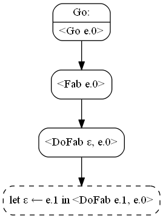
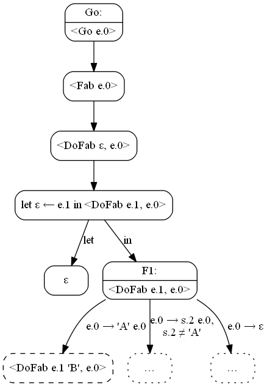
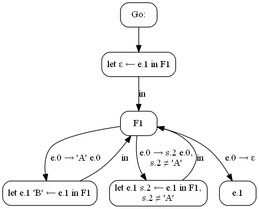

Опыт умозрительной дистилляции Рефала
=====================================

_**Hamilton Distillers,** Inc. is a private family-owned and operated
distillery company, founded by Stephen Paul in 2006, headquartered in Tucson,
Arizona. The company produces and markets three Single Malt Whiskey Del Bac
labels. Its current distillery facility, called Mash & Chisel, is located
in west Tucson, Arizona. Hamilton is the first craft distillery established
in Southern Arizona since prohibition and the largest Whiskey producer
in the Tucson metro region._

[Англоязычная Википедия о гамильтоновской дистилляции][en-ham-dist]

Введение
--------

Недавно я наткнулся на презентацию Гамильтона \[1], где он сравнительно
понятно описал свою дистиляцию. И задумался, а можно ли переложить эту
технологию на Рефал. Подумал-подумал, порисовал графы на листиках и понял,
что можно. В этом документе я продемонстрирую на примерах, как это можно
сделать.

Сразу замечу, что других работ Гамильтона я не читал, мне оказалось достаточным
той его презентации и краткого упоминания дистилляции в диссертации
Ключникова \[8]. Так, что я изобретаю велосипед с квадратными колёсами.

Текст ниже я пишу для себя и для нескольких своих коллег, поэтому
предполагается, что читатель знаком с основами суперкомпиляции и знает
язык Рефал. Если читатель не знаком с суперкомпиляцией, отсылаю его
к нескольким работам Турчина \[2, 3] и научно-популярной статье Ильи
Ключникова \[7].

Далее в работе я планирую рассмотреть диалект Рефала, для которого будут
формулироваться преобразования, на словах описать дистилляцию, как её я
понял и продемонстрировать её работу на нескольких примерах.

**Последующее изложение строится не на строгом формальном фундаменте,
а исключительно на интуитивных соображениях.** Этот документ не претендует
на истину, а лишь отражает моё понимание суперкомпиляции и дистилляции
на конец августа 2018 года.

Перестановочный Рефал
---------------------

Примеры ниже будут описаны на «перестановочном Рефале» — варианте ограниченного
Рефала, где (а) предложения могут дополняться условиями-отрицаниями,
и (б) образцы разных предложений не пересекаются. Поэтому он и называется
перестановочным — можно менять порядок предложений без изменения поведения
программы.

Для записи буду использовать синтаксис Рефала-5, дополненный этими
условиями-отрицаниями.

Предложение будет выглядеть следующим образом:

    ОбразцовоеВыражение [ "!" отрицание, … ] "=" Результатное выражение.

Отрицания могут иметь только следующий вид:

    s-переменная "≠" символ
    символ "≠" s-переменная
    s-переменная "≠" s-переменная

Символом `ε` я часто буду обозначать пустое выражение.

**Пример.** Функция, которая заменяет `'A'` на `'B'`:

    Fab {
      'A' e.Tail = 'B' <Fab e.Tail>;
      s.Other e.Tail ! s.Other ≠ 'A' = s.Other <Fab e.Tail>;
      ε = ε;
    }

Порядок предложений можно поменять:

    Fab {
      ε = ε;
      s.Other e.Tail ! s.Other ≠ 'A' = s.Other <Fab e.Tail>;
      'A' e.Tail = 'B' <Fab e.Tail>;
    }

Семантика функции от этого не изменится.

А вот функция, которая заменяет знаки `'A'` и `'B'` на знак `'C'`:

    Fabc {
      'A' e.R = 'C' <Fabc e.R>;
      s.X e.R ! s.X ≠ 'B', 'A' ≠ s.X = s.X <Fabc e.R>;
      'B' e.R = 'C' <Fabc e.R>;
      ε = ε;
    }

Можно показать, что любую функцию на ограниченном Рефале можно преобразовать
в эквивалентную функцию на перестановочном Рефале. Также можно показать,
что для любой функции на перестановочном Рефале можно записать эквивалентную
функцию на ограниченном Рефале, однако, с расширением области определения.

Можно определить преобразование прогонки, замкнутое на перестановочном Рефале.
При прогонке предложения с отрицаниями вместо переменных подставляются их
актуальные значения (возможно, обобщённые). Если отрицание обращается
в тавталогию, оно отбрасывается. Если отрицание становится противоречием,
уже отбрасывается сама ветвь. В остальных случаях отрицание «вешается» на ветвь
прогонки, а также добавляется в дочернюю конфигурацию как рестрикция.

Таким образом, перестановочный Рефал будет замкнут относительно суперкомпиляции
тоже. Можно определить алгоритм суперкомпиляции таким образом, что остаточная
программа будет в точности сохранять исходную семантику без расширения области
определения (в отличие от SCP4). А для дистилляции это свойство очень важно.

**Примечание.** Наверняка идея перестановочного Рефала давно известна
в рефал-сообществе, но в письменном виде я её пока ни разу не встречал.

Функции графа суперкомпиляции, в отличие от обычного Рефала, многоместные.
Поэтому для удобства записи остаточных программ мы будем полагать, что наш
диалект Рефала также поддерживает многоместные функции — их аргументы
мы будем разделять запятыми.

**Пример.** Функция замены `'A'` на `'B'` с аргументом-аккумулятором:

    Fab {
      e.X = <DoFab ε, e.X>;
    }

    DoFab {
      e.R, 'A' e.X = <DoFab e.R 'B', e.X>;
      e.R, s.Z e.X ! s.Z ≠ 'A' = <DoFab e.R s.Z, e.X>;
      e.R, ε = e.R;
    }

Запись `<F e.x, e.y, e.z>` можно полагать синтаксическим сахаром для записи
`<F (e.x) (e.y) (e.z)>` (аналогично трансформируются и образцы с запятыми).

**Примечание.** Ради этих запятых пришлось отделять отрицания от образца
восклицательным знаком. Если бы не многоместные функции, я бы использовал
запятую как в обычных условиях Рефала-5.

Свойство перестановочности предложений не очевидно из синтаксиса. Поэтому
будем полагать, что исполнитель перестановочного Рефала при компиляции
или перед запуском проверяет тот факт, что все образцы независимы и отвергает
программы, не удовлетворяющие этому условию. Или что у нас есть препроцессор,
который преобразует программы на ограниченном Рефале в программы
на перестановочном.

Далее, когда речь идёт о Рефале, я буду рассматривать перестановочный Рефал.

Что такое «дистилляция»
-----------------------

Дистилляция — это метод анализа и преобразования программ, похожий
на суперкомпиляцию. И является метасистемным переходом над нею. Точно также,
как и при суперкомпиляции, строится граф дистиляции, а по графу строится
остаточная программа.

В отличие от суперкомпиляции, в узлах графа дистиляции находятся
не конфигурации — параметризованные описания вычислительной среды,
а остаточные программы — результаты суперкомпиляции этих параметризованных
описаний. Прогонка, вложение и обобщение определяются уже не над
конфигурациями, а над этими остаточными программами.

Гамильтон формулировал свою дистилляцию для языка высшего порядка (по крайней
мере в презентации \[1], которую я смотрел, других его работ я не читал).
А я буду описывать дистилляцию для языка первого порядка — Рефала. Поэтому
тут надо понимать, чем отличается суперкомпиляция языка первого порядка
от суперкомпиляции языка высшего порядка.

Интерпретатор языка первого порядка содержит две области памяти: поле программы
и поле зрения. В первой области содержится неизменный исходный текст самой
программы, во второй — текущее состояние вычислений, обрабатываемые данные.
Аналогично у суперкомпилятора (как метасистемы над интерпретатором)
конфигурации являются обобщёнными значениями поля зрения, а поле программы
остаётся константным и неизменным.

Язык высшего порядка является в некотором смысле воплощением лямбда-исчисления,
а значит, между программой и данными нет чёткой границы. В памяти интерпретатора
находится некий лямбда-терм, который на каждом шаге переписывается по некоторым
правилам редукции. При этом без глобальных именованных функций в принципе можно
обойтись.

Таким образом, для языка высшего порядка исходная программа, остаточная
программа и конфигурация в общем являются одними и теми же конструктами.

А значит, дистилляцию Гамильтона можно рассматривать как разновидность
суперкомпиляции языка высшего порядка, конфигурации которого предстают
не в чистом виде, а после довольно глубокого преобразования (суперкомпиляции).
Дистилляцию Гамильтона таким образом можно сравнить с методом многоуровневой
суперкомпиляции, предложенной Ключниковым в своей диссертации \[8].
У Ключникова многоуровневый суперкомпилятор, когда надо обобщить два сильно
непохожих конфигурации, для дочерней конфигурации вызывает вспомогательный
суперкомпилятор для построения «улучшающей леммы» — подбирает другую
конфигурацию (методом перебора), которая текстуально короче текущей,
«лучше» по некоторому критерию и разворачивается в тот же граф конфигураций.
Как показывает Ключников, такая технология может производить достаточно
нетривиальные и интересные преобразования программ (см. его диссертацию).

Таким образом, из-за размытой границы между программой и данными, в дистилляции
Гамильтона теряется из виду её принципиальная особенность — сравнение
не конфигураций, а остаточных программ. И именно поэтому интереснее попробовать
перенести методы дистилляции на язык первого порядка, где программы и данные
различны.

Тривиальный пример на дистилляцию
---------------------------------

**Примечание.** Переменные в исходных программах будут именоваться
идентификаторами (буквами или словами), в остаточных программах — числами.

Результат суперкомпиляции — граф конфигураций. Результат дистилляции — граф
дистилляции. Узлы этого графа я буду называть _метаконфигурацями._ Термин,
возможно, неточный, но мне с ним будет удобнее. Внутри узла метаконфигурации
будет располагаться граф суперкомпиляции метаконфигурации.

Вместо графов суперкомпиляции я буду располагать в узлах сразу остаточные
программы в синтаксисе Рефала (читатель догадался, что перестановочного
Рефала). На корректность рассматриваемых примеров это не повлияет.

Рассмотрим тривиальный пример — функцию `Fab` (заменяющую `'A'` на `'B'`)
с аккумулятором:

    Go { e.0 = <Fab e.0>; }

    Fab { e.X = <DoFab ε, e.X>; }

    DoFab {
      e.R, 'A' e.Y = <DoFab e.R 'B', e.Y>;
      e.R, s.X e.Y ! s.X ≠ 'A' = <DoFab e.R s.X, e.Y>;
      e.R, ε = e.R;
    }

В этом примере и далее как исходные, так и суперкомпилируемые программы будут
начинаться с функции `Go`, аргументами которой будут служить только параметры
(мета)конфигурации в общем положении. Параметр стартовой конфигурации
по соглашению будем обозначать `e.0`.

Начнём строить граф дистилляции.

В метаконфигурации `M0` должен располагаться граф суперкомпиляции функции `Go`
исходной программы. Постром его.

Конфигурацию `F1` нужно прогонять. Нет ничего проще.

Конфигурация `F2` вкладывается в конфигурацию `F1` по отношению
Хигмана-Крускала (см. например стр. 10 в \[5]). Т.е. в конфигурации `F2` можно
стереть некоторые элементы (в данном случае символ `'B'`) и получить
конфигурацию `F1`.

Однако, не существует такой подстановки переменных, которая превращает `F1`
в `F2`. Приходится обобщать. Обобщение конфигураций `F1` и `F2` выглядит как

    `<Fab e.1, e.0>`

Заменим исходную конфигурацию `F1` на её обобщение:

Разделяем последнюю конфигурацию:

Прогоняем конфигурацию `F1`:

Конфигурация `<DoFab e.1 'B', e.0>` вкладывается в `F1`. Даже более того,
существует подстановка, переводящая `F1` в текущую анализируемую конфигурацию:
`e.1 'B' ← e.1`. Получается:

Аналогично анализируем следующую конфигурацию:

Последняя созданная конфигурация вкладывается в `F1` с подстановкой
`e.1 s.2 ← e.1`:

Граф суперкомпиляции построен полностью, исходная программа больше не нужна.
Удаляем транзитные узлы:

Можем выписать остаточную программу для этого графа:

    // Метаконфигурация M1

    Go { e.0 = <F1 ε, e.0>; }

    F1 {
      e.1, 'A' e.0 = <F1 e.1 'B', e.0>;
      e.1, s.2 e.0 ! s.2 ≠ 'A' = <F1 e.1 s.2, e.0>;
      e.1, ε = e.1;
    }

В результате суперкомпиляции просто изчез транзитный переход `Go` → `Fab`.
В остальном остаточная программа совпадает с исходной.

Неберущийся пример Турчина
--------------------------

Литература
----------
1. _Program Transformation in a Labelled Transition Systems Framework._
   G. W. Hamilton, School of Computing Dublin City University Dublin 9,
   Ireland, September 12, 2016,
   [(PDF)](https://research.jetbrains.org/files/material/57d7cced3d025.pdf)
2. Turchin V. F. _The concept of a supercompiler_ // ACM Transactions
   on Programming Languages and Systems, Volume 8, Issue 3, 1986. —
   P.292-325., [(PDF)][concept].
3. V. F. Turchin. _The School «Metacomputation in the Language Refal»._
   Obninsk, July 11-23, 1990.
   * _The Basics of Metacomputation. (Chapter 3)_ [(PDF)][school-chap-3]
   * _The Supercompiler. (Chapter 6)_ [(PDF)][school-chap-6]
4. V. F. Turchin. _The Language REFAL, the Theory of Compilation,
   and Metasystem Analysis._ Courant Institute Report #20,
   New York, 1980, 245 p. [(PDF)][courant]
5. V. F. Turchin. _Metacomputation: Metasystem transitions plus
   supercompilation._ In: Partial Evaluation, LNCS vol. 1110, 1996,
   pp. 481-509. [(PDF)][MST-plus-SCP]
6. Turchin V. F. _Program Transformation with Metasystem Transitions._
   J of Functional Programming 3(3) 283-313, 1993. _(PDF в открытом
   доступе не нашёл)_
7. Ключников И. Г., _Суперкомпиляция: идеи и методы_ // Практика
   функционального программирования, выпуск 7, апрель 2011.
   Ссылка: <http://fprog.ru/2011/issue7/>.
8. Ключников И. Г. _Выявление и доказательство свойств функциональных
   программ методами суперкомпиляции,_ Диссертация на соискание учёной
   степени кандидата физико-математических наук, Москва, 2010,
   [(PDF)](http://keldysh.ru/council/1/klyuchnikov-diss.pdf)

[en-ham-dist]: https://en.wikipedia.org/wiki/Hamilton_Distillers
[concept]: http://s3.amazonaws.com/arena-attachments/1312508/c80fd906ef6f24861e7b7cefae71ca55.pdf
[school-chap-3]: http://pat.keldysh.ru/~roman/doc/Turchin/1990-Turchin--The_Basics_of_Metacomputation--Obninsk_ch3.pdf
[school-chap-6]: http://pat.keldysh.ru/~roman/doc/Turchin/1990-Turchin--The_Supercompiler--Obninsk_ch6.pdf
[courant]: http://pat.keldysh.ru/~roman/doc/Turchin/1980-Turchin--The_Language_REFAL--The_Theory_of_Compilation_and_Metasystem_Analysis.pdf
[MST-plus-SCP]: http://refal.botik.ru/library/Turchin-Metacomputation_Metasystem_transitions_plus_supercompilation_(LNCS_vol_1110,_1996,_pp_481-509).pdf
