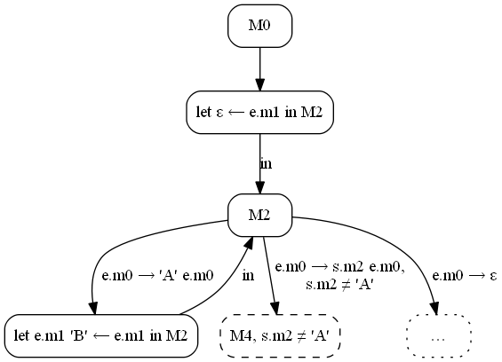

The Essay of Speculative Refal Distillation
===========================================

_Alexander Konovalov, August 2018_

**This is a translation from [russian source](distillery.md)**

_**Hamilton Distillers,** Inc. is a private family-owned and operated
distillery company, founded by Stephen Paul in 2006, headquartered in Tucson,
Arizona. The company produces and markets three Single Malt Whiskey Del Bac
labels. Its current distillery facility, called Mash & Chisel, is located
in west Tucson, Arizona. Hamilton is the first craft distillery established
in Southern Arizona since prohibition and the largest Whiskey producer
in the Tucson metro region._

[Wikipedia about of the Hamilton distillation][en-ham-dist]

<!-- The essay is dedicated to my muse A.N. -->

Introduction
------------

Recently I knocked into the Gamilton’s presenatation \[1] , where he described
his distillation relatively clear. I was thinking about whether it was possible
to shift this technology to the Refal language. I drew some graphs on paper,
and realized that I can do it. In this document I will demonstrate it
on examples.

Please take into consideration, that I didn’t read other Hamilton’s works,
it’s  seemed to me that the presentation about a brief description in Kluchnikov
dissertations \[8] should be enough. That’s why I will reinvent the wheel.

I will write the text below for me and for my other colleagues, I think that
reader must be familiar with the basics of supercompilation and knows the Refal
language. If the reader is not familiar with supercompilation he must read
a couple of Turchin’s works \[2,3] and the popular-science article by Ilya
Kluchnikov [7].

Further in the work, I plan to consider the Refal dialect, for which
transformations will be formulated, to describe distillation how I understood
it, and to demonstrate its work on several examples

**The further statement will be not on the strict formal fundament but
on intuitive considerations.** This document is not claiming for the truth
but represent my understanding of supercompilation and distillation for the end
of the August 2018.

Permutable Refal
----------------

The examples will be described in “permutable Refal” — the variant of strict
Refal language, where (a) the sentences can be extended by negative conditions
and (b) patterns of the different sentences are not overlapped. Therefore, it is
called permutable — you can change the order of sentences without changing
the program.

I will use the Refal-5 syntax, supplemented by these negative conditions.

Sentence will look like this:

    Pattern sentence [ "!" negation, … ] "=" Result sentence .

Negations can have only one form:

    s-variable "≠" symbol
    symbol "≠" s-variable
    s-variable "≠" s-argument

I will mark the `ε` symbol like an empty expression

**Example.** Function which replace `'A'` for `'B'`:

    Fab {
      'A' e.Tail = 'B' <Fab e.Tail>;
      s.Other e.Tail ! s.Other ≠ 'A' = s.Other <Fab e.Tail>;
      ε = ε;
    }

We can change the order of sentences:

    Fab {
      'A' e.Tail = 'B' <Fab e.Tail>;
      s.Other e.Tail ! s.Other ≠ 'A' = s.Other <Fab e.Tail>;
      ε = ε;
    }

Semantics of the function would not change.

Here is the function which replacing `'A'` and `'B'` for `'C'`.

    Fabc {
      'A' e.R = 'C' <Fabc e.R>;
      s.X e.R ! s.X ≠ 'B', 'A' ≠ s.X = s.X <Fabc e.R>;
      'B' e.R = 'C' <Fabc e.R>;
      ε = ε;
    }

It can be shown that any function on a strict Refal can be transformed into
an equivalent function on permutable Refal. It can also be shown that for any
function on permutable Refal, it is possible to write an equivalent function
on a strict Refal, however, with the extension of the domain of definition.

We can define the conversion of the driving, closed on the permutable Refal.
When a sentence with negatives is passed, instead of variables, their actual
values (possibly, generalized ones) are substituted. If the negation turns into
a tautology, it is discarded. If negation becomes a contradiction, the branch
itself is already discarded. In other cases, the negation is “hung up”
on the branch of the driving, and is also added to the child configuration
as a restriction.

In this way, permutable Refal will be also closed over supercompilation. We can
define the algorithm of supercompilation in a way that the residual program
will exactly preserve the original semantics without expanding the domain
of definition (unlike SCP4).  It is really important for distillation.

**Note.** Although the idea of permutable Refal is well known in Refal community
I’ve never came across to it.

The functions of the supercompilation graph, in contrast to the usual Refal,
are multiary. Therefore, for the convenience of writing residual programs,
we will assume that our Refal dialect also supports multiary functions —
we will separate their arguments with commas.

**Example.** The replacement function `'A'` for `'B'` with accumulator
parameter:

    Fab {
      e.X = <DoFab ε, e.X>;
    }

    DoFab {
      e.R, 'A' e.X = <DoFab e.R 'B', e.X>;
      e.R, s.Z e.X ! s.Z ≠ 'A' = <DoFab e.R s.Z, e.X>;
      e.R, ε = e.R;
    }

The `<F e.x, e.y, e.z>` record can be considered as syntactic sugar for the
record `<F (e.x) (e.y) (e.z)>` (patterns with commas are similarly transformed).

**Note.** For these commas, we had to separate the negatives from the pattern
with an exclamation mark. If it were not for multi-arity functions, I would use
a comma as in normal Refal-5.

The property of permutability of sentences is not obvious from the syntax. That
is way, we will assume that the interpreter of the permutation Refal, when
compiling or before launching, verifies that all patterns  are independent and
rejects programs that do not satisfy this condition. Or that we have
a preprocessor that transforms programs on a strict Refal into permutation
programs.

Further I will take a look on Permutable Refal

> *Translation to English of this hunk of this paper is prepared by*
> **Alina Skripacheva <alinagrant@yandex.ru>** _at 2019-01-31_

What is "distillation"
------------------------

Distillation — is the method of the analysis and conversion of programs similar
on supercompilation. And it is also metasystem transition over it. In the same
way, as well as at supercompilation, is built graph of distillation, and
according to the graph is built a residual program.

Unlike supercompilation, in nodes of the graph of distillation are not
configurations — parameterized descriptions of computing environment,
but residual programs — results of supercompilation of this parametrized
descriptions. The driving, embedding and generalization are defined not over
configurations, and over these residual programs.

Dr. Geoff Hamilton formulated its distillation for language of the higher
order (at least in presentation \[1], which I watched, but other his works
I did not read). And I will to describe the distillation for a language of
first order — Refal. Therefore here it is necessary to understand, what
differs in supercompilation of language of first order and supercompilation
of language of the higher order.

The interpreter of language of first order contains two areas of memory:
program field and view field. The first area contains a constant original
text programme itself, in the second — a current state of calculations,
the processed data. Similarly at the supercompiler (as metasystems over
the interpreter) configurations are the generalized view field values,
and a program field remains constant and invariable.

Language of the higher order is somewhat the embodiment of lambda-calculus,
so, between the program and data there is no clear divine. In memory of the
interpreter there is certain a lambda-term which on each step corresponds on
some rules of a reduction. At the same time without the global named
functions in principle it is possible manage.

Thus, for language of the higher order the source program, the residual
program and the configuration generally are the same constructs.

So, distillation of Hamilton can be considered as a kind of supercompilation
of a higher-order language whose configurations appear not in pure form,
but after a rather deep transformation (supercompilation). Distillation
of Hamilton thus can be compared with the method of multilevel
supercompilation proposed by Klyuchnikov in his dissertation \[8].
Klyuchnikov have a multi-level supercompiler, when it is necessary
to generalize the two strongly unlike configurations, for child
configuration calls a helper supercompiler to build the “improvement
Lemma” — picks up another configuration (brute force) that is textually
shorter than the current one, “better” according to some criterion,
and takes place in the same graph of congurations. As shown by Klyuchnikov,
this technology can produce enough nontrivial and interesting program
transformations (see his thesis).

Thus, due to the blurred boundary between program and data, in Hamilton’s
distillation lost sight of its fundamental feature — the comparison not
configurations, but residual programs. And that is why it is more interesting
to try transfer distillation methods to a first-order language where programs
and data are different.

A trivial example for distillation
---------------------------------

**Note.** Variables in the original programs will be referred to identifiers
(letters or words), in residual programs — numbers.

The result of supercompilation — is a graph of configurations.
The result of a distillation — is a graph of distillations. Nodes of this graph
I will call _metaconfigurations._ Term, perhaps inaccurate, but I’ll be more
comfortable with it. Inside the node of metaconfiguration will contain the
count of supercompilation of metaconfiguration.

Instead of supercompiling graphs, I will place the residual ones in the
nodes at once programs in Refal syntax (the reader guessed that the
permutable Refal). This will not affect the correctness of the considered
examples.

Consider a trivial example — the function `Fab` (replacing `'A'` with `'B'`)
with accumulator:

    Go { e.0 = <Fab e.0>; }

    Fab { e.X = <DoFab ε, e.X>; }

    DoFab {
      e.R, 'A' e.Y = <DoFab e.R 'B', e.Y>;
      e.R, s.X e.Y ! s.X ≠ 'A' = <DoFab e.R s.X, e.Y>;
      e.R, ε = e.R;
    }

In this example and further both source and supercompiled programs will be
start with the function `Go`, arguments which will serve as the only options
(meta)configurations in General position. Starting configuration parameter
the agreement will be denoted by `e.0`.

Let’s start building the distillation graph.

![distillery/1000-fab-dofab.dot] (distillery/1000-fab-dofab.png)

The meta configuration `M0` must contain the graph of supercompilation of the
`Go`function source program. Build it.

![distillery/1010-fab-dofab.dot] (distillery/1010-fab-dofab.png)

Configuration `F1` should be run. Nothing is easier.

![distillery/1020-fab-dofab.dot] (distillery/1020-fab-dofab.png)

The `F2` configuration is embedded in the `F1` configuration with respect to
Higman-Kruskal (see e.g. page 10 in \[5]). I.e. in the configuration of `F2`
erase some elements (in this case, the character `'B'`) and get
configuration `F1`.

> *Translation to English of this hunk of this paper is prepared by*
> **Alina Dzuceva <alina.dzuceva1996@mail.ru>** _at 2019-02-25_

Однако, не существует такой подстановки переменных, которая превращает `F1`
в `F2`. Приходится обобщать. Обобщение конфигураций `F1` и `F2` выглядит как

    `<Fab e.1, e.0>`

Заменим исходную конфигурацию `F1` на её обобщение:

Разделяем последнюю конфигурацию:

Прогоняем конфигурацию `F1`:

Конфигурация `<DoFab e.1 'B', e.0>` вкладывается в `F1`. Даже более того,
существует подстановка, переводящая `F1` в текущую анализируемую конфигурацию:
`e.1 'B' ← e.1`. Получается:

Аналогично анализируем следующую конфигурацию:

Последняя созданная конфигурация вкладывается в `F1` с подстановкой
`e.1 s.2 ← e.1`:

Вторая ветвь прогонки профакторизована. Переходим к третьей.

Транзитный шаг:

**Примечание.** В дальнейшем, чтобы не загромождать графы (суперкомпиляции
и дистилляции), для пассивных выражений в let-узлах мы не будем строить
потомков, их наличие будет подразумеваться. Т.е. предыдущий граф будет
выглядеть вот так:

Граф суперкомпиляции построен полностью, исходная программа больше не нужна.
Удаляем транзитные узлы:

Можем выписать остаточную программу для этого графа:

    /* Метаконфигурация M0 */

    Go { e.0 = <F1 ε, e.0>; }

    F1 {
      e.1, 'A' e.0 = <F1 e.1 'B', e.0>;
      e.1, s.2 e.0 ! s.2 ≠ 'A' = <F1 e.1 s.2, e.0>;
      e.1, ε = e.1;
    }

В результате суперкомпиляции просто изчез транзитный переход `Go` → `Fab`.
В остальном остаточная программа совпадает с исходной. Метаконфигурация `M0`
построена:

Начнём её прогонять:

В метаконфигурации `M1` мы должны построить остаточную программу для вызова

    <Go 'A' e.0>

программы из конфигурации `M0`

Конфигурация `F2` вкладывается по Хигману-Крускалу в `F1`. Обобщаем `F1`:

Остаточная программа конфигурации `M1` будет иметь вид

    /* Метаконфигурация M1 */

    Go { e.0 = <F1 ε, e.0>; }

    F1 {
      e.1, 'A' e.0 = <F1 e.1 'B', e.0>;
      e.1, s.2 e.0 ! s.2 ≠ 'A' = <F1 e.1 s.2, e.0>;
      e.1, ε = 'B' e.1;
               ^^^
    }

Остаточные программы идентичны за исключением символа `'B'` (подчёркнуто)
в последнем предложении. Иначе говоря, программу `M0` можно получить из `M1`
стиранием одного символа в результатном выражении. Можно сказать, что `M1`
вкладывается в `M0` по отношению Хигмана-Крускала.

Что будем делать дальше? В суперкомпиляции, когда две конфигурации похожи друг
на друга, выполняется или зацикливание (если есть подстановка переменных,
переводящая `M0` в `M1`), или обобщение (если такой подстановки нет). Но у нас
нет никаких переменных в `M0`. Да и вообще, мы пока не представляем, какие
могут быть переменные в остаточных программах.

Попробуем представить, что же будет обобщением остаточных программ `M0` и `M1`.
А будет вот такая программа:

    /* Попытка обобщения M0 и M1 */

    Go { e.0 = <F1 ε, e.0>; }

    F1 {
      e.1, 'A' e.0 = <F1 e.1 'B', e.0>;
      e.1, s.2 e.0 ! s.2 ≠ 'A' = <F1 e.1 s.2, e.0>;
      e.1, ε = [HOLE] e.1;
    }

Если на место «дырки» подставить `ε`, то получится программа `M0`. Если
на место «дырки» подставить `'B'`, получится `M1`. Дадим нашей «дырке»
какое-нибудь приличное название и обозначение.

    /* Обобщение M0 и M1 */

    Go { e.0 = <F1 ε, e.0>; }

    F1 {
      e.1, 'A' e.0 = <F1 e.1 'B', e.0>;
      e.1, s.2 e.0 ! s.2 ≠ 'A' = <F1 e.1 s.2, e.0>;
      e.1, ε = #e.m1# e.1;
    }

Let’s call `#e.m1#` — _macrovariable_. Indeed, macrovariable is a certain string,
the value of which is set from the outside, similar to the pre-processor macros
in C. After all, these macros can be defined not only by `#define` directives in
the source code, but also by compiler command-line parameters.

For the sake of brevity and euphony sometimes I will call macrovariables
as _macros_.

From the supercompiler’s perspective, macrovariable is some constant but unknown
value. S-macros can be restricted, for example, by being not equal to any
character.

When generalizing during the supercompilation, the previously constructed graph
is discarded. We’ll do the same during the distillation.

Where the metaconfiguration `M2` looks like this:

     /* Metaconfiguration M2 */

    Go { = <F1 ε, #e.m0#>; }

    F1 {
      e.1, 'A' e.0 = <F1 e.1 'B', e.0>;
      e.1, s.2 e.0 ! s.2 ≠ 'A' = <F1 e.1 s.2, e.0>;
      e.1, ε = #e.m1# e.1;
    }

Did you notice? The function `Go` lost its arguments, the argument of the
function `F1` also became a macro. The value of the macro in the function `F1`
will be matched with patterns `'A' e.0`, `s.2 e.0 ! s.2 ≠ 'A'` and `ε`.
Let’s drive the metaconfiguration through these macro values.

Supercompile the configuration `M3` (the residual graph is shown):

Pay attention to the red nodes. In the first case, the supercompiler does not
know the value of the macro `#e.m0#` and replaces it with a new e-variable.
In the second case, the value of the macro parameter is being returned.

The residual program will look like this:

    /* Metaconfiguration M3 */

    Go { = <F1 ε, #e.m0#>; }

    F1 {
      e.1, 'A' e.0 = <F1 e.1 'B', e.0>;
      e.1, s.2 e.0 ! s.2 ≠ 'A' = <F1 e.1 s.2, e.0>;
      e.1, ε = #e.m1# 'B' e.1;
    }

The metaconfiguration `M3` can be got from the metaconfiguration `M2`
by macro substitution `#e.m1# 'B' ← #e.m1#`. Let’s show it in the distillation
graph:

The configuration `M4` develops in a similar way:

We’re interested in the transition that highlighted in red. The supercompiler
doesn’t know which symbol is hidden behind `#s.m2#`, but it knows that it is
not equal to `'A'`. Therefore, it makes a transition. The residual program:

    /* Metaconfiguration M4 */

    Go { = <F1 ε, #e.m0#>; }

    F1 {
      e.1, 'A' e.0 = <F1 e.1 'B', e.0>;
      e.1, s.2 e.0 ! s.2 ≠ 'A' = <F1 e.1 s.2, e.0>;
      e.1, ε = #e.m1# #s.m2# e.1;
    }

The metaconfiguration `M4` can be got from the metaconfiguration `M2` by macro
substitution `#e.m1# #s.m2# ← #e.m1#`. Let’s show it in the graph:

The metaconfiguration `M5`:

The residual program looks like this:

    /* Metaconfiguration M4 */

    Go { = #e.m1#; }

In the function `Go`, there’s a constant expression that depends only on macros.
The distillation graph is fully constructed:

According to the graph, we can construct the residual (“distilled”) program:

    /* Distilled program */

    Go { e.m0 = <M2 ε, e.m0>; }

    M2 {

      e.m1, 'A' e.m0 = <M2 e.m1 'B', e.m0>;

      e.m1, s.m2 e.m0 ! s.m2 ≠ 'A' = <M2 e.m1 s.m2, e.m0>;

      e.m1, ε = e.m1;

    }

Obviously, the program is exactly the same as the initial one. That’s why it’s
a trivial example. It was needed to illustrate the conversion technique
on a very simple program.

Another trivial example (but with a nontrivial conclusion)
----------------------------------------------------------

Let’s consider the distillation of a program:

    Go { = <Fab2 #e.0#> }

    Fab2 {
      'A' e.X = 'B' <Fab2 e.X>;
      s.Z e.X ! s.Z ≠ 'A' = s.Z <Fab2 e.X>;
      ε = ε;
    }

Let’s start constructing the distillation graph:

Constructing the metaconfiguration `M0`:

It’s not hard to guess that the residual program will look like this:

    /* Metaconfiguration M0 */

    Go { = <F1 #e.0#>; }

    F1 {
      'A' e.X = 'B' <F1 e.X>;
      s.1 e.X ! s.1 ≠ 'A' = s.1 <F1 e.X>;
      ε = ε;
    }

The macro `#e.0#` falls into the function `F1` and the program branches
depending on its value. We have no other macros so we’re driving through it.

Constructing the metaconfiguration `M1`:

The residual program looks like this:

    /* Metaconfiguration M1 */

    Go { = 'B' <F1 #e.0#>; }

    F1 {
      'A' e.0 = 'B' <F1 e.0>;
      s.1 e.0 ! s.1 ≠ 'A' = s.1 <F1 e.0>;
      ε = ε;
    }

If you erase the symbol `'B'` in the function `Go` in the program `M1`, you’ll
get the program `M0`. “Dangerous similarity”. Let’s generalize the program `M0`
by adding the macro `#e.1#`:

    /* Metaconfiguration M2 */

    Go { = #e.1# <F1 #e.0#>; }

    F1 {
      'A' e.0 = 'B' <F1 e.0>;
      s.1 e.0 ! s.1 ≠ 'A' = s.1 <F1 e.0>;
      ε = ε;
    }

There’s no branching by the value of the macro `#e.1#` but there’s branching by
the macro `#e.0#` in the function `F1`. Starting the driving:

It’s easy to check that the residual program `M3` will look like this:

    /* Metaconfiguration M3 */

    Go { = #e.1# 'B' <F1 #e.0#>; }

    F1 {
      'A' e.0 = 'B' <F1 e.0>;
      s.1 e.0 ! s.1 ≠ 'A' = s.1 <F1 e.0>;
      ε = ε;
    }

There’s a substitution `#e.1# 'B' ← #e.1#` that transforms the program `M2`
into `M3`. Let’s loop back:

The metaconfiguration `M4` will look like this:

    /* Metaconfiguration M4 */

    Go { = #e.1# #s.2# <F1 #e.0#>; }

    F1 {
      'A' e.0 = 'B' <F1 e.0>;
      s.1 e.0 ! s.1 ≠ 'A' = s.1 <F1 e.0>;
      ε = ε;
    }

Once again, we have a substitution that transforms `M2` into `M4`. Looping back:

Finally, the metaconfiguration `M5` will look like this:

    /* Metaconfiguration M5 */

    Go { = #e.1#; }

The right part of the function `Go` is passive. The tree is constructed:

The distilled program:

    Go { e.0 = <M2 ε, e.0>; }

    M2 {
      e.1, 'A' e.0 = <M2 e.1 'B', e.0>;
      e.1, s.2 e.0 ! s.2 ≠ 'A' = <M2 e.1 s.2, e.0>;
      e.1, ε = e.1;
    }

The distillation procedure added a accumulator variable to the program. You can
find a way to refine the technique so that the program is identical to the
initial one (i.e. identical to `Fab2`). But we won’t do that. Instead,
let’s pay attention to the fact that the distilled program for `Fab2`
turned out to be identical to the distilled program from the previous
example (`Fab` + `DoFab`). I.e. **the distillation proved the nontrivial
fact of equivalence of these two programs.**

Turchin’s “irreducible” example
-------------------------------

It is known that supercompilation is able to fold some compositions
of functions. For example,

    Go { e.0 = <Fbc2 <Fab2 e.0>>; }

    Fab2 {
      'A' e.R = 'B' <Fab2 e.R>;
      s.X e.R ! s.X ≠ 'A' = s.X <Fab2 e.R>;
      ε = ε;
    }

    Fbc2 {
      'B' e.R = 'C' <Fbc2 e.R>;
      s.X e.R ! s.X ≠ 'B' = <Fbc2 e.R>;
      ε = ε;
    }

“speculative” supercompilation will fold it into a residual program
([graph](distillery/3000-fab-fbc.png)).

    Go { e.0 = <F1 e.0>; }

    F1 {
      'A' e.0 = 'C' <F1 e.0>;
      s.1 e.0 ! s.1 ≠ 'A' = <F2 s.1, e.0>;
      ε = ε;
    }

    F2 {
      'B', e.0 = 'C' <F1 e.0>;
      s.1, e.0 ! s.1 ≠ 'B' = s.1 <F1 e.0>;
    }

**Note**. Later on the supercompilation graphs will be given by hyperlinks
to avoid the narrative overloading.

Smart supercompiler would know to embed the function `F2` into the function
`F1` but we don’t have a smart compiler but a simple one.

But if the functions `Fab` and `Fbc` are written using accumulator variables,
then supercompilation is useless. Let’s consider the following example:

    Go { e.0 = <Fbc <Fab e.0>> }

    Fab { e.X = <DoFab ε, e.X>; }

    DoFab {
      e.R, 'A' e.X = <DoFab e.R 'B', e.X>;
      e.R, s.Z e.X ! s.Z ≠ 'A' = <DoFab e.R s.Z, e.X>;
      e.R, ε = e.R
    }

    Fbc { e.X = <DoFbc ε, e.X>; }

    DoFbc {
      e.R, 'B' e.X = <DoFbc e.R 'C', e.X>;
      e.R, s.Z e.X ! s.Z ≠ 'B' = <DoFbc e.R s.Z, e.X>;
      e.R, ε = e.R
    }

The residual program ([graph](distillery/3010-fab-fbc.png)) will look like this:

    Go { e.0 = <F1 ε, e.0>; }

    F1 {
      e.1, 'A' e.0 = <F1 e.1 'B', e.0>;
      e.1, s.2 e.0 ! s.2 ≠ 'A' = <F1 e.1 s.2, e.0>;
      e.1, ε = <F2 ε, e.1>;
    }

    F2 {
      e.2, 'B' e.1 = <F2 e.2 'C', e.1>;
      e.2, s.3 e.1 ! s.3 ≠ 'B' = <F2 e.2 s.3, e.1>;
      e.2, ε = e.2;

    }

As you can see, supercompilation removed the transit functions `Fab` and `Fbc`,
left the function `DoFbc` unchanged (renaming it to `F2`), replaced the
composition with a call to `F2` at the exit point of recursion of `F1`
(its prototype is `DoFab`). But supercompilation didn’t remove the
second pass through the input data.

This program can be found is some of Turchin’s works and he tries to
eliminate the composition in different complex ways. In particular,
in Courant report \[4, section 5.5] he’s using “differential metafunction”,
Turchin is using walk grammars in the work \[6]. I never understood how
successful these attempts are because the constructions of it are complex
and vague.

Let’s see how distillation handles this example. The only difference in
the task of distillation is that in the function `Go` is used a macro
and not a parameter:

    Go { = <Fbc <Fab #e.0#>>; }

    Fab { e.X = <DoFab ε, e.X>; }

    DoFab {
      e.R, 'A' e.X = <DoFab e.R 'B', e.X>;
      e.R, s.Z e.X ! s.Z ≠ 'A' = <DoFab e.R s.Z, e.X>;
      e.R, ε = e.R
    }

    Fbc { e.X = <DoFbc ε, e.X>; }

    DoFbc {
      e.R, 'B' e.X = <DoFbc e.R 'C', e.X>;
      e.R, s.Z e.X ! s.Z ≠ 'B' = <DoFbc e.R s.Z, e.X>;
      e.R, ε = e.R

    }

Starting constructing the graph:

We’ve already supercompiled this program, therefore, the residual program
in the metaconfiguration `M0` will differ only by the macro:

    /* Metaconfiguration M0 */

    Go { = <F1 ε, #e.0#>; }

    F1 {
      e.1, 'A' e.0 = <F1 e.1 'B', e.0>;
      e.1, s.2 e.0 ! s.2 ≠ 'A' = <F1 e.1 s.2, e.0>;
      e.1, ε = <F2 ε, e.1>;
    }

    F2 {
      e.2, 'B' e.1 = <F2 e.2 'C', e.1>;
      e.2, s.3 e.1 ! s.3 = 'B' = <F2 e.2 s.3, e.1>;
      e.2, ε = e.2;
    }

We have only one macro (`#e.0#`), it’s parsed in the function `F1`. Let’s start
the driving.

The residual program in the node `M1` will look like this
([graph]( distillery/3040-fab-fbc.png)):

    /* Metaconfiguration M1 */

    Go { = <F1 ε, #e.0#>; }

    F1 {
      e.1, 'A' e.0 = <F1 e.1 'B', e.0>;
      e.1, s.2 e.0 ! s.2 ≠ 'A' = <F1 e.1 s.2, e.0>;
      e.1, ε = <F2 ε, e.1>;
    }

    F2 {
      e.2, 'B' e.1 = <F2 e.2 'C', e.1>;
      e.2, s.3 e.1 ! s.3 = 'B' = <F2 e.2 s.3, e.1>;
      e.2, ε = 'C' e.2;
               ^^^
    }

The functions `M0` and `M1` are similar, they only differ by one symbol
in the third sentence. Let’s generalize by adding a macro to `M0`:

The program `M2` will look like this:

    /* Metaconfiguration M2 */

    Go { = <F1 ε, #e.0#>; }

    F1 {
      e.1, 'A' e.0 = <F1 e.1 'B', e.0>;
      e.1, s.2 e.0 ! s.2 ≠ 'A' = <F1 e.1 s.2, e.0>;
      e.1, ε = <F2 ε, e.1>;
    }

    F2 {
      e.2, 'B' e.1 = <F2 e.2 'C', e.1>;
      e.2, s.3 e.1 ! s.3 ≠ 'B' = <F2 e.2 s.3, e.1>;
      e.2, ε = #e.1# e.2;
    }

Starting the driving through `M2`:

The residual program in `M3` will look like this (the supercompilation graph
for `M3` is left as an exercise for the reader):

    /* Metaconfiguration M3 */

    Go { = <F1 ε, #e.0#>; }

    F1 {
      e.1, 'A' e.0 = <F1 e.1 'B', e.0>;
      e.1, s.2 e.0 ! s.2 ≠ 'A' = <F1 e.1 s.2, e.0>;
      e.1, ε = <F2 ε, e.1>;
    }

    F2 {
      e.2, 'B' e.1 = <F2 e.2 'C', e.1>;
      e.2, s.3 e.1 ! s.3 ≠ 'B' = <F2 e.2 s.3, e.1>;
      e.2, ε = #e.1# 'C' e.2;
    }

There’s a substitution `#e.1# 'C' ← #e.1#`that transforms the metaconfiguration
`M3` into `M2`. Let’s loop the graph back:

It gets interesting. Let’s construct the metaconfiguration `M4`. The graph
turned out cumbersome so I won’t add it to the text, follow the
[link](distillery/3080-fab-fbc.png) to see it. I'd like to pay attention
to the fragments that highlighted in red and blue.  The transition is
highlighted in red — the supercompiler knows that
the symbol `#s.1#` is not equal to `'A'`, therefore, it runs the second sentence
of the function `F1` right away. The fragment of the graph that is estimating
the actual value of the macrovariable `#s.1#` is highlighted
in blue.

The residual program that is constructed according to the graph looks like this:

    /* Metaconfiguration M4 */

    Go { = <F1 ε, #e.0#>; }

    F1 {
      e.1, 'A' e.0 = <F1 e.1 'B', e.0>;
      e.1, s.2 e.0 ! s.2 ≠ 'A' = <F1 e.1 s.2, e.0>;
      e.1, ε = <F2 #s.2#, e.1>;
    }

    F2 {
      'B', e.1 = <F3 ε, e.1>;
      s.2, e.1 ! s.2 ≠ 'B' = <F4 ε, s.2, e.1>;
    }

    F3 {
      e.3, 'B' e.1 = <F3 e.3 'C', e.1>;
      e.3, s.4 e.1 ! s.4 ≠ 'B' = <F3 e.3 s.4, e.1>;
      e.3, ε = #e.1# 'C' e.3;
    }

    F4 {
      e.3, s.2, 'B' e.1 = <F4 e.3 'C', s.2, e.1>;
      e.3, s.2, s.4 e.1 ! s.4 ≠ 'B' = <F4 e.3 s.4, s.2, e.1>;
      e.3, s.2, ε = #e.1# s.2 e.3;
    }

The metaconfiguration `M4` is not embedded into any of its ancestors
(`M2` or `M1`). Because there is no such renaming of variables and functions
in `M4` that will cause the record of `M4` to move to `M1` or `M2` after
erasing some elements. Therefore, we have no choice but to make a driving.

We can either drive through the macro `#e.0#` or the macro `#s.2#`.
Because there is no branching in the metaconfiguration `M4` by macro `#e.1#`.
The macrovariable `#e.0#` is in the cycle that’s represented by the function
`F1`. Let’s call the branching by this cycle a while-branching
by analogy with while-cycle:

    while (...) {
      ...
    }

The branching on the value of the macro `#s.2#` is outside the cycle
(function `F2`). Let’s call such branching an if-branching by analogy with
if-statement:

    if (...) {
      ...
    } else {
      ...
    }

If we use driving on the while-branching, we will only expand one iteration of
the cycle, the structure of the residual program will not change. The residual
program will just take into account a certain amount of initial data, for
example, will change the variable-accumulator. Note that in the previous
examples we used driving only on while-branching.

If you use driving on the if-branching, the branching operation will disappear.
In each of the branches there will be only separate branches of the former
conditional statement. It means that the structure of the residual program
will be simplified and its size will decrease. Hence, we have the heuristic —
you should give preference to if-branching.

Let’s drive the branching through the macros`#s.2#`.  The branches
of the driving are highlighted in blue in the metaconfiguration graph `M4`.

The construction of the metaconfiguration graph `M6` is left as an exercise to
the reader. Hint: you need to replace `#s.2#` with `'B'` in the program `M4`
and make a supercompilation the way it’s done previously.

It’s easy to make sure that the residual program for the metaconfiguration `M6`
will look like this:

    /* Metaconfiguration M6 */
    Go { = <F1 ε, #e.0#>; }

    F1 {
      e.1, 'A' e.0 = <F1 e.1 'B', e.0>;
      e.1, s.2 e.0 ! s.2 ≠ 'A' = <F1 e.1 s.2, e.0>;
      e.1, ε = <F2 ε, e.1>;
    }

    F2 {
      e.2, 'B' e.1 = <F2 e.2 'C', e.1>;
      e.2, s.3 e.1 ! s.4 ≠ 'B' = <F2 e.2 s.3, e.1>;
      e.2, ε = #e.1# 'C' e.2;
    }

It’s obvious that the program `M6` can be obtained from the program `M2` by
substitution`#e.1# 'C' ← #e.1#`. Let’s show it in the distillation graph:

The next unparsed metaconfiguration is `M7`. Let’s construct it.

The supercompilation graph is available [here](distillery/3110-fab-fbc.png).
As before, red shows the transition made by the supercompiler, knowing the
properties of the macro. The part of the graph above red completely repeats
the function `F1`. The residual program looks like this:

    /* Metaconfiguration M7 */
    Go { = <F1 ε, #e.0#>; }

    F1 {
      e.1, 'A' e.0 = <F1 e.1 'B', e.0>;
      e.1, s.2 e.0 ! s.2 ≠ 'A' = <F1 e.1 s.2, e.0>;
      e.1, ε = <F2 ε, e.1>;
    }

    F2 {
      e.2, 'B' e.1 = <F2 e.2 'C', e.1>;
      e.2, s.3 e.1 ! s.4 ≠ 'B' = <F2 e.2 s.3, e.1>;
      e.2, ε = #e.1# #s.2# e.2;
    }

The metaconfiguration `M2` is transformed into `M7` by substitution
`#e.1# #s.2# ← #e.1#`. Let’s show it in the graph:

There’s left the configuration `M5`  that is constructed trivially:

The residual program:

    /* Metaconfiguration M5 */

    Go { = #e.1#; }

The distillation graph is constructed:

The distillated program looks like this:

    Go { e.0 = <M2 ε, e.0>; }

    M2 {
      e.1, 'A' e.0 = <M2 e.1 'C', e.0>;
      e.1, s.2 e.0 ! s.2 ≠ 'A' = <M4 s.2, e.1, e.0>;
      e.1, ε = e.1;
    }

    M4 {
      'B', e.1, e.0 = <M2 e.1 'C', e.0>;
      s.2, e.1, e.0 ! s.2 ≠ 'B' = <M2 e.1 s.2, e.0>;
    }

The result is a program that makes one pass through the input data. Oddly
enough, the program structurally resembles the result of _supercompilation_
of the composition `<Fbc2 <Fab2 e.0>>` at the beginning of this section.
The only difference is that this program uses a variable-accumulator. If you
use the distillation on the composition`<Fbc2 <Fab2 e.0>>`, you can expect
a generally identical distillated program (see the results of the previous
section).

Naive reversing list
--------------------

I’ll take the following example directly from the Hamilton’s presentation \[1]
and will adapt it for Refal. Hamilton had it formulated for a pseudocode of a
higher-order functional language and it looked like this:

    nrev vs
    where
    nrev = λxs.case xs of
        [] => []
      | x′ : xs′ => app (nrev xs′) [x′]
    app = λxs.λys.case xs of
                      [] => ys
                    | x′ : xs′ => x′ : (app xs′ ys)

There are no Lisp’s lists in Refal and the concatenation operation is
fundamental and built into the language. Therefore, if you rewrite it verbatim,
the function app becomes unnecessary and the program itself becomes an effective
implementation of the reversing list in Refal:

    Go { e.vs = <nrev e.vs>; }

    nrev {
      ε = ε;
      t.x e.xs = <nrev e.xs> t.x;
    }

Therefore, we will explicitly imitate Lisp’s lists. An empty list we will show
as a term `NIL`, cons-cell as a term `(t.Head t.Tail)`. In this case the
function `nrev` will be shown like this:

    Go { t.vs = <nrev t.vs> }

    nrev {
      NIL = NIL;
      (t.x t.xs) = <app <nrev t.xs>, (t.x NIL)>;
    }

    app {
      NIL, t.ys = t.ys;
      (t.x t.xs), t.ys = (t.x <app t.xs, t.ys>);
    }

Let’s start to distillate it.

Let’s construct the metaconfiguration graph `M0` with initial starting
point `<Go #t.0#>`:

The residual program:

    /* Metaconfiguration M0 */

    Go { = <F1 #t.0#>; }

    F1 {
      NIL = NIL;
      (t.1 t.0) = <F2 (t.1 NIL), <F1 t.0>>;
    }

    F2 {
      t.3, NIL = t.3;
      t.3, (t.4 t.2) = (t.4 <F2 t.3 t.2>);
    }

The residual program differs from the initial one only by the order of
the arguments in the functions. The reason is because I put them in descending
order of numbers, for example, the format of the function `F2` looks like
`<F2 t.3, t.2>`.

In the graph and in the program there’s a narrowing of the macrovariable.
Starting the driving:

The metaconfiguration `M1` is supercompiled trivially, its residual program:

    /* Metaconfiguration M1 */

    Go { = NIL; }

Let’s construct the metaconfiguration `M2`. The graph of its supercompilation
is large, it’s available [here](distillery/4040-nrev.png). The residual program:

    /* Metaconfiguration M2 */

    Go { = <F3 <F1 #t.0#>>; }

    F1 {
      NIL = NIL;
      (t.2 t.1) = <F2 (t.2 NIL), <F1 t.1>>;
    }

    F2 {
      t.4, NIL = t.4;
      t.4, (t.5 t.3) = (t.5 <F2 t.4, t.3>);
    }

    F3 {
      NIL = (#t.1# NIL);
      (t.7 t.0) = (t.7 <F3 t.0>);
    }

The metaconfiguration `M2` is not embedded in `M0` because they’re not similar.
Keep driving on. The macro `#t.1#` is not parsed, the macro `#t.0#`
splits in the function `F1`. We’ll drive through it.

The metaconfiguration `M3` is driving through trivially.

    /* Metaconfiguration M3 */

    Go { = (#t.1# NIL); }

We’ll consider the configuration `M4`. The graph is available
[here](distillery/4070-nrev.png), the residual program:

    /* Metaconfiguration M4 */

    Go { = <F3 <F1 #t.0#>>; }

    F1 {
      NIL = NIL;
      (t.2 t.1) = <F2 (t.2 NIL), <F1 t.1>>;
    }

    F2 {
      t.4, NIL = t.4;
      t.4, (t.5 t.3) = (t.5 <F2 t.4, t.3>);
    }

    F3 {
      NIL = (#t.3# (#t.1# NIL));
      (t.7 t.0) = (t.7 <F3 t.0>);
    }

The program `M4` is embedded in `M2` – in the first sentence of the function
`M3` we can erase `(#t.3` and `)` and get the program `M2`. Let’s generalize.

The program in the metaconfiguration `M6` will look like this:

    /* Metaconfiguration M6 */

    Go { = <F3 <F1 #t.0#>>; }

    F1 {
      NIL = NIL;
      (t.2 t.1) = <F2 (t.2 NIL), <F1 t.1>>;
    }

    F2 {
      t.4, NIL = t.4;
      t.4, (t.5 t.3) = (t.5 <F2 t.4, t.3>);
    }

    F3 {
      NIL = #t.3#;
      (t.7 t.0) = (t.7 <F3 t.0>);
    }

As before, we’re driving through `#t.0#`:

The supercompilation `M7` makes the program:

    /* Metaconfiguration M7 */

    Go { = #t.3#; }

The configuration graph for `M8` is available [here](distillery/4110-nrev.png),
the residual program:

    /* Metaconfiguration M8 */

    Go { = <F3 <F1 #t.0#>>; }

    F1 {
      NIL = NIL;
      (t.2 t.1) = <F2 (t.2 NIL), <F1 t.1>>;
    }

    F2 {
      t.4, NIL = t.4;
      t.4, (t.5 t.3) = (t.5 <F2 t.4, t.3>);
    }

    F3 {
      NIL = (#t.4# #t.3#);
      (t.7 t.0) = (t.7 <F3 t.0>);
    }

There’s a substitution of macrovariables that transforms `M6` into `M8`,
it’s`(#t.4# #t.3#) ← #t.3#`. We’ll show it in the graph:

The distillation graph is fully constructed, the distillated program will
look like this:

    Go { t.0 = <M0 t.0>; }

    M0 {
      NIL = NIL;
      (t.1 t.0) = <M6 (t.1 NIL), t.0>;
    }

    M6 {
      t.3, NIL = t.3;
      t.3, (t.4 t.0) = <M6 (t.4 t.3), t.0>;
    }

It can be seen that the new program has not a quadratic (as the initial one)
but linear complexity and the variable-accumulator is used to reverse the list.
At the same time, the program has one expanded iteration of the cycle.

By the way, the distilled program in Hamilton’s presentation looks like this:

    case xs of
        [] => []
      | x′ : xs′ => let* w = []
                    in f x′ xs′ w
    where
    f = λx′.λxs′.λw.case xs′ of
                        [] => x′ : w
                      | x″ : xs″ => let* w′ = x′ : w
                                    in f x″ xs″ w′

There’s also an expanded first iteration but the elements of the collected list
(`w`) are transmitted separately.

I can’t resist adding that my distilled program looks more transparent
than Hamilton’s.

Fibonacci numbers
-----------------

Now we’ll look at how distillation can reduce the exponential complexity to
linear.

Fibonacci numbers is a sequence, the first two elements of which are equal
to 1 and 1, and each following element is the sum of the previous two:

1, 1, 2, 3, 5, 8, 13, 21, ...

If the elements of this sequence are numbered from zero, then the naive
function that calculates the n-th Fibonacci number will look like this:

    Fib {
      0 = 1;
      1 = 1;
      s.N = <+ <Fib <- s.N 2>> <Fib <- s.N 1>>>;
    }

The complexity of this function is exponential; and the base is the
number _φ_ = 1.6180339… that is the golden section. However, the n-th Fibonacci
number can be calculated with linear complexity:

    Fib {
      s.N = <DoFib s.N 1 1>;
    }

    DoFib {
      0   s.Nth s.Next = s.Nth;
      s.C s.Nth s.Next = <DoFib <- s.C 1> s.Next <+ s.Nth s.Next>>;
    }

Next, we’ll show how distillation can reduce the number of steps in the
calculation of the n-th Fibonacci number from exponential to linear. The
distillation procedure we’ve defined knows nothing about the arithmetic
axioms so we will use a unary numeral system. The letters `I`; will act
as counting rods.

    Fib {
      ε = I;
      I = I;
      I I e.N = <Fib I e.N> <Fib e.N>;
    }

We will make the last two sentences in a separate function, it will simplify
the intermediate calculations:

    Fib {
      ε = I;
      I e.N = <Fib1 I e.N>;
    }

    Fib1 {
      I = I;
      I I e.N = <Fib I e.N> <Fib e.N>;
    }

Let’s start to construct the distillation graph:

Let’s supercompile the metaconfiguration `M0` (the entry point is `<Fib #e.0#>`):

The residual program will look like this:

    /* Metaconfiguration M0 */
    Go { = <F1 #e.0#>; }

    F1 {
      ε = I;
      I e.0 = <F2 e.0>;
    }

    F2 {
      ε = I;
      I e.0 = <F2 e.0> <F1 e.0>;
    }

The program has the narrowing by the macro `#e.0#`; starting the driving:

The metaconfiguration `M1` develops into the constant:

    /* Metaconfiguration M1 */

    Go { = I; }

Let’s construct `M2`. The graph is available [here](distillery/5040-fib.png);
the residual program:

    /* Metaconfiguration M2 */

    Go { = <F1 #e.0#>; }

    F1 {
      ε = I;
      I e.0 = <F1 e.0> <F2 e.0>;
    }

    F2 {
      ε = I;
      I e.0 = <F1 e.0>;
    }

It’s funny that the functions `F1` and `F2` just switched places. The program
is not embedded into `M0` so we keep driving on.

The metaconfiguration `M3` is simple once again:

    /* Metaconfiguration M3 */

    Go { = I; }

Constructing `M4`. The graph is available [here](distillery/5070-fib.png);
the residual program:

    /* Metaconfiguration M4 */

    Go { = <F1 #e.0#> <F2 #e.0#>; }

    F1 {
      ε = I;
      I e.0 = <F1 e.0> <F2 e.0>;
    }

    F2 {
      ε = I;
      I e.0 = <F1 e.0>;
    }

The program `M4` is similar to the program `M2` – if you erase the call of `F2`
in the function Go, `M4` will transform into `M2`. Let’s generalize:

The program `M5` will look like this:

    /* Metaconfiguration M5 */

    Go { = <F1 #e.0#> #e.1#; }

    F1 {
      ε = I;
      I e.0 = <F1 e.0> <F2 e.0>;
    }

    F2 {
      ε = I;
      I e.0 = <F1 e.0>;
    }

Let’s use the driving:

`M6` will obviously look like this:

    /* Metaconfiguration M6 */

    Go { = I #e.1#; }

Constructing `M7`. It’s easy to make sure that the residual program will
look like this:

    /* Metaconfiguration M7 */

    Go { = <F1 #e.0#> <F2 #e.0#> #e.1#; }

    F1 {
      ε = I;
      I e.0 = <F1 e.0> <F2 e.0>;
    }

    F2 {
      ε = I;
      I e.0 = <F1 e.0>;
    }

(The construction of the graph will be left as an exercise for the reader in
case you don’t believe me).

The substitution `<F2 #e.0#> #e.1# ← #e.1#` transforms the
metaconfiguration `M5` into `M7`.

The metaconfiguration `M8` will look like this:

    /* Metaconfiguration M8 */

    Go { = <F2 #e.0#> #e.1#; }

    F1 {
      ε = I;
      I e.0 = <F1 e.0> <F2 e.0>;
    }

    F2 {
      ε = I;
      I e.0 = <F1 e.0>;
    }

I just put the left part of the reductive substitution in the function `Go`.
If you make a transit step and supercompile the metaconfiguration,
the functions `F1` and `F2` will simply switch their names:

    /* Metaconfiguration M9 */

    Go { = <F1 #e.0#> #e.1#; }

    F1 {
      ε = I;
      I e.0 = <F2 e.0>;
    }

    F2 {
      ε = I;
      I e.0 = <F2 e.0> <F1 e.0>;
    }

The configuration `M9` is embedded in the configuration `M0` but there’s no
reductive substitution. What should we do? Generalize `M0`.

    /* Metaconfiguration M10 */

    Go { = <F1 #e.0#> #e.1#; }

    F1 {
      ε = I;
      I e.0 = <F2 e.0>;
    }

    F2 {
      ε = I;
      I e.0 = <F2 e.0> <F1 e.0>;
    }

Let’s use the driving:

`M11` is constructed trivially:

Let’s construct the metaconfiguration `M12`. Its graph is available
[here](distillery/5160-fib.png); the residual program:

    /* Metaconfiguration M12 */

    Go { = <F1 #e.0#> #e.1#; }

    F1 {
      ε = I;
      I e.0 = <F1 e.0> <F2 e.0>;
    }

    F2 {
      ε = I;
      I e.0 = <F1 e.0>;
    }

The metaconfiguration `M12` literally coincided with the metaconfiguration `M5`.
We’ll drive it through `#e.0#`, like we did with `M5`.

The metaconfiguration `M13` is simply constructed:

Since `M12` literally coincides with `M5`, the residual program `M14` will be
literally the same as `M7`. `M7` is embedded in `M5`, therefore, `M14` will be
embedded in `M12` with the exact same substitution.

It is easy to guess that `M15` will literally coincide with `M8`.

    /* Metaconfiguration M15 */

    Go { = <F2 #e.0#> #e.1#; }

    F1 {
      ε = I;
      I e.0 = <F1 e.0> <F2 e.0>;
    }

    F2 {
      ε = I;
      I e.0 = <F1 e.0>;
    }

The transit step of supercompilation `M15` → `M16` (`M16` coincides with `M9`):

    /* Metaconfiguration M16 */

    Go { = <F1 #e.0#> #e.1#; }

    F1 {
      ε = I;
      I e.0 = <F2 e.0>;
    }

    F2 {
      ε = I;
      I e.0 = <F2 e.0> <F1 e.0>;
    }

The metaconfiguration `M16` literally coincides with `M10`!
Let’s loop the graph back:

The graph is fully constructed. Let’s reduce transit vertices for clarity:

The distillated program:

    Go { e.0 = <M10 ε, e.0> }

    M10 {
      e.1, ε = I e.1;
      e.1, I e.0 = <M12 e.1, e.0>;
    }

    M12 {
      e.1, ε = I e.1;
      e.1, I e.0 = <M12 <M10 e.1, e.0>, e.0>;
    }

Oddly enough, this program also calculates the Fibonacci numbers:

    <Go ε>
    <M10 ε, ε>
    I

    <Go I>
    <M10 ε, I>
    <M12 ε, ε>
    I

    <Go I I>
    <M10 ε, I I>
    <M12 ε, I>
    <M12 <M10 ε, ε>, ε>
    <M12 I, ε>
    I I

    <Go I I I>
    <M10 ε, I I I>
    <M12 ε, I I>
    <M12 <M10 ε, I>, I>
    <M12 <M12 ε, ε>, I>
    <M12 I, I>
    <M12 <M10 I, ε>, ε>
    <M12 I I, ε>
    I I I

    <Go I I I I>
    <M10 ε, I I I I>
    <M12 ε, I I I>
    <M12 <M10 ε, I I>, I I>
    <M12 <M12 ε, I>, I I>
    <M12 <M12 <M10 ε, ε>, ε>, I I>
    <M12 <M12 I, ε>, I I>
    <M12 I I, I I>
    <M12 <M10 I I, I>, I>
    <M12 <M12 I I, ε>, I>
    <M12 I I I, I>
    <M12 <M10 I I I, ε>, ε>
    <M12 I I I I, ε>
    I I I I I

But the 0th Fibonacci number was calculated in 2 steps, the 1st in 3 steps, the
2nd in 5 steps, the 3rd in 8 steps, the 4th in 13 steps. I.e. the exponential
complexity hasn’t gone away, the program only became more sophisticated.

In other words, the quality of the distilled program does not satisfy us.

And if the distillate strength is not enough for us, let’s raise its degree
by using the second distillation.

Fibonacci numbers, re-distillation
----------------------------------

What happens if we distillate the previously distilled program once again?

Let’s describe the task of distillation.

    Go { = <M10 ε, #e.0#> }

    M10 {
      e.1, ε = I e.1;
      e.1, I e.0 = <M12 e.1, e.0>;
    }

    M12 {
      e.1, ε = I e.1;
      e.1, I e.0 = <M12 <M10 e.1, e.0>, e.0>;
    }

And begin to construct the graph.

The metaconfiguration `M0` will be similar to the initial program with
renaming of functions
(exercise for the reader: construct the graph and make sure yourself).

    /* Metaconfiguration M0 */

    Go { = <F1 ε, #e.0#> }

    F1 {
      e.1, ε = I e.1;
      e.1, I e.0 = <F2 e.1, e.0>;
    }

    F2 {
      e.1, ε = I e.1;
      e.1, I e.0 = <F2 <F1 e.1, e.0>, e.0>;
    }

What to do next? Use driving, there’s no other option.

The metaconfiguration `M1` is constructed trivially.

Let’s construct the graph for `M2`. [Here](distillery/6030-fib2.png) it is.
The residual program:

    /* Metaconfiguration M2 */

    Go { = <F1 ε, #e.0#> }

    F1 {
      e.1, ε = I e.1;
      e.1, I e.0 = <F1 <F2 e.1, e.0>, e.0>;
    }

    F2 {
      e.1, ε = I e.1;
      e.1, I e.0 = <F1 e.1, e.0>;
    }

The functions `F1` and `F2` switched places, and in the function `Go` another
function is called. Something similar we saw in the previous section.
`M0` and `M2` are not similar to each other, therefore, we keep driving on.

The metaconfiguration `M3`:

We’ll have to supercompile `M4`. The graph is available
[here](distillery/6060-fib2.png); the residual program:

    /* Metaconfiguration M4 */

    Go { = <F1 ε, #e.0#> }

    F1 {
      e.1, ε = I I e.1;
      e.1, I e.0 = <F1 <F2 e.1, e.0>, e.0>;
    }

    F2 {
      e.1, ε = I e.1;
      e.1, I e.0 = <F1 e.1, e.0>;
    }

The metaconfigurations `M2` and `M4` are similar – if you erase one of the `I` in
the first sentence of the function `F1` in `M4`, you’ll get the metaconfiguration
`M2`. But they’re not embedded. What should we do? Generalize.

In `M2` we have the right part of `I e.1`, in `M4` - `I I e.1`. The question is
where to add the macro? It’s either `I #e.1# e.1`, or `#e.1# I e.1`. You can add
it randomly and try to use the driving. If it works – you guessed right, if not
– you can try the other option.

Or you can ponder for a while. Where did `I I e.1` in `M4` come from?

The first `I` was constructed from `F1`, the rest of `I e.1` is from `F2`.
Therefore, we should generalize  `I #e.1# e.1` . Yes, it’s a **speculation**;
an automatic distiller won’t be able to conduct such reasoning and can make
a wrong generalization (but it will fix it from the next iteration).
Or specifically for such case `I ~ I I` it can add two macros `#e.1# I #e.2#`.

The metaconfiguration `M5` looks like this:

    /* Metaconfiguration M5 */

    Go { = <F1 ε, #e.0#> }

    F1 {
      e.1, ε = I #e.1# e.1;
      e.1, I e.0 = <F1 <F2 e.1, e.0>, e.0>;
    }

    F2 {
      e.1, ε = I e.1;
      e.1, I e.0 = <F1 e.1, e.0>;
    }

Let’s use the driving (I won’t describe the branch `e.0 → ε` in detail):

The metaconfiguration `M7` will have [such](distillery/6100-fib2.png)
a graph and such a residual program:

    /* Metaconfiguration M7 */

    Go { = <F1 ε, #e.0#> }

    F1 {
      e.1, ε = I #e.1# I e.1;
      e.1, I e.0 = <F1 <F2 e.1, e.0>, e.0>;
    }

    F2 {
      e.1, ε = I #e.1# e.1;
      e.1, I e.0 = <F1 e.1, e.0>;
    }

On one hand, we’ve achieved some kind of success. Macro substitution
`#e.1# I ← #e.1#` in `M5` transforms the function `F1` of the program `M5`
into the function `F1` of the program `M7`. On the other hand, there’s a
difference in the function `F2`. In the parent configuration `M5` the right
part of the first sentence looks like `I e.1` , in the child configuration
`M7` it’s `I #e.1# e.1`. We’ll generalize once again, and the generalization
here is more obvious.

    /* Metaconfiguration M8 */

    Go { = <F1 ε, #e.0#> }

    F1 {
      e.1, ε = I #e.1# e.1;
      e.1, I e.0 = <F1 <F2 e.1, e.0>, e.0>;
    }

    F2 {
      e.1, ε = I #e.2# e.1;
      e.1, I e.0 = <F1 e.1, e.0>;
    }

Using the driving:

The metaconfiguration `M10` has the [graph](distillery/6130-fib2.png)
and the residual program:

    /* Metaconfiguration M10 */

    Go { = <F1 ε, #e.0#> }

    F1 {
      e.1, ε = I #e.1# I #e.2# e.1;
      e.1, I e.0 = <F1 <F2 e.1, e.0>, e.0>;
    }

    F2 {
      e.1, ε = I #e.1# e.1;
      e.1, I e.0 = <F1 e.1, e.0>;
    }

Not only the metaconfigurations `M8` and `M10` are similar, there’s a
substitution that transforms `M8` into `M10`!
It’s `#e.1# I #e.2# ← #e.1#, #e.1# ← #e.2#` . I.e. we can loop it back.

The graph is fully constructed. Let’s reduce it a little by removing
the transitions:

Let’s write the distilled program according to the graph:

    Go { e.0 = <M0 e.0>; }

    M0 {
      ε = I;
      I e.0 = <M8 ε, ε, e.0>;
    }

    M8 {
      e.2, e.1, ε = I e.1;
      e.2, e.1, I e.0 = <M8 e.1, e.1 I e.2, e.0>;
    }

We can make sure that this program calculates the Fibonacci numbers:

    <Go ε>
    <M0 ε>
    I

    <Go I>
    <M0 I>
    <M8 ε, ε, ε>
    I

    <Go I I>
    <M0 I I>
    <M8 ε, ε, I>
    <M8 ε, I, ε>
    I I

    <Go I I I>
    <M0 I I I>
    <M8 ε, ε, I I>
    <M8 ε, I, I>
    <M8 I, I I, ε>
    I I I

    <Go I I I I>
    <M0 I I I I>
    <M8 ε, ε, I I I>
    <M8 ε, I, I I>
    <M8 I, I I, I>
    <M8 I I, I I I I, ε>
    I I I I I

It calculates the Fibonacci numbers in the linear number of steps. But
we can’t say it can’t be done with the linear complexity because it’s Refal.
On Refal’s list implementations the copying of the variable `e.1` in
the function `M8` is performed with linear complexity from length,
and its length grows exponentially with each iteration of the cycle.
On vector implementations the concatenation `e.1 I e.2` is performed in linear
time from the lengths of `e.1` and `e.2`; and as it was already mentioned,
both of these variables grows exponentially with each iteration. If there
implementations of Refal that use more complex data structure
(e.g “ropes” \[9, 10] or deques with a concatenation, suggested by
Chris Okasaki\[11]) are developed, then there’s a chance to reduce
the actual complexity to O(N log N) or even O(N).

It should be noted that the example of distillation of Fibonacci numbers was
taken from the same Hamilton’s presentation \[1].
He describes it like this (slide 104):

> ### Futher Distillation Example
> The _fib_ function

    fib n
    where
    fib = λn.case n of
                Zero => Succ Zero
              | Succ n′ => case n′ of
                              Zero => Succ Zero
                            | Succ n″ => (fib n′) + (fib n″)

> is transformed to something similar to the following by distillation:

    f n (Succ Zero) (Succ Zero)
    where
    f = λn.λx.λy.case n of
                    Zero => x
                  | Succ n′ => f n′ y (x + y)

In other words, Hamilton in his presentation didn’t examine the transformation
itself, he just wrote that distillation is able to do it. I note that
Hamilton used a different representation of natural numbers. The sum
of the «counting rods» is expressed by simple concatenation; to add
the numbers represented by wrappers of the constructor `Succ`
around the constructor `Zero`, an explicit addition function
is needed.

Therefore, to make the analogy with Hamilton’s example more accurate natural
numbers should be represented as `0`, `(0)`, `((0))`, `(((0)))`…
Maybe someday I’ll experiment on this implementation.

Conclusions, comments, open questions
-------------------------------------

### Distillation of the first-order language is possible

The distillation technique can be adapted to the first-order language.
And maybe it’s even easier to understand the distillation for the
first-order language than for the higher-order language.

In his presentation Hamilton had to distinguish `let` in the supercompiler
residual programs and `let*` in the distillation tree. In the
first-order language there is no such need because the different
types of let-nodes are in the different graphs.

Also, due to syntactically different macros, there is no confusion between
the variables (parameters) of the supercompilation tree in the
metaconfigurations and the parameters in the distillation tree.

###Distillation is cooler than supercompilation

Examples have demonstrated that:

* distillation can reveal the composition of functions with accumulators,
* distillation can reduce algorithmic complexity.

Moreover, in these cases supercompilation couldn’t complete the task.
There are tricky examples where supercompilation can reduce
complexity but they’re unrealistic and not so interesting.

### You can do without macros

I was replacing distinct parts of the residual programs with «macros».
It’s possible to avoid macros by using input configuration parameters
instead of them. In this case the metaconfigurations from the previous
section could look like this:

    /* Metaconfiguration M5 */

    Go { e.1, e.0 = <F1 ε, e.1, e.0> }

    F1 {
      e.2, e.1, ε = I e.1 e.2;
      e.2, e.1, I e.0 = <F1 <F2 e.2, e.1, e.0>, e.1, e.0>;
    }

    F2 {
      e.2, e.1, ε = I e.2;
      e.2, e.1, I e.0 = <F1 e.2, e.1, e.0>;
    }

    /* Metaconfiguration M8 */
    Go { e.2, e.1, e.0 = <F1 ε, e.2, e.1, e.0> }

    F1 {
      e.3, e.2, e.1, ε = I e.1 e.3;
      e.3, e.2, e.1, I e.0 = <F1 <F2 e.3, e.2, e.1, e.0>, e.2, e.1, e.0>;
    }

    F2 {
      e.3, e.2, e.1, ε = I e.2 e.3;
      e.3, e.2, e.1, I e.0 = <F1 e.3, e.2, e.1, e.0>;
    }

It’s possible to make a reasoning for such notation but the notation would be
cumbersome and the arguments more complex. That’s why I chose macros.

### The embedding and generalization of two programs

I was using the following rule. If we have two programs `P1` and `P2`,
then the program `P2` is embedded in `P1`, given that:

* there is such a renaming of functions and variables in the program `P2` that
* you can erase the variables, symbols, pairs of round and angle brackets
  in the resulting parts of the program `P2` if their content is constant
  or depends on macros only; and the program `P2` will transform
  into the program `P1`.

During the generalization, there is such expression with macros
for two resulting expressions that there are macro substitutions
that translate their generalization into each of the expressions.

I performed supercompilation of the metaconfigurations manually.
Therefore, in order to avoid renaming, I was intentionally choosing
such names of the variables and functions that one program
will be embedded in another.

The practical distiller is likely to work not on the level of residual programs
in Refal syntax but on the level of graph representations.

### The macros in the patterns?

In all the above examples the differences between the residual programs
were found only in the resulting expressions. I don’t know if it’s possible
to find such an example where the residual programs will differ by the pattern
and the insertion of the macro to the left part will be meaningful in the
context of distillation.

### Multistory distillation?

The considered speculative distiller uses a supercompiler to construct residual
programs in the metaconfigurations nodes. And as a result it constructs
a graph similar to the supercompilation graph, from which you can also extract
the residual program.

Thus, the distiller is a metasystemic transition over supercompilation.

In Turchin’s “The Phenomenon of Science” he describes a metasystemic
staircase and this staircase can be described for distillation also.

The “first-order” distiller uses a supercompiler to construct
metaconfigurations. The “second-order” distiller will use the
“first-order” distiller for the same purpose. And so on.

We already know the task in which second-order distiller will work better
– Fibonacci numbers. There’s a reason to expect that in cases where
re-distillation works good, the second-order distillation will
work just as well.

### Rectification of programs?

A brief excursion into alcohol distillation.

There are two technologies for producing strong drinks:
_distillation_ and _rectification_. The feedstock (wine or pruno) has a low
concentration of alcohol and also contains harmful substances
(more harmful than ethyl alcohol) – methanol, acetylene and fusel oils. All these
substances have a different boiling point. Ethanol boils at 78 °C, methanol
and acetylene at lower temperature, fusel oils boils at the temperature higher
than ethyl alcohol. The difference in the boiling points is used
for their separation.

**Distillation** uses a temporal separation of fractions. The feedstock is
gradually heated in the distillation still and therefore low-boiling “angel’s
cuts” are boiled away in the first place, then ethanol starts to boil
(base fraction); when the alcohol is boiled away, fusel oils start to evaporate.

Distillation products: moonshine, whiskey, rum, cognac.

**Rectification** uses spatial separation of fractions. The vapor heated
to the high temperature enters the fractional column – a tower in which spatial
temperature gradient is maintained – from the bottom. At lower levels the
temperature is too high for ethanol and head fractions to condense. Only fusel
oils are precipitated. In the middle the temperature is lower, ethyl alcohol
can be precipitated. Angel’s cuts are condensed at the very top because all
the alcohol has been settled “the floor below”. 

Rectification product: vodka.

Rectification technology allows to obtain a purer alcohol than distillation
technology. Is it good or not, everyone decides for himself. Those who love
whiskey or moonshine sometimes appreciate these products for the bouquet
which is created by a small concentration of fusel oils. On the other hand,
distillation drinks can cause a more severe hangover because of fusel oils.

Why did I pay so much attention to it? Because the question is **what should
transformation program technology look like so it can be called
the _rectification_ of programs?**

### Why does distillation works at all?

I don’t know that yet.

> *Translation to English of this hunk of this paper is prepared by*
> **Iolanta Grabchilova <ilona.vetrova@bk.ru>** _at 2019-02-28_

> *Markown of this hunk of this paper is prepared by*
> **Maria Velichko <mary_velichko@mail.ru>** and
> **Yana Karaseva <yana.karaseva.97@mail.ru>** _at 2019-03-14_

References
----------

1. _Program Transformation in a Labelled Transition Systems Framework._
   G. W. Hamilton, School of Computing Dublin City University Dublin 9,
   Ireland, September 12, 2016,
   [(PDF)](https://research.jetbrains.org/files/material/57d7cced3d025.pdf)
2. Turchin V. F. _The concept of a supercompiler_ // ACM Transactions
   on Programming Languages and Systems, Volume 8, Issue 3, 1986. —
   P.292-325., [(PDF)][concept].
3. V. F. Turchin. _The School «Metacomputation in the Language Refal»._
   Obninsk, July 11-23, 1990.
   * _The Basics of Metacomputation. (Chapter 3)_ [(PDF)][school-chap-3]
   * _The Supercompiler. (Chapter 6)_ [(PDF)][school-chap-6]
4. V. F. Turchin. _The Language REFAL, the Theory of Compilation,
   and Metasystem Analysis._ Courant Institute Report #20,
   New York, 1980, 245 p. [(PDF)][courant]
5. V. F. Turchin. _Metacomputation: Metasystem transitions plus
   supercompilation._ In: Partial Evaluation, LNCS vol. 1110, 1996,
   pp. 481-509. [(PDF)][MST-plus-SCP]
6. Turchin V. F. _Program Transformation with Metasystem Transitions._
   J of Functional Programming 3(3) 283-313, 1993. _(no public avaliable PDF)_
7. Klyuchnikov I. G., _Supercompilation: ideas and methods_ // Practice
   of functional programming, issue 7, April 2011
   URL: <http://fprog.ru/2011/issue7/> (in Russian).
8. Klyuchnikov I. G., _Inferring and proving properties of functional programs
   by means of supercompilation_, PhD thesis, Moscow, 2010,
   [(PDF)](http://keldysh.ru/council/1/klyuchnikov-diss.pdf) (in Russian)
9. Wikipedia contributors. (2018, July 17). Rope (data structure).
   In _Wikipedia, The Free Encyclopedia._ Retrieved 11:10, August 27, 2018,
   from <https://en.wikipedia.org/w/index.php?title=Rope_(data_structure)&oldid=850712918>
10. «Ropes — fast strings», Flux, article on Habr, ссылка:
    <https://habr.com/post/144736/> (in Russian).
11. Chris Okasaki, _Purely Functional Data Structures_ —
    URL: <https://www.cs.cmu.edu/~rwh/theses/okasaki.pdf>

<!-- длинные URL’ы в подвале для того, чтобы они не рвали ткань текста -->

[en-ham-dist]: https://en.wikipedia.org/wiki/Hamilton_Distillers
[concept]: http://s3.amazonaws.com/arena-attachments/1312508/c80fd906ef6f24861e7b7cefae71ca55.pdf
[school-chap-3]: http://pat.keldysh.ru/~roman/doc/Turchin/1990-Turchin--The_Basics_of_Metacomputation--Obninsk_ch3.pdf
[school-chap-6]: http://pat.keldysh.ru/~roman/doc/Turchin/1990-Turchin--The_Supercompiler--Obninsk_ch6.pdf
[courant]: http://pat.keldysh.ru/~roman/doc/Turchin/1980-Turchin--The_Language_REFAL--The_Theory_of_Compilation_and_Metasystem_Analysis.pdf
[MST-plus-SCP]: http://refal.botik.ru/library/Turchin-Metacomputation_Metasystem_transitions_plus_supercompilation_(LNCS_vol_1110,_1996,_pp_481-509).pdf
