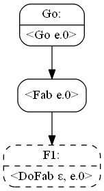
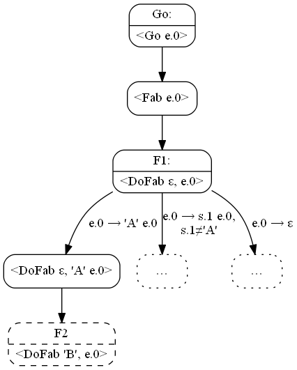

Опыт умозрительной дистилляции Рефала
=====================================

_Александр Коновалов, август 2018_

_**Hamilton Distillers,** Inc. is a private family-owned and operated
distillery company, founded by Stephen Paul in 2006, headquartered in Tucson,
Arizona. The company produces and markets three Single Malt Whiskey Del Bac
labels. Its current distillery facility, called Mash & Chisel, is located
in west Tucson, Arizona. Hamilton is the first craft distillery established
in Southern Arizona since prohibition and the largest Whiskey producer
in the Tucson metro region._

[Англоязычная Википедия о гамильтоновской дистилляции][en-ham-dist]

<!-- Эссе посвящается моей музе А.Н. -->

Введение
--------

Недавно я наткнулся на презентацию Гамильтона \[1], где он сравнительно
понятно описал свою дистиляцию. И задумался, а можно ли переложить эту
технологию на Рефал. Подумал-подумал, порисовал графы на листиках и понял,
что можно. В этом документе я продемонстрирую на примерах, как это можно
сделать.

Сразу замечу, что других работ Гамильтона я не читал, мне оказалось достаточным
той его презентации и краткого упоминания дистилляции в диссертации
Ключникова \[8]. Так, что я изобретаю велосипед с квадратными колёсами.

Текст ниже я пишу для себя и для нескольких своих коллег, поэтому
предполагается, что читатель знаком с основами суперкомпиляции и знает
язык Рефал. Если читатель не знаком с суперкомпиляцией, отсылаю его
к нескольким работам Турчина \[2, 3] и научно-популярной статье Ильи
Ключникова \[7].

Далее в работе я планирую рассмотреть диалект Рефала, для которого будут
формулироваться преобразования, на словах описать дистилляцию, как её я
понял и продемонстрировать её работу на нескольких примерах.

**Последующее изложение строится не на строгом формальном фундаменте,
а исключительно на интуитивных соображениях.** Этот документ не претендует
на истину, а лишь отражает моё понимание суперкомпиляции и дистилляции
на конец августа 2018 года.

Перестановочный Рефал
---------------------

Примеры ниже будут описаны на «перестановочном Рефале» — варианте ограниченного
Рефала, где (а) предложения могут дополняться условиями-отрицаниями,
и (б) образцы разных предложений не пересекаются. Поэтому он и называется
перестановочным — можно менять порядок предложений без изменения поведения
программы.

Для записи буду использовать синтаксис Рефала-5, дополненный этими
условиями-отрицаниями.

Предложение будет выглядеть следующим образом:

    ОбразцовоеВыражение [ "!" отрицание, … ] "=" Результатное выражение.

Отрицания могут иметь только следующий вид:

    s-переменная "≠" символ
    символ "≠" s-переменная
    s-переменная "≠" s-переменная

Символом `ε` я часто буду обозначать пустое выражение.

**Пример.** Функция, которая заменяет `'A'` на `'B'`:

    Fab {
      'A' e.Tail = 'B' <Fab e.Tail>;
      s.Other e.Tail ! s.Other ≠ 'A' = s.Other <Fab e.Tail>;
      ε = ε;
    }

Порядок предложений можно поменять:

    Fab {
      ε = ε;
      s.Other e.Tail ! s.Other ≠ 'A' = s.Other <Fab e.Tail>;
      'A' e.Tail = 'B' <Fab e.Tail>;
    }

Семантика функции от этого не изменится.

А вот функция, которая заменяет знаки `'A'` и `'B'` на знак `'C'`:

    Fabc {
      'A' e.R = 'C' <Fabc e.R>;
      s.X e.R ! s.X ≠ 'B', 'A' ≠ s.X = s.X <Fabc e.R>;
      'B' e.R = 'C' <Fabc e.R>;
      ε = ε;
    }

Можно показать, что любую функцию на ограниченном Рефале можно преобразовать
в эквивалентную функцию на перестановочном Рефале. Также можно показать,
что для любой функции на перестановочном Рефале можно записать эквивалентную
функцию на ограниченном Рефале, однако, с расширением области определения.

Можно определить преобразование прогонки, замкнутое на перестановочном Рефале.
При прогонке предложения с отрицаниями вместо переменных подставляются их
актуальные значения (возможно, обобщённые). Если отрицание обращается
в тавталогию, оно отбрасывается. Если отрицание становится противоречием,
уже отбрасывается сама ветвь. В остальных случаях отрицание «вешается» на ветвь
прогонки, а также добавляется в дочернюю конфигурацию как рестрикция.

Таким образом, перестановочный Рефал будет замкнут относительно суперкомпиляции
тоже. Можно определить алгоритм суперкомпиляции таким образом, что остаточная
программа будет в точности сохранять исходную семантику без расширения области
определения (в отличие от SCP4). А для дистилляции это свойство очень важно.

**Примечание.** Наверняка идея перестановочного Рефала давно известна
в рефал-сообществе, но в письменном виде я её пока ни разу не встречал.

Функции графа суперкомпиляции, в отличие от обычного Рефала, многоместные.
Поэтому для удобства записи остаточных программ мы будем полагать, что наш
диалект Рефала также поддерживает многоместные функции — их аргументы
мы будем разделять запятыми.

**Пример.** Функция замены `'A'` на `'B'` с аргументом-аккумулятором:

    Fab {
      e.X = <DoFab ε, e.X>;
    }

    DoFab {
      e.R, 'A' e.X = <DoFab e.R 'B', e.X>;
      e.R, s.Z e.X ! s.Z ≠ 'A' = <DoFab e.R s.Z, e.X>;
      e.R, ε = e.R;
    }

Запись `<F e.x, e.y, e.z>` можно полагать синтаксическим сахаром для записи
`<F (e.x) (e.y) (e.z)>` (аналогично трансформируются и образцы с запятыми).

**Примечание.** Ради этих запятых пришлось отделять отрицания от образца
восклицательным знаком. Если бы не многоместные функции, я бы использовал
запятую как в обычных условиях Рефала-5.

Свойство перестановочности предложений не очевидно из синтаксиса. Поэтому
будем полагать, что исполнитель перестановочного Рефала при компиляции
или перед запуском проверяет тот факт, что все образцы независимы и отвергает
программы, не удовлетворяющие этому условию. Или что у нас есть препроцессор,
который преобразует программы на ограниченном Рефале в программы
на перестановочном.

Далее, когда речь идёт о Рефале, я буду рассматривать перестановочный Рефал.

Что такое «дистилляция»
-----------------------

Дистилляция — это метод анализа и преобразования программ, похожий
на суперкомпиляцию. И является метасистемным переходом над нею. Точно также,
как и при суперкомпиляции, строится граф дистиляции, а по графу строится
остаточная программа.

В отличие от суперкомпиляции, в узлах графа дистиляции находятся
не конфигурации — параметризованные описания вычислительной среды,
а остаточные программы — результаты суперкомпиляции этих параметризованных
описаний. Прогонка, вложение и обобщение определяются уже не над
конфигурациями, а над этими остаточными программами.

Гамильтон формулировал свою дистилляцию для языка высшего порядка (по крайней
мере в презентации \[1], которую я смотрел, других его работ я не читал).
А я буду описывать дистилляцию для языка первого порядка — Рефала. Поэтому
тут надо понимать, чем отличается суперкомпиляция языка первого порядка
от суперкомпиляции языка высшего порядка.

Интерпретатор языка первого порядка содержит две области памяти: поле программы
и поле зрения. В первой области содержится неизменный исходный текст самой
программы, во второй — текущее состояние вычислений, обрабатываемые данные.
Аналогично у суперкомпилятора (как метасистемы над интерпретатором)
конфигурации являются обобщёнными значениями поля зрения, а поле программы
остаётся константным и неизменным.

Язык высшего порядка является в некотором смысле воплощением лямбда-исчисления,
а значит, между программой и данными нет чёткой границы. В памяти интерпретатора
находится некий лямбда-терм, который на каждом шаге переписывается по некоторым
правилам редукции. При этом без глобальных именованных функций в принципе можно
обойтись.

Таким образом, для языка высшего порядка исходная программа, остаточная
программа и конфигурация в общем являются одними и теми же конструктами.

А значит, дистилляцию Гамильтона можно рассматривать как разновидность
суперкомпиляции языка высшего порядка, конфигурации которого предстают
не в чистом виде, а после довольно глубокого преобразования (суперкомпиляции).
Дистилляцию Гамильтона таким образом можно сравнить с методом многоуровневой
суперкомпиляции, предложенной Ключниковым в своей диссертации \[8].
У Ключникова многоуровневый суперкомпилятор, когда надо обобщить два сильно
непохожих конфигурации, для дочерней конфигурации вызывает вспомогательный
суперкомпилятор для построения «улучшающей леммы» — подбирает другую
конфигурацию (методом перебора), которая текстуально короче текущей,
«лучше» по некоторому критерию и разворачивается в тот же граф конфигураций.
Как показывает Ключников, такая технология может производить достаточно
нетривиальные и интересные преобразования программ (см. его диссертацию).

Таким образом, из-за размытой границы между программой и данными, в дистилляции
Гамильтона теряется из виду её принципиальная особенность — сравнение
не конфигураций, а остаточных программ. И именно поэтому интереснее попробовать
перенести методы дистилляции на язык первого порядка, где программы и данные
различны.

Тривиальный пример на дистилляцию
---------------------------------

**Примечание.** Переменные в исходных программах будут именоваться
идентификаторами (буквами или словами), в остаточных программах — числами.

Результат суперкомпиляции — граф конфигураций. Результат дистилляции — граф
дистилляции. Узлы этого графа я буду называть _метаконфигурацями._ Термин,
возможно, неточный, но мне с ним будет удобнее. Внутри узла метаконфигурации
будет располагаться граф суперкомпиляции метаконфигурации.

Вместо графов суперкомпиляции я буду располагать в узлах сразу остаточные
программы в синтаксисе Рефала (читатель догадался, что перестановочного
Рефала). На корректность рассматриваемых примеров это не повлияет.

Рассмотрим тривиальный пример — функцию `Fab` (заменяющую `'A'` на `'B'`)
с аккумулятором:

    Go { e.0 = <Fab e.0>; }

    Fab { e.X = <DoFab ε, e.X>; }

    DoFab {
      e.R, 'A' e.Y = <DoFab e.R 'B', e.Y>;
      e.R, s.X e.Y ! s.X ≠ 'A' = <DoFab e.R s.X, e.Y>;
      e.R, ε = e.R;
    }

В этом примере и далее как исходные, так и суперкомпилируемые программы будут
начинаться с функции `Go`, аргументами которой будут служить только параметры
(мета)конфигурации в общем положении. Параметр стартовой конфигурации
по соглашению будем обозначать `e.0`.

Начнём строить граф дистилляции.

В метаконфигурации `M0` должен располагаться граф суперкомпиляции функции `Go`
исходной программы. Постром его.

Конфигурацию `F1` нужно прогонять. Нет ничего проще.

Конфигурация `F2` вкладывается в конфигурацию `F1` по отношению
Хигмана-Крускала (см. например стр. 10 в \[5]). Т.е. в конфигурации `F2` можно
стереть некоторые элементы (в данном случае символ `'B'`) и получить
конфигурацию `F1`.

Однако, не существует такой подстановки переменных, которая превращает `F1`
в `F2`. Приходится обобщать. Обобщение конфигураций `F1` и `F2` выглядит как

    `<Fab e.1, e.0>`

Заменим исходную конфигурацию `F1` на её обобщение:

Разделяем последнюю конфигурацию:

Прогоняем конфигурацию `F1`:

Конфигурация `<DoFab e.1 'B', e.0>` вкладывается в `F1`. Даже более того,
существует подстановка, переводящая `F1` в текущую анализируемую конфигурацию:
`e.1 'B' ← e.1`. Получается:

Аналогично анализируем следующую конфигурацию:

Последняя созданная конфигурация вкладывается в `F1` с подстановкой
`e.1 s.2 ← e.1`:

Вторая ветвь прогонки профакторизована. Переходим к третьей.

Транзитный шаг:

**Примечание.** В дальнейшем, чтобы не загромождать графы (суперкомпиляции
и дистилляции), для пассивных выражений в let-узлах мы не будем строить
потомков, их наличие будет подразумеваться. Т.е. предыдущий граф будет
выглядеть вот так:

Граф суперкомпиляции построен полностью, исходная программа больше не нужна.
Удаляем транзитные узлы:

Можем выписать остаточную программу для этого графа:

    /* Метаконфигурация M0 */

    Go { e.0 = <F1 ε, e.0>; }

    F1 {
      e.1, 'A' e.0 = <F1 e.1 'B', e.0>;
      e.1, s.2 e.0 ! s.2 ≠ 'A' = <F1 e.1 s.2, e.0>;
      e.1, ε = e.1;
    }

В результате суперкомпиляции просто изчез транзитный переход `Go` → `Fab`.
В остальном остаточная программа совпадает с исходной. Метаконфигурация `M0`
построена:

Начнём её прогонять:

В метаконфигурации `M1` мы должны построить остаточную программу для вызова

    <Go 'A' e.0>

программы из конфигурации `M0`

Конфигурация `F2` вкладывается по Хигману-Крускалу в `F1`. Обобщаем `F1`:

Остаточная программа конфигурации `M1` будет иметь вид

    /* Метаконфигурация M1 */

    Go { e.0 = <F1 ε, e.0>; }

    F1 {
      e.1, 'A' e.0 = <F1 e.1 'B', e.0>;
      e.1, s.2 e.0 ! s.2 ≠ 'A' = <F1 e.1 s.2, e.0>;
      e.1, ε = 'B' e.1;
               ^^^
    }

Остаточные программы идентичны за исключением символа `'B'` (подчёркнуто)
в последнем предложении. Иначе говоря, программу `M0` можно получить из `M1`
стиранием одного символа в результатном выражении. Можно сказать, что `M1`
вкладывается в `M0` по отношению Хигмана-Крускала.

Что будем делать дальше? В суперкомпиляции, когда две конфигурации похожи друг
на друга, выполняется или зацикливание (если есть подстановка переменных,
переводящая `M0` в `M1`), или обобщение (если такой подстановки нет). Но у нас
нет никаких переменных в `M0`. Да и вообще, мы пока не представляем, какие
могут быть переменные в остаточных программах.

Попробуем представить, что же будет обобщением остаточных программ `M0` и `M1`.
А будет вот такая программа:

    /* Попытка обобщения M0 и M1 */

    Go { e.0 = <F1 ε, e.0>; }

    F1 {
      e.1, 'A' e.0 = <F1 e.1 'B', e.0>;
      e.1, s.2 e.0 ! s.2 ≠ 'A' = <F1 e.1 s.2, e.0>;
      e.1, ε = [ДЫРКА] e.1;
    }

Если на место «дырки» подставить `ε`, то получится программа `M0`. Если
на место «дырки» подставить `'B'`, получится `M1`. Дадим нашей «дырке»
какое-нибудь приличное название и обозначение.

    /* Обобщение M0 и M1 */

    Go { e.0 = <F1 ε, e.0>; }

    F1 {
      e.1, 'A' e.0 = <F1 e.1 'B', e.0>;
      e.1, s.2 e.0 ! s.2 ≠ 'A' = <F1 e.1 s.2, e.0>;
      e.1, ε = #e.m1# e.1;
    }

Назовём `#e.m1#` — _макропеременной._ Ведь действительно, макропеременная —
это некоторая строка, значение которой задаётся извне, примерно как макросы
препроцессора в Си. Ведь эти макросы могут определяться не только директивами
`#define` в исходном тексте, но и параметрами командной строки компилятора.

Для краткости и благозвучия я иногда макропеременные буду называть _макросами._

С точки зрения суперкомпилятора макропеременная — это некоторое константное,
но неизвестное значение. На s-макросы могут накладываться рестрикции, например,
что они не равны какому-либо символу.

При обобщении в суперкомпиляции построенный ранее граф отбрасывается. Сделаем
также и при дистилляции.

Где метаконфигурация `M2` имеет вид

    /* Метаконфигурация M2 */

    Go { = <F1 ε, #e.m0#>; }

    F1 {
      e.1, 'A' e.0 = <F1 e.1 'B', e.0>;
      e.1, s.2 e.0 ! s.2 ≠ 'A' = <F1 e.1 s.2, e.0>;
      e.1, ε = #e.m1# e.1;
    }

Заметили? Функция `Go` лишилась аргументов, аргумент функции `F1` тоже стал
макросом. Значение макроса в функции `F1` будет сопоставляться с образцами
`'A' e.0`, `s.2 e.0 ! s.2 ≠ 'A'` и `ε`. Прогоним метаконфигурацию по этим
значениям макроса.

Суперкомпилируем конфигурацию `M3` (сразу показываю остаточный граф):

Обратите внимание на красные узлы. В первом случае суперкомпилятор не знает
значения макроса `#e.m0#` и заменяет его на новую e-переменную. Во втором
случае возвращается значение макропараметра.

Остаточная программа будет иметь вид

    /* Метаконфигурация M3 */

    Go { = <F1 ε, #e.m0#>; }

    F1 {
      e.1, 'A' e.0 = <F1 e.1 'B', e.0>;
      e.1, s.2 e.0 ! s.2 ≠ 'A' = <F1 e.1 s.2, e.0>;
      e.1, ε = #e.m1# 'B' e.1;
    }

Метаконфигурация `M3` может быть получена из метаконфигурации `M2`
макроподстановкой `#e.m1# 'B' ← #e.m1#`. Выразим это в графе дистилляции:

Конфигурация `M4` развивается аналогично:

Интересен переход, выделенный красным. Суперкомпилятор не знает, что
за символ скрывается под `#s.m2#`, но ему известно, что он не равен `'A'`.
Поэтому он делает просто транзитный переход. Остаточная программа:

    /* Метаконфигурация M4 */

    Go { = <F1 ε, #e.m0#>; }

    F1 {
      e.1, 'A' e.0 = <F1 e.1 'B', e.0>;
      e.1, s.2 e.0 ! s.2 ≠ 'A' = <F1 e.1 s.2, e.0>;
      e.1, ε = #e.m1# #s.m2# e.1;
    }

Метаконфигурация `M4` может быть получена из `M2` макроподстановкой
`#e.m1# #s.m2# ← #e.m1#`. Покажем на графе:

С метаконфигурацией `M5` всё просто:

Остаточная программа имеет вид

    /* Метаконфигурация M4 */

    Go { = #e.m1#; }

В функции `Go` константное выражение, которое зависит только от макросов.
Граф дистилляции построен полностью:

По графу можно построить остаточную («дистиллированную») программу

    /* Дистиллированная программа */

    Go { e.m0 = <M2 ε, e.m0>; }

    M2 {
      e.m1, 'A' e.m0 = <M2 e.m1 'B', e.m0>;
      e.m1, s.m2 e.m0 ! s.m2 ≠ 'A' = <M2 e.m1 s.m2, e.m0>;
      e.m1, ε = e.m1;
    }

Очевидно, программа полностью совпадает с исходной. На то он и тривиальный
пример. Он нужен был для того, чтобы проиллюстрировать технику преобразования
на очень простой программе.

Другой тривиальный пример (но с нетривиальным выводом)
------------------------------------------------------

Рассмотрим дистилляцию программы

    Go { = <Fab2 #e.0#> }

    Fab2 {
      'A' e.X = 'B' <Fab2 e.X>;
      s.Z e.X ! s.Z ≠ 'A' = s.Z <Fab2 e.X>;
      ε = ε;
    }

Начнём строить граф дистилляции:

Построим метаконфигурацию `M0`:

Остаточная программа, не трудно догадаться, будет

    /* Метаконфигурация M0 */

    Go { = <F1 #e.0#>; }

    F1 {
      'A' e.X = 'B' <F1 e.X>;
      s.1 e.X ! s.1 ≠ 'A' = s.1 <F1 e.X>;
      ε = ε;
    }

Макрос `#e.0#` падает в функцию `F1` и там программа ветвится в зависимости
от его значения. Других макросов у нас нет, прогоняем его.

Строим метаконфигурацию `M1`:

Остаточная программа такая:

    /* Метаконфигурация M1 */

    Go { = 'B' <F1 #e.0#>; }

    F1 {
      'A' e.0 = 'B' <F1 e.0>;
      s.1 e.0 ! s.1 ≠ 'A' = s.1 <F1 e.0>;
      ε = ε;
    }

Если в программе `M1` стереть символ `'B'` в функции `Go`, то получится
программа `M0`. «Опасное сходство». Обобщаем программу `M0`, добавляя в неё
макрос `#e.1#`:

    /* Метаконфигурация M2 */

    Go { = #e.1# <F1 #e.0#>; }

    F1 {
      'A' e.0 = 'B' <F1 e.0>;
      s.1 e.0 ! s.1 ≠ 'A' = s.1 <F1 e.0>;
      ε = ε;
    }

По значению макроса `#e.1#` ветвлений нет, по макросу `#e.0#` есть ветвление
в функции `F1`. Начинаем прогонку:

Нетрудно проверить, что остаточная программа `M3` будет иметь вид

    /* Метаконфигурация M3 */

    Go { = #e.1# 'B' <F1 #e.0#>; }

    F1 {
      'A' e.0 = 'B' <F1 e.0>;
      s.1 e.0 ! s.1 ≠ 'A' = s.1 <F1 e.0>;
      ε = ε;
    }

Существует подстановка `#e.1# 'B' ← #e.1#`, переводящая программу `M2` в `M3`.
Заворачиваем цикл:

Метаконфигурация `M4` будет иметь вид

    /* Метаконфигурация M4 */

    Go { = #e.1# #s.2# <F1 #e.0#>; }

    F1 {
      'A' e.0 = 'B' <F1 e.0>;
      s.1 e.0 ! s.1 ≠ 'A' = s.1 <F1 e.0>;
      ε = ε;
    }

Опять имеем подстановку, переводящую `M2` в `M4`. Заворачиваем цикл:

Наконец, метаконфигурация `M5` будет иметь вид:

    /* Метаконфигурация M5 */

    Go { = #e.1#; }

Пассивная правая часть функции `Go`. Дерево построено:

Дистиллированная программа:

    Go { e.0 = <M2 ε, e.0>; }

    M2 {
      e.1, 'A' e.0 = <M2 e.1 'B', e.0>;
      e.1, s.2 e.0 ! s.2 ≠ 'A' = <M2 e.1 s.2, e.0>;
      e.1, ε = e.1;
    }

Процедура дистилляции добавила в программу переменную-аккумулятор. Можно
подыскать способ уточнить методику так, чтобы в этом случае программа
получалась идентичной исходной (т.е. идентичной `Fab2`). Но мы этого делать
не будем. Вместо этого обратим внимание на тот факт, что дистиллированная
программа для `Fab2` получилась идентична дистиллированной программе
из предыдущего примера (`Fab` + `DoFab`). Т.е. **дистилляция доказала
нетривиальный факт эквивалентности этих двух программ.**

«Неберущийся» пример Турчина
----------------------------

Известно, что суперкомпиляция умеет схлопывать некоторые композиции функций.
Например,

    Go { e.0 = <Fbc2 <Fab2 e.0>>; }

    Fab2 {
      'A' e.R = 'B' <Fab2 e.R>;
      s.X e.R ! s.X ≠ 'A' = s.X <Fab2 e.R>;
      ε = ε;
    }

    Fbc2 {
      'B' e.R = 'C' <Fbc2 e.R>;
      s.X e.R ! s.X ≠ 'B' = <Fbc2 e.R>;
      ε = ε;
    }

«умозрительная» суперкомпиляция свернёт в остаточную программу
([её граф](distillery/3000-fab-fbc.png)).

    Go { e.0 = <F1 e.0>; }

    F1 {
      'A' e.0 = 'C' <F1 e.0>;
      s.1 e.0 ! s.1 ≠ 'A' = <F2 s.1, e.0>;
      ε = ε;
    }

    F2 {
      'B', e.0 = 'C' <F1 e.0>;
      s.1, e.0 ! s.1 ≠ 'B' = s.1 <F1 e.0>;
    }

**Примечание.** Далее, чтобы не загромождать изложение, графы суперкомпиляции
буду давать гиперссылками.

Умный суперкомпилятор догадался бы встроить функцию `F2` в функцию `F1`,
но у нас не умный суперкомпилятор, а простой.

Но если функции `Fab` и `Fbc` написаны с использованием переменных-аккумуляторов,
то суперкомпиляция бессильна. Рассмотрим следующий пример:

    Go { e.0 = <Fbc <Fab e.0>> }

    Fab { e.X = <DoFab ε, e.X>; }

    DoFab {
      e.R, 'A' e.X = <DoFab e.R 'B', e.X>;
      e.R, s.Z e.X ! s.Z ≠ 'A' = <DoFab e.R s.Z, e.X>;
      e.R, ε = e.R
    }

    Fbc { e.X = <DoFbc ε, e.X>; }

    DoFbc {
      e.R, 'B' e.X = <DoFbc e.R 'C', e.X>;
      e.R, s.Z e.X ! s.Z ≠ 'B' = <DoFbc e.R s.Z, e.X>;
      e.R, ε = e.R
    }

Остаточная программа ([её граф](distillery/3010-fab-fbc.png)) будет иметь вид

    Go { e.0 = <F1 ε, e.0>; }

    F1 {
      e.1, 'A' e.0 = <F1 e.1 'B', e.0>;
      e.1, s.2 e.0 ! s.2 ≠ 'A' = <F1 e.1 s.2, e.0>;
      e.1, ε = <F2 ε, e.1>;
    }

    F2 {
      e.2, 'B' e.1 = <F2 e.2 'C', e.1>;
      e.2, s.3 e.1 ! s.3 ≠ 'B' = <F2 e.2 s.3, e.1>;
      e.2, ε = e.2;
    }

Как видно, суперкомпиляция удалила транзитные функции `Fab` и `Fbc`, функцию
`DoFbc` оставила неизменной (переименовав её в `F2`), композицию заменила
на вызов `F2` в точке выхода из рекурсии `F1` (её прообраз — `DoFab`).
Но двойной проход по входным данным суперкомпиляция не удалила.

У Турчина в некоторых работах встречается эта программа, и он разными сложными
способами пытается устранить композицию. В частности, в курантовском отчёте
\[4, раздел 5.5] он для этого использует «дифференциальную метафункцию»,
в работе \[6] Турчин использует грамматики путей (walk grammars). На сколько
успешны эти попытки, я так и не понял, поскольку построения сложные и туманные.

Посмотрим, как дистилляция справляется с этим примером. Задание на дистилляцию
отличается только тем, что в функции `Go` используется не параметр, а макрос:

    Go { = <Fbc <Fab #e.0#>>; }

    Fab { e.X = <DoFab ε, e.X>; }

    DoFab {
      e.R, 'A' e.X = <DoFab e.R 'B', e.X>;
      e.R, s.Z e.X ! s.Z ≠ 'A' = <DoFab e.R s.Z, e.X>;
      e.R, ε = e.R
    }

    Fbc { e.X = <DoFbc ε, e.X>; }

    DoFbc {
      e.R, 'B' e.X = <DoFbc e.R 'C', e.X>;
      e.R, s.Z e.X ! s.Z ≠ 'B' = <DoFbc e.R s.Z, e.X>;
      e.R, ε = e.R
    }

Начинаем строить граф:

Эту программу мы уже суперкомпилировали, поэтому остаточная программа
в метаконфигурации `M0` будет тоже отличаться лишь макросом:

    /* Метаконфигурация M0 */

    Go { = <F1 ε, #e.0#>; }

    F1 {
      e.1, 'A' e.0 = <F1 e.1 'B', e.0>;
      e.1, s.2 e.0 ! s.2 ≠ 'A' = <F1 e.1 s.2, e.0>;
      e.1, ε = <F2 ε, e.1>;
    }

    F2 {
      e.2, 'B' e.1 = <F2 e.2 'C', e.1>;
      e.2, s.3 e.1 ! s.3 ≠ 'B' = <F2 e.2 s.3, e.1>;
      e.2, ε = e.2;
    }

Макрос у нас только один (`#e.0#`), он разбирается в функции `F1`. Начнём её
прогонять.

Остаточная программа в узле `M1` будет выглядеть так
([граф](distillery/3040-fab-fbc.png)):

    /* Метаконфигурация M1 */

    Go { = <F1 ε, #e.0#>; }

    F1 {
      e.1, 'A' e.0 = <F1 e.1 'B', e.0>;
      e.1, s.2 e.0 ! s.2 ≠ 'A' = <F1 e.1 s.2, e.0>;
      e.1, ε = <F2 ε, e.1>;
    }

    F2 {
      e.2, 'B' e.1 = <F2 e.2 'C', e.1>;
      e.2, s.3 e.1 ! s.3 ≠ 'B' = <F2 e.2 s.3, e.1>;
      e.2, ε = 'C' e.2;
               ^^^
    }

Функции `M0` и `M1` похожи, различаются только одним символом в третьем
предложении. Обобщаем — вставляем макрос в `M0`:

Программа `M2` будет иметь вид

    /* Метаконфигурация M2 */

    Go { = <F1 ε, #e.0#>; }

    F1 {
      e.1, 'A' e.0 = <F1 e.1 'B', e.0>;
      e.1, s.2 e.0 ! s.2 ≠ 'A' = <F1 e.1 s.2, e.0>;
      e.1, ε = <F2 ε, e.1>;
    }

    F2 {
      e.2, 'B' e.1 = <F2 e.2 'C', e.1>;
      e.2, s.3 e.1 ! s.3 ≠ 'B' = <F2 e.2 s.3, e.1>;
      e.2, ε = #e.1# e.2;
    }

Начинаем прогонять `M2`:

Остаточная программа в `M3` будет иметь вид (граф суперкомпиляции для `M3`
оставляю в качестве упражнения читателю):

    /* Метаконфигурация M3 */

    Go { = <F1 ε, #e.0#>; }

    F1 {
      e.1, 'A' e.0 = <F1 e.1 'B', e.0>;
      e.1, s.2 e.0 ! s.2 ≠ 'A' = <F1 e.1 s.2, e.0>;
      e.1, ε = <F2 ε, e.1>;
    }

    F2 {
      e.2, 'B' e.1 = <F2 e.2 'C', e.1>;
      e.2, s.3 e.1 ! s.3 ≠ 'B' = <F2 e.2 s.3, e.1>;
      e.2, ε = #e.1# 'C' e.2;
    }

Существует подстановка `#e.1# 'C' ← #e.1#`, переводящая метаконфигурацию `M3`
в метаконфигурацию `M2`. Зацикливаем граф:

Дальше интереснее. Строим метаконфигурацию `M4`. Граф получился громоздким,
поэтому в текст вставлять не буду
[смотрите его по ссылке](distillery/3080-fab-fbc.png). Хочу обратить внимание
на фрагменты, выделенные красным и синим. Красным
выделен транзитный переход — суперкомпилятор знает, что символ `#s.1#`
не равен `'A'`, и поэтому сразу выполняется второе предложение функции
`F1`. Синим выделен фрагмент графа, оценивающий
фактическое значение макропеременной `#s.1#`.

Остаточная программа, построенная по графу, выглядит так:

    /* Метаконфигурация M4 */

    Go { = <F1 ε, #e.0#>; }

    F1 {
      e.1, 'A' e.0 = <F1 e.1 'B', e.0>;
      e.1, s.2 e.0 ! s.2 ≠ 'A' = <F1 e.1 s.2, e.0>;
      e.1, ε = <F2 #s.2#, e.1>;
    }

    F2 {
      'B', e.1 = <F3 ε, e.1>;
      s.2, e.1 ! s.2 ≠ 'B' = <F4 ε, s.2, e.1>;
    }

    F3 {
      e.3, 'B' e.1 = <F3 e.3 'C', e.1>;
      e.3, s.4 e.1 ! s.4 ≠ 'B' = <F3 e.3 s.4, e.1>;
      e.3, ε = #e.1# 'C' e.3;
    }

    F4 {
      e.3, s.2, 'B' e.1 = <F4 e.3 'C', s.2, e.1>;
      e.3, s.2, s.4 e.1 ! s.4 ≠ 'B' = <F4 e.3 s.4, s.2, e.1>;
      e.3, s.2, ε = #e.1# s.2 e.3;
    }

Метаконфигурация `M4` не вкладывается ни в одного из своих предков (`M2` или
`M1`). Потому что не существует таких переименований переменных и функций
в `M4`, что после стирания части элементов запись `M4` перейдёт в `M1` или
`M2`. Поэтому у нас нет никакого выбора кроме выполнения прогонки.

Прогонять мы можем либо макрос `#e.0#`, либо макрос `#s.2#`. Потому что
по макросу `#e.1#` ветвлений в метаконфигурации `M4` у нас нет. Макропеременная
`#e.0#` находится в условии цикла, описываемого функцией `F1`. Назовём
ветвление по нему while-ветвлением по аналогии с циклом while:

    while (...) {
      ...
    }

Ветвление по значению макроса `#s.2#` находится вне цикла (функция `F2`).
Назовём такое ветвление if-ветвлением по аналогии с оператором if:

    if (...) {
      ...
    } else {
      ...
    }

Если мы выполним прогонку по while-ветвлению, то всего лишь развернём один
виток цикла, структура остаточной программы при этом не изменится. Остаточная
программа просто учтёт некоторое количество начальных данных, например,
изменится переменная-аккумулятор. Замечу, что в предыдущих примерах прогонялись
только while-ветвления.

Если прогнать if-ветвление, то операция ветвления изчезнет. В каждой из ветвей
прогонки останутся только отдельные ветки бывшего условного оператора.
А значит, структура остаточной программы упростится и её размер уменьшится.
Отсюда эвристика — нужно предпочитать if-ветвления.

Прогоним ветвление по макросу `#s.2#`. Ветви прогонки были обозначены синим
в графе метаконфигурации `M4`.

Построение графа метаконфигурации `M6` оставим в качестве упражнения читателю.
Подсказка: нужно в программе `M4` заменить `#s.2#` на `'B'` и выполнить
суперкомпиляцию так, как это делалось ранее.

Нетрудно убедиться, что остаточная программа для метаконфигурации `M6` будет
иметь вид

    /* Метаконфигурация M6 */

    Go { = <F1 ε, #e.0#>; }

    F1 {
      e.1, 'A' e.0 = <F1 e.1 'B', e.0>;
      e.1, s.2 e.0 ! s.2 ≠ 'A' = <F1 e.1 s.2, e.0>;
      e.1, ε = <F2 ε, e.1>;
    }

    F2 {
      e.2, 'B' e.1 = <F2 e.2 'C', e.1>;
      e.2, s.3 e.1 ! s.4 ≠ 'B' = <F2 e.2 s.3, e.1>;
      e.2, ε = #e.1# 'C' e.2;
    }

Очевидно, что программу `M6` можно получить из программы `M2` подстановкой
`#e.1# 'C' ← #e.1#`. Покажем это на графе дистилляции:

Следующей непроанализированной метаконфигурацией оказывается `M7`. Построим её.

Граф суперкомпиляции [доступен по ссылке](distillery/3110-fab-fbc.png). Красным,
как и ранее, показан транзитный переход, который делает суперкомпилятор, зная
свойства макроса. Часть графа выше красного полностью повторяет функцию `F1`.
Остаточная программа имеет вид

    /* Метаконфигурация M7 */

    Go { = <F1 ε, #e.0#>; }

    F1 {
      e.1, 'A' e.0 = <F1 e.1 'B', e.0>;
      e.1, s.2 e.0 ! s.2 ≠ 'A' = <F1 e.1 s.2, e.0>;
      e.1, ε = <F2 ε, e.1>;
    }

    F2 {
      e.2, 'B' e.1 = <F2 e.2 'C', e.1>;
      e.2, s.3 e.1 ! s.4 ≠ 'B' = <F2 e.2 s.3, e.1>;
      e.2, ε = #e.1# #s.2# e.2;
    }

Метаконфигурация `M2` превращается в `M7` путём макрозамены `#e.1# #s.2# ← #e.1#`.
Укажем это в графе:

Осталась конфигурация `M5`, она строится тривиально:

Остаточная программа:

    /* Метаконфигурация M5 */

    Go { = #e.1#; }

Граф дистилляции построен:

Дистиллированная программа имеет вид

    Go { e.0 = <M2 ε, e.0>; }

    M2 {
      e.1, 'A' e.0 = <M2 e.1 'C', e.0>;
      e.1, s.2 e.0 ! s.2 ≠ 'A' = <M4 s.2, e.1, e.0>;
      e.1, ε = e.1;
    }

    M4 {
      'B', e.1, e.0 = <M2 e.1 'C', e.0>;
      s.2, e.1, e.0 ! s.2 ≠ 'B' = <M2 e.1 s.2, e.0>;
    }

Получилась программа, которая делает один проход по входным данным.
Как ни странно, программа по своей структуре напоминает результат
_суперкомпиляции_ композиции `<Fbc2 <Fab2 e.0>>` в начале этого раздела.
Отличие лишь в том, что здесь используется переменная-аккумулятор.
Если композицию `<Fbc2 <Fab2 e.0>>` подвергнуть дистилляции, то можно ожидать
вообще идентичной дистиллированной программе (см. результаты предыдущего
раздела).

Наивное обращение списка
------------------------

Следующий пример я возьму непосредственно из презентации Гамильтона \[1]
и адаптирую его для Рефала. У Гамильтона она формулировалась для псевдокода
функционального языка высшего порядка и выглядела так:

    nrev vs
    where
    nrev = λxs.case xs of
        [] => []
      | x′ : xs′ => app (nrev xs′) [x′]
    app = λxs.λys.case xs of
                      [] => ys
                    | x′ : xs′ => x′ : (app xs′ ys)

В Рефале нет лисповских списков, а операция конкатенации фундаментальная
и встроена в язык. Поэтому, если переписывать дословно, функция `app`
становится не нужна, а сама программа становится эффективной реализацией
обращения списка на Рефале:

    Go { e.vs = <nrev e.vs>; }

    nrev {
      ε = ε;
      t.x e.xs = <nrev e.xs> t.x;
    }

Поэтому будем в явном виде имитировать лисповские списки. Пустой список будем
изображать термом `NIL`, cons-ячейку — термом `(t.Head t.Tail)`. Тогда функция
`nrev` будет изображена вот так:

    Go { t.vs = <nrev t.vs> }

    nrev {
      NIL = NIL;
      (t.x t.xs) = <app <nrev t.xs>, (t.x NIL)>;
    }

    app {
      NIL, t.ys = t.ys;
      (t.x t.xs), t.ys = (t.x <app t.xs, t.ys>);
    }

Начнём её дистиллировать.

Построим граф метаконфигурации `M0` со стартовой входной точкой `<Go #t.0#>`

Остаточная программа:

    /* Метаконфигурация M0 */

    Go { = <F1 #t.0#>; }

    F1 {
      NIL = NIL;
      (t.1 t.0) = <F2 (t.1 NIL), <F1 t.0>>;
    }

    F2 {
      t.3, NIL = t.3;
      t.3, (t.4 t.2) = (t.4 <F2 t.3 t.2>);
    }

Остаточная программа отличается от исходной лишь порядком аргументов
в функциях. Причина — я их располагаю в порядке убывания номеров, например,
формат функции `F2` имеет вид `<F2 t.3, t.2>`.

В графе и в программе есть сужение по макропеременной. Начнём прогонку

Метаконфигурация `M1` суперкомпилируется тривиально, её остаточная программа

    /* Метаконфигурация M1 */

    Go { = NIL; }

Построим метаконфигурацию `M2`. Граф её суперкомпиляции большой, поэтому
[доступен по ссылке](distillery/4040-nrev.png). Остаточная программа:

    /* Метаконфигурация M2 */

    Go { = <F3 <F1 #t.0#>>; }

    F1 {
      NIL = NIL;
      (t.2 t.1) = <F2 (t.2 NIL), <F1 t.1>>;
    }

    F2 {
      t.4, NIL = t.4;
      t.4, (t.5 t.3) = (t.5 <F2 t.4, t.3>);
    }

    F3 {
      NIL = (#t.1# NIL);
      (t.7 t.0) = (t.7 <F3 t.0>);
    }

Метаконфигурация `M2` не вкладывается в `M0`, потому что непохожи. Прогоняем
дальше. Макрос `#t.1#` нигде не разбирается, макрос `#t.0#` разбивается
в функции `F1`. Будем прогонять по нему.

Метаконфигурация `M3` прогоняется тривиально.

    /* Метаконфигурация M3 */

    Go { = (#t.1# NIL); }

Рассматриваем конфигурацию `M4`. Граф [доступен по ссылке](distillery/4070-nrev.png),
остаточная программа:

    /* Метаконфигурация M4 */

    Go { = <F3 <F1 #t.0#>>; }

    F1 {
      NIL = NIL;
      (t.2 t.1) = <F2 (t.2 NIL), <F1 t.1>>;
    }

    F2 {
      t.4, NIL = t.4;
      t.4, (t.5 t.3) = (t.5 <F2 t.4, t.3>);
    }

    F3 {
      NIL = (#t.3# (#t.1# NIL));
      (t.7 t.0) = (t.7 <F3 t.0>);
    }

Программа `M4` вкладывается в `M2` — в первом предложении функции `F3` можно
стереть `(#t.3` и `)` и получить программу `M2`. Обобщаем.

Программа в метаконфигурации `M6` будет иметь вид

    /* Метаконфигурация M6 */

    Go { = <F3 <F1 #t.0#>>; }

    F1 {
      NIL = NIL;
      (t.2 t.1) = <F2 (t.2 NIL), <F1 t.1>>;
    }

    F2 {
      t.4, NIL = t.4;
      t.4, (t.5 t.3) = (t.5 <F2 t.4, t.3>);
    }

    F3 {
      NIL = #t.3#;
      (t.7 t.0) = (t.7 <F3 t.0>);
    }

Прогоняем по `#t.0#`, как и раньше:

Суперкомпиляция `M7` даёт программу

    /* Метаконфигурация M7 */

    Go { = #t.3#; }

Граф конфигурации для `M8` [доступен по ссылке](distillery/4110-nrev.png),
остаточная программа

    /* Метаконфигурация M8 */

    Go { = <F3 <F1 #t.0#>>; }

    F1 {
      NIL = NIL;
      (t.2 t.1) = <F2 (t.2 NIL), <F1 t.1>>;
    }

    F2 {
      t.4, NIL = t.4;
      t.4, (t.5 t.3) = (t.5 <F2 t.4, t.3>);
    }

    F3 {
      NIL = (#t.4# #t.3#);
      (t.7 t.0) = (t.7 <F3 t.0>);
    }

Существует подстановка макропеременных, переводящая `M6` в `M8`, это
`(#t.4# #t.3#) ← #t.3#`. Отразим это в графе:

Граф дистилляции полностью построен, дистиллированная программа имеет вид:

    Go { t.0 = <M0 t.0>; }

    M0 {
      NIL = NIL;
      (t.1 t.0) = <M6 (t.1 NIL), t.0>;
    }

    M6 {
      t.3, NIL = t.3;
      t.3, (t.4 t.0) = <M6 (t.4 t.3), t.0>;
    }

Видно, что новая программа имеет не квадратичную (как исходная), а линейную
сложность, а для обращения списка используется переменная-аккумулятор. При
этом в программе имеется один явно развёрнутый виток цикла.

Дистиллированная программа в презентации Гамильтона, кстати, имеет вид

    case xs of
        [] => []
      | x′ : xs′ => let* w = []
                    in f x′ xs′ w
    where
    f = λx′.λxs′.λw.case xs′ of
                        [] => x′ : w
                      | x″ : xs″ => let* w′ = x′ : w
                                    in f x″ xs″ w′

Тоже имеется развёрнутый первый виток, но элементы собираемого списка (`w`)
у него передаются по отдельности.

Не удержусь, добавлю, что моя дистиллированная программа выглядит прозрачнее,
нежели гамильтоновская.

Числа Фибоначчи
---------------

Теперь мы рассмотрим, как дистилляция сможет снизить экспоненциальную сложность
до линейной.

Числами Фибоначчи называется последовательность, первые два элемента которой
равны 1 и 1, каждый последующий элемент равен сумме двух предыдущих:

    1, 1, 2, 3, 5, 8, 13, 21, ...

Если элементы этой последовательности нумеровать с нуля, то наивная функция,
вычисляющая n-е число Фибоначчи будет иметь вид:

    Fib {
      0 = 1;
      1 = 1;
      s.N = <+ <Fib <- s.N 2>> <Fib <- s.N 1>>>;
    }

Сложность этой функции — экспоненциальная, причём основанием экспоненты
является число _φ_ = 1.6180339… — золотое сечение. Однако, n-е число Фибоначчи
можно вычислять и с линейной сложностью:

    Fib {
      s.N = <DoFib s.N 1 1>;
    }

    DoFib {
      0   s.Nth s.Next = s.Nth;
      s.C s.Nth s.Next = <DoFib <- s.C 1> s.Next <+ s.Nth s.Next>>;
    }

Далее мы покажем, как при помощи дистилляции можно снизить число шагов
вычисления n-го числа Фибоначчи с экспоненциального до линейного. Определённая
нами процедура дистилляции ничего не знает об аксиомах арифметики, поэтому
будем пользоваться единичной системой счисления. Роль счётных палочек будут
выполнять буквы `I`.

    Fib {
      ε = I;
      I = I;
      I I e.N = <Fib I e.N> <Fib e.N>;
    }

Вынесем два последних предложения в отдельную функцию, это позволит упростить
промежуточные выкладки:

    Fib {
      ε = I;
      I e.N = <Fib1 I e.N>;
    }

    Fib1 {
      I = I;
      I I e.N = <Fib I e.N> <Fib e.N>;
    }

Начнём строить граф дистилляции:

Просуперкомпилируем метаконфигурацию `M0` (входная точка `<Fib #e.0#>`)

Остаточная программа имеет вид

    /* Метаконфигурация M0 */

    Go { = <F1 #e.0#>; }

    F1 {
      ε = I;
      I e.0 = <F2 e.0>;
    }

    F2 {
      ε = I;
      I e.0 = <F2 e.0> <F1 e.0>;
    }

В программе есть сужение по макросу `#e.0#`, начнём прогонку.

Метаконфигурация `M1` раскрывается в константу

    /* Метаконфигурация M1 */

    Go { = I; }

Строим `M2`. Граф можно посмотреть [по ссылке](distillery/5040-fib.png),
остаточная программа

    /* Метаконфигурация M2 */

    Go { = <F1 #e.0#>; }

    F1 {
      ε = I;
      I e.0 = <F1 e.0> <F2 e.0>;
    }

    F2 {
      ε = I;
      I e.0 = <F1 e.0>;
    }

Забавно, что функции `F1` и `F2` просто поменялись местами. Программа
не вкладывается в `M0`, поэтому продолжаем прогонку.

Метаконфигурация `M3` опять простая:

    /* Метаконфигурация M3 */

    Go { = I; }

Строим `M4`. Граф можно увидеть [по ссылке](distillery/5070-fib.png), остаточная
программа:

    /* Метаконфигурация M4 */

    Go { = <F1 #e.0#> <F2 #e.0#>; }

    F1 {
      ε = I;
      I e.0 = <F1 e.0> <F2 e.0>;
    }

    F2 {
      ε = I;
      I e.0 = <F1 e.0>;
    }

Программа `M4` похожа на программу `M2`: если в функции `Go` стереть вызов
`F2`, то `M4` превратится в `M2`. Обобщаем:

Программа `M5` будет иметь вид

    /* Метаконфигурация M5 */

    Go { = <F1 #e.0#> #e.1#; }

    F1 {
      ε = I;
      I e.0 = <F1 e.0> <F2 e.0>;
    }

    F2 {
      ε = I;
      I e.0 = <F1 e.0>;
    }

Выполняем прогонку:

`M6`, очевидно,

    /* Метаконфигурация M6 */

    Go { = I #e.1#; }

Строим `M7`. Нетрудно убедиться, что остаточная программа будет иметь вид:

    /* Метаконфигурация M7 */

    Go { = <F1 #e.0#> <F2 #e.0#> #e.1#; }

    F1 {
      ε = I;
      I e.0 = <F1 e.0> <F2 e.0>;
    }

    F2 {
      ε = I;
      I e.0 = <F1 e.0>;
    }

(Построение графа оставим в качестве упражнения читателю, если читатель мне
не верит.)

Подстановка `<F2 #e.0#> #e.1# ← #e.1#` переводит метаконфигурацию `M5` в `M7`.

Метаконфигурация `M8` имеет вид

    /* Метаконфигурация M8 */

    Go { = <F2 #e.0#> #e.1#; }

    F1 {
      ε = I;
      I e.0 = <F1 e.0> <F2 e.0>;
    }

    F2 {
      ε = I;
      I e.0 = <F1 e.0>;
    }

Я просто в функции `Go` поместил левую часть сводящей подстановки. Если сделать
транзитный шаг — суперкомпилировать метаконфигурацию, то функции `F1` и `F2`
просто поменяются именами:

    /* Метаконфигурация M9 */

    Go { = <F1 #e.0#> #e.1#; }

    F1 {
      ε = I;
      I e.0 = <F2 e.0>;
    }

    F2 {
      ε = I;
      I e.0 = <F2 e.0> <F1 e.0>;
    }

Конфигурация `M9` вкладывается в конфигурацию `M0`, но сводящей подстановки нет.
Что делать? Обобобщать `M0`.

    /* Метаконфигурация M10 */

    Go { = <F1 #e.0#> #e.1#; }

    F1 {
      ε = I;
      I e.0 = <F2 e.0>;
    }

    F2 {
      ε = I;
      I e.0 = <F2 e.0> <F1 e.0>;
    }

Прогоняем:

`M11` строится тривиально,

Строим метаконфигурацию `M12`. Её граф [по ссылке](distillery/5160-fib.png),
остаточная программа

    /* Метаконфигурация M12 */

    Go { = <F1 #e.0#> #e.1#; }

    F1 {
      ε = I;
      I e.0 = <F1 e.0> <F2 e.0>;
    }

    F2 {
      ε = I;
      I e.0 = <F1 e.0>;
    }

Метаконфигурация `M12` дословно совпала с метаконфигурацией `M5`.
Прогоняем её, как и `M5`, по `#e.0#`.

Метаконфигурация `M13` строится просто.

Поскольку `M12` дословно совпадает с `M5`, остаточная программа `M14`,
будет дословно совпадать с `M7`. `M7` вкладывается в `M5`, поэтому
`M14` будет вкладываться в `M12` с точно такой же подстановкой.

Нетрудно догадаться, что `M15` будет дословно совпадать с `M8`.

    /* Метаконфигурация M15 */

    Go { = <F2 #e.0#> #e.1#; }

    F1 {
      ε = I;
      I e.0 = <F1 e.0> <F2 e.0>;
    }

    F2 {
      ε = I;
      I e.0 = <F1 e.0>;
    }

Транзитный шаг суперкомпиляции `M15` → `M16` (`M16` совпадает с `M9`)

    /* Метаконфигурация M16 */

    Go { = <F1 #e.0#> #e.1#; }

    F1 {
      ε = I;
      I e.0 = <F2 e.0>;
    }

    F2 {
      ε = I;
      I e.0 = <F2 e.0> <F1 e.0>;
    }

Метаконфигурация `M16` дословно совпадает с `M10`! Зацикливаем граф:

Граф построен полностью. Сократим транзитные вершины для наглядности:

Дистиллированная программа:

    Go { e.0 = <M10 ε, e.0> }

    M10 {
      e.1, ε = I e.1;
      e.1, I e.0 = <M12 e.1, e.0>;
    }

    M12 {
      e.1, ε = I e.1;
      e.1, I e.0 = <M12 <M10 e.1, e.0>, e.0>;
    }

Как ни странно, это программа тоже вычисляет числа Фибоначчи

    <Go ε>
    <M10 ε, ε>
    I

    <Go I>
    <M10 ε, I>
    <M12 ε, ε>
    I

    <Go I I>
    <M10 ε, I I>
    <M12 ε, I>
    <M12 <M10 ε, ε>, ε>
    <M12 I, ε>
    I I

    <Go I I I>
    <M10 ε, I I I>
    <M12 ε, I I>
    <M12 <M10 ε, I>, I>
    <M12 <M12 ε, ε>, I>
    <M12 I, I>
    <M12 <M10 I, ε>, ε>
    <M12 I I, ε>
    I I I

    <Go I I I I>
    <M10 ε, I I I I>
    <M12 ε, I I I>
    <M12 <M10 ε, I I>, I I>
    <M12 <M12 ε, I>, I I>
    <M12 <M12 <M10 ε, ε>, ε>, I I>
    <M12 <M12 I, ε>, I I>
    <M12 I I, I I>
    <M12 <M10 I I, I>, I>
    <M12 <M12 I I, ε>, I>
    <M12 I I I, I>
    <M12 <M10 I I I, ε>, ε>
    <M12 I I I I, ε>
    I I I I I

Но 0-е число Фибоначчи вычислилось за 2 шага, 1-е — за 3, 2-е за 5, 3-е —
за 8, 4-е — за 13. Т.е. экспоненциальная сложность никуда не делась, только
программа стала более навороченной.

Т.е. качество дистиллированной программы нас не удовлетворяет.

А если крепости дистиллята нам не достаточно, то давайте повысим его градус,
выполнив второй перегон.

Числа Фибоначчи, повторная дистилляция
--------------------------------------

Что будет, если предыдущую дистиллированную программу дистиллировать ещё раз?

Опишем задание на дистилляцию

    Go { = <M10 ε, #e.0#> }

    M10 {
      e.1, ε = I e.1;
      e.1, I e.0 = <M12 e.1, e.0>;
    }

    M12 {
      e.1, ε = I e.1;
      e.1, I e.0 = <M12 <M10 e.1, e.0>, e.0>;
    }

И начнём строить граф

Метаконфигурация `M0` повторит исходную программу с переименованием функций
(упражнение читателю: построить граф и убедиться).

    /* Метаконфигурация M0 */

    Go { = <F1 ε, #e.0#> }

    F1 {
      e.1, ε = I e.1;
      e.1, I e.0 = <F2 e.1, e.0>;
    }

    F2 {
      e.1, ε = I e.1;
      e.1, I e.0 = <F2 <F1 e.1, e.0>, e.0>;
    }

Что дальше делать? Прогонять, больше нечего делать.

Метаконфигурация `M1` строится тривиально.

Строим граф для `M2`. [Граф построили](distillery/6030-fib2.png). Остаточная
программа:

    /* Метаконфигурация M2 */

    Go { = <F1 ε, #e.0#> }

    F1 {
      e.1, ε = I e.1;
      e.1, I e.0 = <F1 <F2 e.1, e.0>, e.0>;
    }

    F2 {
      e.1, ε = I e.1;
      e.1, I e.0 = <F1 e.1, e.0>;
    }

Функции `F1` и `F2` поменялись местами, в функции `Go` вызывается другая
функция. Что-то похожее было в предыдущем разделе. `M0` и `M2` не похожи друг
на друга, поэтому продолжаем прогонку.

С `M3` всё просто:

`M4` придётся суперкомпилировать. Граф [доступен по ссылке](distillery/6060-fib2.png),
остаточная программа

    /* Метаконфигурация M4 */

    Go { = <F1 ε, #e.0#> }

    F1 {
      e.1, ε = I I e.1;
      e.1, I e.0 = <F1 <F2 e.1, e.0>, e.0>;
    }

    F2 {
      e.1, ε = I e.1;
      e.1, I e.0 = <F1 e.1, e.0>;
    }

Метаконфигурации `M2` и `M4` похожи — если в `M4` стереть одну из букв `I`
в первом предложении функции `F1`, получится метаконфигурация `M2`.
Но они не вкладываются. Что делать? Обобщать.

В `M2` имеем правую часть `I e.1`, в `M4` — `I I e.1`. Спрашивается, куда
втыкать макрос? Можно так: `I #e.1# e.1`. А можно так: `#e.1# I e.1`.
Можно воткнуть наугад и попробовать прогнать дальше. Если получится — угадали,
если не получится — попробовать другой вариант.

А можно подумать. Откуда взялась `I I e.1` в `M4`?

Первая буква `I` была построена из `F1`, остальная часть `I e.1` — из `F2`.
Следовательно, обобщать надо `I #e.1# e.1`. Да, это **спекуляция**,
автоматический дистиллятор такие рассуждения провести не сможет, и может
сделать ошибочное обобщение (но на следующей итерации всё исправит). Либо
для конкретно такого случая `I ~ I I` он может ввести сразу два макроса
`#e.1# I #e.2#`.

Метаконфигурация `M5` имеет вид

    /* Метаконфигурация M5 */

    Go { = <F1 ε, #e.0#> }

    F1 {
      e.1, ε = I #e.1# e.1;
      e.1, I e.0 = <F1 <F2 e.1, e.0>, e.0>;
    }

    F2 {
      e.1, ε = I e.1;
      e.1, I e.0 = <F1 e.1, e.0>;
    }

Прогоняем (ветку `e.0 → ε` я подробно расписывать не буду):

Метаконфигурация `M7` будет иметь [такой граф](distillery/6100-fib2.png) и такую
остаточную программу

    /* Метаконфигурация M7 */

    Go { = <F1 ε, #e.0#> }

    F1 {
      e.1, ε = I #e.1# I e.1;
      e.1, I e.0 = <F1 <F2 e.1, e.0>, e.0>;
    }

    F2 {
      e.1, ε = I #e.1# e.1;
      e.1, I e.0 = <F1 e.1, e.0>;
    }

С одной стороны, мы достигли некоторого успеха. Макроподстановка
`#e.1# I ← #e.1#` в `M5` превращает функцию `F1` программы `M5` в функцию `F1`
программы `M7`. С другой стороны, появилось отличие в функции `F2`.
В родительской конфигурации `M5` правая часть первого предложения имеет вид
`I e.1`, в дочерней `M7` — `I #e.1# e.1`. Опять обобщаем, причём обобщение
здесь более очевидно.

    /* Метаконфигурация M8 */

    Go { = <F1 ε, #e.0#> }

    F1 {
      e.1, ε = I #e.1# e.1;
      e.1, I e.0 = <F1 <F2 e.1, e.0>, e.0>;
    }

    F2 {
      e.1, ε = I #e.2# e.1;
      e.1, I e.0 = <F1 e.1, e.0>;
    }

Прогоняем:

Метаконфигурация `M10` имеет [граф](distillery/6130-fib2.png) и остаточную
программу

    /* Метаконфигурация M10 */

    Go { = <F1 ε, #e.0#> }

    F1 {
      e.1, ε = I #e.1# I #e.2# e.1;
      e.1, I e.0 = <F1 <F2 e.1, e.0>, e.0>;
    }

    F2 {
      e.1, ε = I #e.1# e.1;
      e.1, I e.0 = <F1 e.1, e.0>;
    }

Метаконфигурации `M8` и `M10` не просто похожи. Существует даже подстановка,
переводящая `M8` в `M10`! Это `#e.1# I #e.2# ← #e.1#, #e.1# ← #e.2#`. То есть,
можем зациклить.

Граф построен полностью. Немного подсократим его, убрав транзитные переходы:

Напишем по графу дистиллированную программу

    Go { e.0 = <M0 e.0>; }

    M0 {
      ε = I;
      I e.0 = <M8 ε, ε, e.0>;
    }

    M8 {
      e.2, e.1, ε = I e.1;
      e.2, e.1, I e.0 = <M8 e.1, e.1 I e.2, e.0>;
    }

Можем убедиться, что эта программа вычисляет числа Фибоначчи

    <Go ε>
    <M0 ε>
    I

    <Go I>
    <M0 I>
    <M8 ε, ε, ε>
    I

    <Go I I>
    <M0 I I>
    <M8 ε, ε, I>
    <M8 ε, I, ε>
    I I

    <Go I I I>
    <M0 I I I>
    <M8 ε, ε, I I>
    <M8 ε, I, I>
    <M8 I, I I, ε>
    I I I

    <Go I I I I>
    <M0 I I I I>
    <M8 ε, ε, I I I>
    <M8 ε, I, I I>
    <M8 I, I I, I>
    <M8 I I, I I I I, ε>
    I I I I I

Причём вычисляет числа Фибоначчи она за линейное количество шагов. Но сказать,
что с линейной сложностью нельзя, потому что это Рефал. На списковых реализациях
Рефала копирование переменной `e.1` в функции `M8` выполняется с линейной
сложностью от длины, а её длина растёт экспоненциально с каждой итерацией цикла.
На векторных реализациях конкатенация `e.1 I e.2` выполняется за линейное
время от длин `e.1` и `e.2`, а обе эти переменные, как уже было сказано, растут
экспоненциально с каждой итерацией. Если будут разработаны реализации Рефала,
использующие более сложные структуры данных (например, «верёвки» (ropes) \[9,
10] или деки с конкатенацией, предложенные Крисом Окасаки \[11]), то реальную
сложность удастся снизить до O(N log N) или даже O(N).

Нужно отметить, что пример на дистилляцию чисел Фибоначчи я взял из той же
презентации Гамильтона \[1]. У него он описан вот так (слайд 104):

> ### Futher Distillation Example
> The _fib_ function

    fib n
    where
    fib = λn.case n of
                Zero => Succ Zero
              | Succ n′ => case n′ of
                              Zero => Succ Zero
                            | Succ n″ => (fib n′) + (fib n″)

> is transformed to something similar to the following by distillation:

    f n (Succ Zero) (Succ Zero)
    where
    f = λn.λx.λy.case n of
                    Zero => x
                  | Succ n′ => f n′ y (x + y)

Т.е. Гамильтон не рассматривал в своей презентации само преобразование,
просто написал, что дистилляция это может. Замечу, что Гамильтон использовал
другое представление натуральных чисел. Сумма «счётных палочек» выражается
простой конкатенацией, для сложения чисел, представленных обёртками
конструктора `Succ` вокруг конструктора `Zero` нужна явная функция сложения.

Поэтому, чтобы аналогия с примером Гамильтона была более точной, натуральные
числа следовало бы изображать как `0`, `(0)`, `((0))`, `(((0)))`… Возможно,
когда-нибудь я проэкспериментирую на этом представлении.

Выводы, замечания, открытые вопросы
-----------------------------------

### Дистилляция языка первого порядка возможна
Методику дистилляции перенести на язык первого порядка можно. И, возможно даже,
дистилляцию проще понять для первого порядка, чем для высшего.

Гамильтону в презентации приходилось различать `let` в суперкомпилированных
остаточных программах и `let*` в дереве дистилляций. Здесь такой необходимости
нет, поскольку разные типы let-вершин просто находятся в разных графах.

Также благодаря синтаксически отличным макросам нет путаницы с переменными
(параметрами) дерева суперкомпиляции в метаконфигурациях и параметрами в дереве
дистилляции.

### Дистилляция покруче суперкомпиляции
Примеры продемонстрировали, что

* дистилляция может раскрывать композицию функций с аккумуляторами,
* дистилляция может снижать алгоритмическую сложность.

Причём в перечисленных случаях суперкомпиляция не справлялась. Есть хитрые
примеры, где и суперкомпиляция может снижать сложность, но они оторваны от жизни
и не так интересны.

### Можно обойтись без макросов
Различающиеся части в остаточных программах я заменял на «макросы». Можно было
без макросов обойтись, используя вместо них входные конфигурационные параметры.
Метаконфигурации из предыдущего раздела тогда могли бы выглядеть так:

    /* Метаконфигурация M5 */

    Go { e.1, e.0 = <F1 ε, e.1, e.0> }

    F1 {
      e.2, e.1, ε = I e.1 e.2;
      e.2, e.1, I e.0 = <F1 <F2 e.2, e.1, e.0>, e.1, e.0>;
    }

    F2 {
      e.2, e.1, ε = I e.2;
      e.2, e.1, I e.0 = <F1 e.2, e.1, e.0>;
    }

    /* Метаконфигурация M8 */

    Go { e.2, e.1, e.0 = <F1 ε, e.2, e.1, e.0> }

    F1 {
      e.3, e.2, e.1, ε = I e.1 e.3;
      e.3, e.2, e.1, I e.0 = <F1 <F2 e.3, e.2, e.1, e.0>, e.2, e.1, e.0>;
    }

    F2 {
      e.3, e.2, e.1, ε = I e.2 e.3;
      e.3, e.2, e.1, I e.0 = <F1 e.3, e.2, e.1, e.0>;
    }

Можно было проводить рассуждения и для такой нотации, но и сама нотация будет
громоздкой, и рассуждения более сложными. Поэтому я остановился на макросах.

### Вложение и обобщение двух программ
Я пользовался следующим правилом. Если у нас есть две программы `P1` и `P2`,
то программа `P2` вкладывается в `P1`, если

* существует такое переименование функций и переменных в программе `P2`, что
* в результатных частях программы `P2` можно стереть переменные, символы,
  пары круглых или угловых скобок, если их содержимое константно или зависит
  только от макросов, и программа `P2` превратится в программу `P1`.

При обобщении для двух результатных выражений находится такое выражение
с макросами, что существуют макроподстановки, переводящие их обобщение
в каждое из выражений.

Суперкомпиляцию метаконфигураций я проводил вручную. И поэтому, чтобы избежать
переименований, я специально подбирал такие имена переменных и функций,
что одна программа будет вкладываться в другую.

Вероятно, практический дистиллятор будет работать не на уровне остаточных
программ в синтаксисе Рефала, а на уровне представлений графов.

### Макросы в образцах?
Во всех рассморенных примерах различия между остаточными программами находились
только в результатных выражениях. Я не знаю, можно ли подобрать такой пример,
что остаточные программы будут различаться образцом и вставка макроса в левую
часть будет осмысленной в контексте дистилляции.

### Многоэтажная дистилляция?
Рассмотренный умозрительный дистиллятор использует суперкомпилятор для
построения остаточных программ в узлах метаконфигураций. И в результате работы
строит граф, подобный графу суперкомпиляции, из которого тоже можно извлечь
остаточную программу.

Таким образом, дистиллятор являет собой метасистемный переход над
суперкомпиляцией.

У Турчина в «Феномене науки» описывается метасистемная лестница и эту лестницу
можно описать и для дистилляции.

Дистиллятор «первого порядка» использует суперкомпилятор для построения
метаконфигураций. Дистиллятор «второго порядка» будет использовать для этой же
цели уже дистиллятор «первого порядка». И так далее.

И уже известна задача, где дистиллятор второго порядка справится лучше —
числа Фибоначчи. Есть основания ожидать, что там, где справляется двойная
дистилляция, дистилляция второго порядка будет справляться не хуже.

### Ректификация программ?
Краткий экскурс в винокурение.

Известны две технологии получения крепких напитков: _дистилляция_
и _ректификация._ Исходное сырьё (вино или брага) имеет низкую концентрацию
алкоголя, а также содержит вредные для здоровья вещества (в смысле, более
вредные, чем винный спирт) — метанол, ацетилен и сивушные масла. Все эти
вещества имеют разную температуру кипения. Этанол кипит при температуре 78 °C,
метанол и ацетилен — меньшую температуру, сивушные масла — большую, чем
у винного спирта. Различием температур кипения и пользуются для их разделения.

**Дистилляция (перегонка)** использует временно́е разделение фракций. Исходное
сырьё постепенно нагревают в перегонном кубе и поэтому сначала в нём выкипают
легкокипящие «головные» фракции, затем начинает кипеть этанол (основная
фракция), когда спирт выкипает, начинают испаряться сивушные масла.

Продукты дистилляции: самогон, виски, ром, коньяк.

**Ректификация** использует пространственное разделение фракций. Нагретые
до высокой температуры пары поступают снизу в ректификационную колонну —
башню, в которой поддерживается пространственный градиент температур.
На нижних уровнях температура слишком высока, чтобы могли конденсироваться
этанол и головные фракции. Осаждаются только сивушные масла. Посередине
температура ниже, уже может осаждаться винный спирт. Головные фракции
конденсируются только на самом верху, поскольку весь спирт осел «этажом
ниже».

Продукт ректификации: водка.

Технология ректификации позволяет получить более чистый спирт, нежели
дистилляция. Благо это или нет, каждый решает сам. Любители виски или
самогона порой ценят соответствующие продукты именно за тот букет, который
создаётся небольшой концентрацией сивушных масел. С другой стороны,
напитки дистилляции могут вызывать более тяжёлое похмелье именно из-за
сивушных масел.

Собственно, к чему это я так расписался? К тому, что **как должна
выглядеть технология трансформации программ, чтобы её можно было назвать
_ректификацией_ программ?**

### Почему вообще дистилляция работает?
Этого я пока не знаю.

Литература
----------
1. _Program Transformation in a Labelled Transition Systems Framework._
   G. W. Hamilton, School of Computing Dublin City University Dublin 9,
   Ireland, September 12, 2016,
   [(PDF)](https://research.jetbrains.org/files/material/57d7cced3d025.pdf)
2. Turchin V. F. _The concept of a supercompiler_ // ACM Transactions
   on Programming Languages and Systems, Volume 8, Issue 3, 1986. —
   P.292-325., [(PDF)][concept].
3. V. F. Turchin. _The School «Metacomputation in the Language Refal»._
   Obninsk, July 11-23, 1990.
   * _The Basics of Metacomputation. (Chapter 3)_ [(PDF)][school-chap-3]
   * _The Supercompiler. (Chapter 6)_ [(PDF)][school-chap-6]
4. V. F. Turchin. _The Language REFAL, the Theory of Compilation,
   and Metasystem Analysis._ Courant Institute Report #20,
   New York, 1980, 245 p. [(PDF)][courant]
5. V. F. Turchin. _Metacomputation: Metasystem transitions plus
   supercompilation._ In: Partial Evaluation, LNCS vol. 1110, 1996,
   pp. 481-509. [(PDF)][MST-plus-SCP]
6. Turchin V. F. _Program Transformation with Metasystem Transitions._
   J of Functional Programming 3(3) 283-313, 1993. _(PDF в открытом
   доступе не нашёл)_
7. Ключников И. Г., _Суперкомпиляция: идеи и методы_ // Практика
   функционального программирования, выпуск 7, апрель 2011.
   Ссылка: <http://fprog.ru/2011/issue7/>.
8. Ключников И. Г. _Выявление и доказательство свойств функциональных
   программ методами суперкомпиляции,_ Диссертация на соискание учёной
   степени кандидата физико-математических наук, Москва, 2010,
   [(PDF)](http://keldysh.ru/council/1/klyuchnikov-diss.pdf)
9. Wikipedia contributors. (2018, July 17). Rope (data structure).
   In _Wikipedia, The Free Encyclopedia._ Retrieved 11:10, August 27, 2018,
   from <https://en.wikipedia.org/w/index.php?title=Rope_(data_structure)&oldid=850712918>
10. «Ropes — быстрые строки», Flux, статья на Хабре, ссылка:
    <https://habr.com/post/144736/> (дата обращения 27 августа 2018).
11. Окасаки К. Чисто функциональные структуры данных — ДМК Пресс, 2016. —
    252 с. Есть неофициальный перевод:
    <https://github.com/gogabr/pfds> (исходники в формате TeX).

<!-- длинные URL’ы в подвале для того, чтобы они не рвали ткань текста -->

[en-ham-dist]: https://en.wikipedia.org/wiki/Hamilton_Distillers
[concept]: http://s3.amazonaws.com/arena-attachments/1312508/c80fd906ef6f24861e7b7cefae71ca55.pdf
[school-chap-3]: http://pat.keldysh.ru/~roman/doc/Turchin/1990-Turchin--The_Basics_of_Metacomputation--Obninsk_ch3.pdf
[school-chap-6]: http://pat.keldysh.ru/~roman/doc/Turchin/1990-Turchin--The_Supercompiler--Obninsk_ch6.pdf
[courant]: http://pat.keldysh.ru/~roman/doc/Turchin/1980-Turchin--The_Language_REFAL--The_Theory_of_Compilation_and_Metasystem_Analysis.pdf
[MST-plus-SCP]: http://refal.botik.ru/library/Turchin-Metacomputation_Metasystem_transitions_plus_supercompilation_(LNCS_vol_1110,_1996,_pp_481-509).pdf
