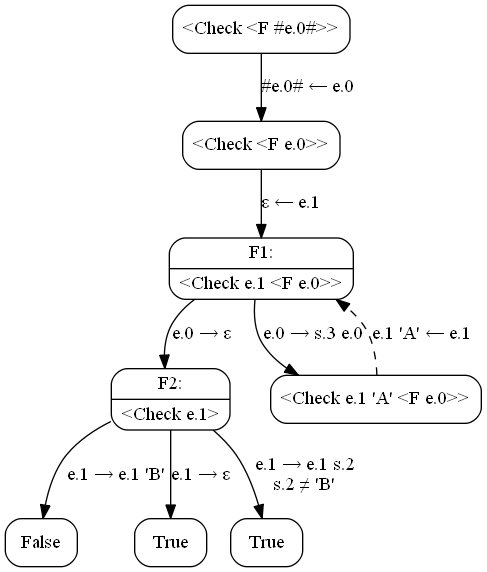

Some examples of Rectification
==============================

Rectification is Hamilton’s distillation misunderstanded
by me (Alexander Konovalov). In this page I will collect some examples
of rectification transformation.

AAA…AAA not contain B
---------------------

A function `F` generates a string that contain only `'A'` characters:

    F {
      s.X e.Y = 'A' <F e.Y>;
      ε = ε;
    }

A function `Check` checks that a line not ends to `'B'`:

    Check {
      e.A 'B' = False;
      ε = True;
      e.A s.NotB ! s.NotB ≠ 'B' = True;
    }

If we check by supercompilation that string generating by `F` don’t ends
to `B`, we got fail.

Source program:

    Go { e.0 = <Check <F e.0>> }

    F {
      s.X e.Y = 'A' <F e.Y>;
      ε = ε;
    }

    Check {
      e.A 'B' = False;
      ε = True;
      e.A s.NotB ! s.NotB ≠ 'B' = True;
    }

  
Supercompilation graph

  

Residual program:

    Go { e.0 = <F1 e.0, ε>; }

    F1 {
      ε, e.1 = <F2 e.1>;
      s.3 e.0, e.1 = <F1 e.0, e.1 'A'>;
    }

    F2 {
      e.1 'B' = False;
      ε = True;
      e.1 s.2 ! s.2 ≠ 'B' = True;
    }

**Note.** Node `F2` is not loop and can be inlined to `F1`. We will outline
it for clarity.

The residual program contains symbol `False` that supercompilation didn’t
prove that string `'AA…AA'` generating left-to-right is not finished to `'B'`.

Let try to prove it by rectification. Start from similar source program:

    Go { = <Check <F #e.0#>> }

    F {
      s.X e.Y = 'A' <F e.Y>;
      ε = ε;
    }

    Check {
      e.A 'B' = False;
      ε = True;
      e.A s.NotB ! s.NotB ≠ 'B' = True;
    }

Entry point `Go` is zero arity bug the program contains macrovariable
`#e.0#`. Let create start metaconfiguration `M0` by supercompilation
the program:

  
Graph for M0

  

Residual program in `M0`:

    Go { = <F1 #e.0#, ε>; }

    F1 {
      ε, e.1 = <F2 e.1>;
      s.3 e.0, e.1 = <F1 e.0, e.1 'A'>;
    }

    F2 {
      e.1 'B' = False;
      ε = True;
      e.1 s.2 ! s.2 ≠ 'B' = True;
    }

Macrovariable `#e.0#` drops to contractions `ε` and `s.3 e.0`. Start
built rectification graph with the contractions:

In metaconfiguration `M1` macro `#e.0#` will be replaced to `ε`,
in `M2` — to `#s.1# #e.0#`.

Building of `M1` is trivial.

  
Graph for M1

  

Residual program:

    Go { = True }

New rectification graph:

Create metaconfiguration `M2`.

Consider call `<F2 'A' e.1>` (dashed in the graph). Sentences of `F2`
provide three equations:

    'A' e.1 : e.1 'B'               (1)
    'A' e.1 : ε                     (2)
    'A' e.1 : e.1 s.2 ! s.2 ≠ 'B'   (1)

Equation (1) have only one solution:

* `e.1 → e.1 'B', 'A' e.1 ← e.1`.

Equation (2) have no solutions.

Equation (3) have two solutions:

* `e.1 → ε, ε ← e.1, 'A' ← s.2`,
* `e.1 → e.1 s.2 ! s.2 ≠ 'B', 'A' e.1 ← e.1`.

Let create driving cluster for call `<F2 'A' e.1>` and continue
supercompilation:

Residual program for `M2` will be

    Go { = <F1 #e.0#, ε>; }

    F1 {
      ε, e.1 = <F2 e.1>;
      s.3 e.0, e.1 = <F1 e.0, e.1 'A'>;
    }

    F2 {
      e.1 'B' = False;
      ε = True;
      e.1 s.2 ! s.2 ≠ 'B' = True;
    }

Metaconfigurations `M1` and `M2` are identical, loop `M2` to `M1`
in rectification graph:

Rectified program will be

    Go { e.0 = <M0 e.0> }

    M0 {
      ε = True;
      s.1 e.0 = <M0 e.0>;
    }

Rectified program not contain symbol `False` that rectification proves
that string `'AA…AA'` generating from left to right can’t ends to `'B'`.

_TO BE CONTINUED…_
